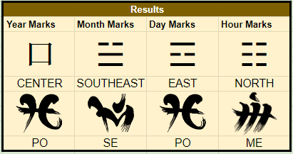
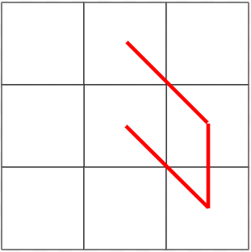
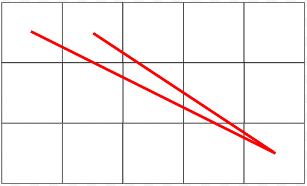

# Astrology

Although often viewed by outsiders as a minor component of Dynastic society, the
science of astrology is infused into many decisions made throughout the Dynasty.
Most major decisions are made with consultation to the will of Heaven through
studying the stars. Marriages, business arrangements, and many more are studied
with astrology before a determination is made. Thus, although astrology is
not the defining trait of the Dynasty, it is a deeply important one with
ramifications for many parts of life.

## The Theory of Astrology

Heaven's most essential function is to plot the course of Destiny within
Creation. Heaven makes Destiny known to Creation through the motions of the
firmament -- the position of stars, planets, nebulae, the sun, the moon, and so
on. Through studying the night sky, humans can learn the Heavenly Plan for the
near and far future.

Astrology is **not** divination. Divination is foolish peasant magic that
attempts to tell the future through random things like the movement of cards or
the flights of birds. Astrology is a scientific method of reading the will of
Heaven, derived from thousands of years of careful study. It isn't _fake_ like
divination is.

## The Eight Marks

An essential part of astrology is the subject's Eight Marks. The Eight Marks are
four sets of two marks apiece corresponding to the year, month, day, and hour
of your birth. In astrological predictions, a person's Eight Marks act as a kind
of "personal key" for that individual. To take the specific readings of a
person, you use their Eight Marks as input for the astrological formulae.

Every person has four _directional favors_. There are nine possible directional
favors: north, northeast, east, southeast, etc., and the center.

Every person also has four _sacred syllables_. There are fifteen possible
sacred syllables, each one corresponding to one of the dragons and the
assertive, harmonious, and waning aspects.

[This tool will allow you to calculate the Eight Marks](https://docs.google.com/spreadsheets/d/1RzGZDUhXRmTbqmmMikWhkv0glU7JA16JzDGJfjM8GtA/edit?usp=sharing)
for a character based on their year, month, day, and hour of birth.

As an example, Ledaal Naiyo's Eight Marks are:

### Terrestrial and Celestial Diagrams

Once a person's Eight Marks have been determined, their _Terrestrial and_
_Celestial Diagrams_ can be constructed.

The _Terrestrial Diagram_ shows their four directional favors in a 3-by-3 grid
corresponding to the Nine Directions. Their _Celestial Diagram_ shows their
four sacred syllables on a 5-by-3 diagram, one column representing each of the
elements and one row representing each of the three aspects.

Naiyo's Terrestrial Diagram looks like this:

And his Celestial Diagram looks like this:

Like the Eight Marks, the Terrestrial and Celestial diagrams are used as an
integral part of a person's astrological predictions. Many astrological
formulae rely on certain traits of the diagram such as the length, crossings,
open/closedness, and so on.

### Names

One final important trait of the Eight Marks is that they indicate the overall
dispoition of Heaven toward the individual. This disposition is often used when
deriving a person's birth name.

Some parents seek to balance out the child's diagram. For example, Naiyo above
shows a bias to the south-east. His parents may give him a name that shows a
bias to the north-west in order to balance his character. A child whose
Celestial marks are strongly Air might receive a birth-name like Candle or
Ember to balance her.

Other parents might seek to reinforce a child's auspicious markings. For
example, Naiyo above has two of the same mark -- he is doubly _PO_. To reflect
this favor of Pasiap, his parents might give him a birth-name which includes
that syllable. A child who has a strong tendency to the west might receive a
name like _Storm_ or _River_ to summarize his nature.

### Personality

It is widely believed that the child's marks foretell their personality. For
example, Naiyo above has a strong bias to the south-east -- this foretells a
mystical or mysterious personality. Since he's a sorcerer, that much was
clearly true! Such predictions are merely suggestions. It is not uncommon for a
child to defy their marks -- but just as often, they conform to them, especially
since their uncles and mothers are eager to reinforce that conception on them!

## The Mechanisms of the Firmament

Astrology is a complicated science involving many, many different factors. In
the most basic and general terms, astrology traces the positions and relations
of the seven celestial bodies and attempts to deduce what that means for the
future.

The dome of night is in constant motion, a long slow rotation which completes a
cycle once every year. The axis of rotation passes through the North Star, and
the rest of the night sky rotates clockwise around the axis. Over the course of
the year, the constellations gradually disappear beneath the western horizon
before rising again half a year later from the eastern horizon.

### The Sun and the Solar Zodiac

The Sun rises in the east and sets in the west, tracing a course in an arc
across the sky. Over the course of the year, the sun wobbles its course. It
passes through twenty-five constellations, collectively known as the _solar_
_zodiac_.

#### The Sun Itself

The sun is male and yellow. It rules leadership, religion, craftsmen, wrath,
and victory over obstacles. A depiction of the sun has four rays. The position
of the sun dictates the broad strokes of the near future and is factored into
every calculation; the sun is omnipresent.

#### Constellations of the Solar Zodiac

The Quiver; The Messenger; The Peacock; The Rising Smoke; The Mask; The
Treasure Trove; The Shield; The Ship's Wheel; The Banner; The Pillar; The
Sword; The Ewer; The Gull; The Corpse; The Haywain; The Sorcerer; The Spear;
The Gauntlet; The Lovers; The Guardians; The Mast; The Captain; The Crow; The
Key; The Musician.

### The Moon and the Lunar Abodes

The moon follows the sun, rising in the east and setting in the west. Like the
sun, the moon's course wobbles throughout the year. The path the moon takes
wanders through thirteen constellations called the _lunar abodes_.

#### The Moon Itself

The moon is male and black. It rules liminality, transition, change, monsters,
magic, and chance. A depiction of the moon has horns. The position of the moon
indicates disruptions, shifts, and the tides of luck.

#### Abodes of the Moon

The Madonna; The Archer; The Waif; The Mirror; The Doorway; The Rabbit; The
Mortar-and-Pestle; The Nautilus; The Eye; The Serpent; The Chalice; The Bride
nd Groom; The Philter.

### The Five Maiden Planets

Five star-like objects can be seen in the sky, larger and brighter than anything
save the sun and the moon. These five planets wander, traversing the night sky
without rhyme or reason discernable to humanity. They answer only to Destiny.

#### Mercury

Mercury is feminine glows warm saffron. It governs journeys, travel, movement,
and freedom, as well as the opposites: staying, stalling, falling, and bondage.
A depiction of Mercury has wings.

#### Venus

Venus is female glows deep sapphire blue. It governs joy, serenity, sex, love,
friendship, and levity, as well as the opposites: mistery, turmoil, hatred,
fear, rivalry, and gravity. A depiction of Venus has ribbons.

#### Mars

Mars is feminine and burns an angry red. It governs battle, violence, conflict,
martial skill, and victory, as well as the opposites: peace, diplomacy,
resolution, submission, and defeat. A depiction of Mars is bloody.

#### Jupiter

Jupiter is feminine and ivy green. It governs secrets, knowledge, the unknown,
concealment, and deception, as well as the opposites: revelation, ignorance,
discovery, awareness, and truth. A depiction of Jupiter is bell-shaped.

#### Saturn

Saturn is purple and feminine. It governs the end of things, cessation, and
finality. It also governs their absence: beginnings, rebirth, and the endless.
A depiction of Saturn has a shadow.

### Indicator Stars

An _indicator star_ is a special star, based on the individual, which offers a
reference point to foretell some aspect of a person's future. There are many,
many different kinds of indicator stars. When a planet appears in the
constellation of an indicator star or the moon draws near or a star is
obscured by a shining nebula or brought into focus by the curve of an aurora,
these are all omens that something related to that indicator star is near.

Some indicator stars include:

- The five positive stars: the Jewel-Star, the Hearth-Star, the Root-Star, the
  Tide-Star, and the Storm-Star;
- The five negative stars: the Worm-Star, the Ash-Star, the Rot-Star, the
  Drown-Star, and the Miasma-Star;
- The Tyrant-Star, which indicates leadership and government;
- The Extinction-Star, which relates to death and dying;
- The Soul-Star, which indicates health and wellness;
- The Cherry-Blossom-Star, which indicates fertility and children;
- etc.

Indicator stars are derived from layers of formulae and are not universal. For
example, Naiyo's extinction star might also be Jayla's cherry blossom star,
while Tempest's cascade star is nothing at all to either Jayla or Naiyo.

## Using Astrology in Your Game

> This section is written from a detached perspective.

- Have characters draw up a star chart before major endeavors; perhaps a bad
  omen means someone needs extra occurrences, or the opposing forces delay their
  big push because Mars is not in their favor.
- Tease your players with foresight -- "Tempest, I have bad news -- Mars is in
  the abode of your extinction-star. That's a bad omen." sounds ominous as fuck
  and can add tension right before an impressive duel.
- NPCs may instinctually trust a PC more if they learn that the PC has Eight
  Marks that are complimentary to their own, or a star which foretells good
  fortune; it's always good to be on the right side of someone who is about to
  make it big.
- Your uncle has found a wonderful young man, whose chart is nearly a perfect
  compliment to your own. Amazing! Won't you come stay for a week and get to
  know him? No pressure. It's just so rare to meet such an auspicious person --
  perhaps he'll be the one?

In general, remember that humans are obsessed with the future and take every
opportunity they can to try and guess at it. Many important figures have
astrologers they trust to help them make good decisions. These individuals are
ripe for suborning to your cause or may make powerful allies if they find that
the stars are in your favor.
