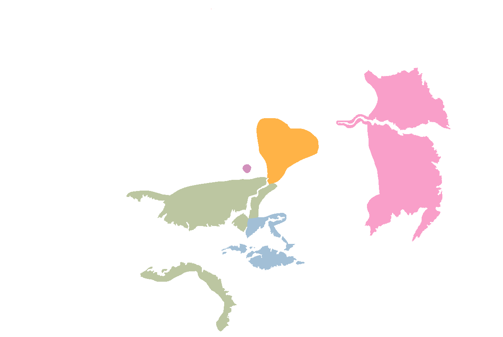

# The Unification Period

The period between the founding of the Realm in RY 1 and the complete conquest
of the Blessed Isle under the Realm in RY 254 is called the _Unification_
_Period_. This period is characterized by frequent and continuous war, the birth
or prototyping of many of the Realm's contemporary practices including the
creation of the first Great Houses, and the rebuilding of society following the
devastation of the Thousand Sorrows and Seven Tigers periods.

The first century was a period of growth and healing, during which the Empress
committed many of her internal resources to establishing secure cities under her
rule. The propensity for state-building that she demonstrated during the first
century gained her powerful momentum that she carried through the next two
centuries to unite the Isle under her rule.

## Power Players

The Empress was not the only power on the rise during the period. A handful of
major competitor states are important to enumerate for a better comprehension of
the Unification Period.

### States of the Blessed Isle

In addition the Empress' nascent Realm, a handful of other government existed
on the Isle. Many of these traced their heritage back to the Shogunate period;
others arose during the Seven Tigers period as regional governments of
Tragedy survivors.

Of these governments, most were so unnoteworthy that they are not even
elaborated upon here; the following are significant enough that they deserve to
be addressed by name.

#### The Triumphate of Arjuf

The Triumphate of Arjuf was the Realm's greatest rival during the Unification
Period. Based in and around the city of Arjuf, the Triumphate was a military and
economic power that originated in the Shogunate period. The Triumphate was the
very first state to break away from the nominal power of the Shogun, but
retained the military dictatorship that characterized the Shogunate states.

The leader of Arjuf was the Triumphant, selected from the commanding generals of
Arjuf by the other generals. The Triumphant was a lifetime position, but was
expected to lead Arjuf's military endeavors and overseas conquests. Triumphants
tended not to last very long -- the best thing they could do for their legacy
was die honorably leading conquests in the name of their nation.

Arjuf held a huge swathe of land on the southern shores of the Isle, and their
territory only expanded when they began gobbling up now-vacant land during the
Seven Tigers period. Some neighboring states had already surrendered to Arjuf
during the Thousand Tragedies as the Triumphate expanded its reach. They also
maintained a couple coastal port holdings across the Strait of Arjuf, on the
Southshore Peninsula, which they had managed to defend against the incursions of
the Seven Tigers.

Arjuf's primary power was military, with a well-trained Legionnaire-style army
backed by their mercantile wealth. After the Thousand Tragedies period, Arjuf
expanded their economic reach, exploiting their Southshore holdings to mine
jade and silver from the mountains and trade with the See and the Immaculate
State.

#### The Harmonious Mountain State

The _Immaculate State_ is formally known as the Harmonious Mountain State, but
the prior name is used even in scholarly literature. The Immaculate State
traces its origins to the Vth century of the Shogunate, but was founded not in
accordance with the Shogun/Daimyo system, but instead as a theocratic coalition
of monasteries and temples high in the mountains of the Omphalos. At its peak,
it covered a staggering amount of sparsely-populated mountain land and commanded
a highly-respected military of pikemen and javelineers.

The Harmonious Mountain State was founded by the Twelve Legendary Masters, a
group of monks who had grown tired of the Shogunate's political landscape and
the ritualized combat of the interstate wars. They retreated into the mountains
and united several disparate mountain tribes under their leadership, and from
there established monasteries and cities in accordance with their sacred wisdom.

The Immaculate State was fully independent and recognized no higher authority;
even during the late Shogunate, it maintained that, as a religious community, it
did not fall under the martial governance of the daimyos or the shogun. After
the Unraveling and the Seven Tigers period, it quickly expanded to encapsulate
more mountains and natural resources. The State was lead by the
_Mouth of Peace_ and governed by the _Order_; the Empress would eventually
absorb these institutions into her own Realm. The capital of the State was at
the low-lying city of Juche.

The Harmonious Mountain State was famed for its huge, hearty people and its
sacred wisdom. They traded little with the outside, preferring where possible to
make due on their own; their population was always widespread and never large.
Their military was notable for their mountain fighting techniques, making use of
neither riding beasts nor chariots, and for their famous _Pasiap's Company_, the
highly-trained temple guards turned state's mercenaries which were a feared and
respected military unit by the fall of the Shogunate.

#### The See of Radimel

The _See of Radimel_ was a hereditary monarchy based on the island of Radimel's
Seat, dead south of the Blessed Isle. The See, and the island itself, are named
metonymously for the Seat of Radimel, a spectacular throne of lapis lazuli and
gold housed at the capital city, Port-of-Peace. The monarch of the See of
Radimel was called the Enthroned.

The See of Radimel had a strange position for most of its history, being neither
an allodial-state ruled by a daimyo nor a marcher-state sworn to a daimyo.
Instead, the Enthroned of Radimel swore loyalty directly to the Shogun, and had
no stake in the jade economy. The people of Radimel were traders of lesser
things like teas and fruits, and served as naval might -- which held little
prestige among the primarily land-war mindset of the Shogunate.

Consumate outsiders, the Radimeli declared independence from the Shogunate at
the end of the Vth century, when the position of Shogun was once again empty and
the Entrhoned objected to the new Regent appointed in her place. After that,
Radimel supplemented income with oversea shipping services to the various
allodial-states, and occasional acts of privateering against ships passing
through their waters without paying.

#### The Mercantile Federation

The _Mercantile Federation_ arose in the early RY 100s, as an alliance of a
handful of mercantile republics on the far Daoshin Peninsula. The capital of the
Federation was the stoney port city of Myion.

The Mercantile Federation lasted only a brief few decades before its conquest by
the Realm, and a brief resurgence during the coup of Manosque Viridian. At the
height of its power, the Federation had large pools of jade wealth which it was
able to use as leverage for security contracts with the many independent
mercenary companies that could be found on the Daoshin Peninsula, such as the
famous Red Company and the infamous Silver Knives.

### States of the River Province

The River Province was home to several marcher-states during the Shogunate
period, but the majority retained independence as smaller kingdoms. Two
particular River Province states are relevant for the early history of the
Realm: the Seventh Legion of Lookshy, and the Emirate of Jiara.

#### The Seventh Legion of Lookshy

The city of Lookshy was called Deheleshen before the fall, and the capital of a
powerful marcher-state tasked with administering the Yanaze river. During the
Unraveling, the Seventh Legion fell back to Lookshy and held the city walls
against the oncoming horde.

Lookshy is second only to the Isle in population of Dragon-Blooded, making it
a prominent rival of the Realm. After the three invasions of the River Province
in the late first century, Lookshy came to recognize the Realm as a potent foe.
Lookshy played a pivotal role in the second century wars.

#### The Emirate of Jiara

The Emirate of Jiara was maintained as a marcher-state by the allodial-state of
Shian, and the amirah savored her freedom once the Shogunate fell. The plateaus
and river valleys of Jiara were rich in resources and fertile land for crops,
allowing the Emirate to bounce back from the apocalypse more readily than many
other states.

The amirah began the first century with the goal of doing as the Empress ended
up doing, and creating an empire that spanned the world. Her ambition outpaced
greater than her ability, but the conquests of Jiara along the coast nonetheless
made it one of the largest states in the region and a frequent frenemy of the
Seventh Legion.

## RY 1: The Establishment of the Realm

The first year of the Realm was defined by the arrival of refugees and
petitioners from across the Isle. Thousands of hopefuls had seen the image of
the Empress in the sky, and made the trek across glass deserts, through beating
sour rain, and with little in their bellies, to reach her new Realm.

The Imperial Manse sits atop a raised spur of land, and does not have direct
access to the ocean. This proved, very quickly, to be an issue, requiring
arrivals by boat to trek upland to reach the promised home. In this manner, two
tent cities quickly arose: one on the water to receive petitioners, and another
up the spur where the Imperial Manse set, several hours trek inland. The merging
of these two tent cities was the first major step in the growth of the Realm.

Within just a handful of years, the land around the Imperial Manse had
transformed from forested wilderness to cleared grassland, and then to the
beginnings of urban sprawl. Docks were built, and then expanded, allowing for
movement of people and goods by the ocean. Stone quarries popped up to fuel the
need for building material. Upriver, new merchant clans arose, getting rich on
the river clay for forming bricks and river soil for building new farms.

By all accounts, the development of the Imperial City from nothing to one of the
most powerful urban areas in the world was among the fastest in human history.
The recognizeable Inner City of the modern era was apparent in a mostly-finished
state within two decades.

## RY 3: The Integration of the Xianyu Peninsula

The Empress is Wàn, descended from the chocobo-riding, red-haired people of the
Xianyu Peninsula. During the first few years recovering from the apocalypse, the
Xianyu Princes warred among themselves, competing for what scarce resources they
could get their hands on.

The Empress began her conquest of the Xianyu Peninsula by integrating the
wandering, post-apocalyptic people on the opposite bank of the river from the
Imperial City. She offered them protection and government in exchange for their
riding skill and service. By these means, she quickly amassed a respectable
army of riders to assist in her plans for her homeland.

The Empress offered a simple decision to the Xianyu Princes: submit, or be
overrun. Many Princes, awed by her beauty, charisma, and miraculous
apparation, swore fealty to her on principle as a Shogunate officer, or out of
admiration for her growing strength. Others resisted her authority, and these
were answered with her Dragon-Blooded followers and the cavalry of the southern
river shore. After a few conclusive victories lead by the Empress herself, all
the surviving Xianyu Princes swore loyalty to her, and the peninsula was hers.

The Realm at this point started to face shortages of material goods; the Xianyu
Peninsula's crops and resources had been decimated in the Thousand Tragedies
just a decade ago, and stores of rice had yet to be recovered. The Empress
used her magic and her Dragon-Blooded followers to inspire verdant growth in the
fields. Even with these boons, it quickly became clear that her young state
needed more than it could produce with the resources it had.

The Realm may well have ended here, dying of shortages as so many post-Tragedy
states did, were it not for the surprising influx of jade that arrived at the
Empress' door one morning. A strange crystaline creature, bearing carts of jade,
had descended from the mountains and come to offer her tribute. The Empress
swiftly learned that the Mountain Folk, those inscrutable and inhuman
dwellers-beneath-the-mountains, had sworn her fealty and were prepared to offer
her annual tribute as their new leader, as long as she left them alone to tend
their own affairs.

The influx of staggering amounts of jade -- far more than the coffers of
competing states -- gave the Empress the momentum she needed to overcome the
initial hurdles of infrastructure. She was able to make generous payments to
talented craftsmen who had survived the Thousand Tragedies, who helped her
nation construct infrastructure; she was able to pay mercenary bandits to serve
her as state force; she was able to pay sorcerers and bribe divinities for
fertility, health, and good harvests.

## RY 15: The Luo-Han Subjugation

The Luo-Han Plains are known today as a beautiful and tranquil place of farmland
and respite, a temperate and pleasant retreat for those who want a more quiet
life. This is in stark contrast to the Plains in the early first century: a
dry and cracked expanse, torn with many rifts leaking strange mystical energy,
and populated by horse-riding tribes of warriors.

The Luo-Han was home to several distinct bands of riding peoples, focused on the
tradition of horses. During the Late Shogunate, these peoples had been divided
between riding and settled branches, but the chaos of the Thousand Troubles had
forced many of the settled citizens to take up riding once again. They thus
formed a widespread and low density population which could do little to stop
the nascent Realm from simply gobbling up land.

Though the Luo-Han could do little to stop the Realm from taking their land,
they did much to stop the Realm from taking their people. The riders were unable
to hold land against the Empress, but retaliated with raids and nighttime
slaughters. The Empress used a combination of Legions, bribes, and remnant
Shogunate authority to gradually cow the Luo-Han people across fifteen years of
conflict.

By RY 15, the Empress had subjugated enough of the Luo-Han people that she was
able to begin stamping out the rebellious riders and begin extracting tribute.
Her bargain was simple: she offered magic, crops, and jade in exchange for their
servitude, promising to seal the cracks and restore the Luo-Han Plains to their
former verdancy in exchange for loyalty. The people listened to their stomachs.

## RY 18: Araka Jeresh

The man called Araka Jeresh, more formally Heron XIX, ruled Arjuf as Heron XIX
through the Seven Tigers period and into the Empress' rule. A man equally as
capable as he was arrogant, he was an archetypal Triumphant: loud, proud, good
with a sword, and roguishly handsome.

In the early years of the Realm, Araka Jeresh sent a courier to the nascent
Realm, offering to share the weight of the crown equally with the Empress. She
captured the courier, putting him to use in her service, and sent a sorcerous
message to Araka Jeresh. The story goes that her apparition awoke him in the
night, where she spied him disheveled and naked; she recited a poem which
compared him unfavorably to the scraggly, preening moa which roam the Arjufi
countryside. She then used her magic to call down green fire that reduced his
hunting palace to ash. The story continues that it was that night, as he stood
shivering and naked staring at the remnants of his retreat, that Araka Jeresh
knew real love for the first time.

Araka Jeresh has a reputation in history as a vain and foppish man embodying
many of the worst male traits -- erotic fixation, emotional instability,
violent overreaction -- which is certainly deserved. However, his secondary
reputation, as an insightful commander and talented leader, is likewise
deserved. A Wood Aspect through and through, Jeresh was, by all accounts, an
excellent judge of potential, and quickly recognized that the Empress was not
someone to trifle with.

After his palace was burned, Jeresh traveled in person over seas, braving
Radimeli pirates and stormy winter waters, to speak to the Empress in person.
He offered an alliance, genuine this time, with a shared goal: pushing the See
of Radimel from its holdings on the mainland, which he knew would obstruct the
Empress' expansion and which troubled his own attempts at establishing trade
with the cities rebuilding themselves on the southeastern edge of the Isle.

The Empress accepted. Jerah was born shortly thereafter.

## RY 19 - RY 20: Pushing Radimel from the Isle

During the Seven Tigers period, the See of Radimel had pushed onto the mainland
Blessed Isle by taking the land along the Bay of Radimel. Most importantly, the
See secured authority over the port of Garu, at the very southern tip of the
Blessed Isle. Securing Garu-At-The-Bay meant that the See had control over both
sides of the Strait of Garu, running between Radimel's Seat and the mainland.

This had proven to be a tiresome burden. The See's fleet, by this point little
more than a confederation of privateers under the command of a tax-happy queen,
extracted tariffs from all business attempting to travel by the Strait. Further,
the Enthroned of Radimel, Ulay, had made it clear that she desired to further
solidify her position, hoping that her control of the Strait would bring massive
profits in the next century as the world rebuilt.

The Empress and Araka Jeresh both disapproved of the expanding authority of the
See, and formed an alliance to push Ulay's forces from the mainland. They
mounted a join expedition to secure the Bay of Radimel: they would squeeze the
Radimeli from both sides and force Ulay to withdraw to her island.

The Empress faced an obstacle in the form of the Dragonswrath Desert, which left
little choice but to approach along the coast. Skirting with the desert on her
right and the ocean on her left, the Empress made slow but effective progress.
Garu fell into her authority at the end of the first year of the campaign, after
she personally felled the walls with a powerful spell.

Although the Triumphant held both banks of the Caracal, the Dhorash Mountains
proved to be an obstacle for overland movement of his troops. The Dhorash were,
and still are, for all intents and purposes a wall of dry stone that separates
the banks of the Caracal from the Dragonswrath Desert and the shores of the Bay
of Radimel.

Araka Jeresh had little trouble in taking the Radimeli holdings on the lowlands
south of thet mountains, but from there had only one choice: push through
Dhorash's Bite, the narrow, jagged strip of land between the edges of the
mountains and the Bay of Radimel. Ulay's forces needed to do little more than
hold on to the Bite for Arjuf's advancement to be stymied.

Araka Jeresh finally broke through at the end of the second year, mobilizing his
ace in the hole: the _Wings of Triumph_, a flying ship and remnant of the
Shogunate, the last of its kind in Arjuf's reserves. Jeresh himself lead a
bombing run on the city of South Rest (now Empress' Mercy), razing the city to
the ground. The vessel did not survive the conflict, felled at the last by a
storm serpent summoned by one of Ulay's sorcerers.

Having secured Ulay's only two major holdings, it was little work from there for
the allied Realm-Arjuf forces to clean up the stragglers and fully push the
Radimeli presence from the mainland.

## RY 20 - RY 44: Consolidation

At the completion of the war with Radimel, the Empress had succeeded in
transforming her Realm from a single city-state into a proper Empire. She
controlled the Xianyu Peninsula from the coast to the city of Sanqu; the Luo-Han
Plains from the Jade Coast to the eastern edges of the Mhaltin Mountains; and
the port city of Garu and the southern coast from the eastern edge of the
Dragonswrath Desert. Her new state rivaled Arjuf in size and had sprung up
basically overnight.

For the period between RY 20 and RY 44, the Empress focused on consolidating her
authority within her new Realm through various methods. To begin with, she went
about fulfilling her promises to the princes who had sworn fealty to her: she
sent her sorcerers and Dragon-Blooded followers out to heal the world. She
spent years on projects to negotiate favorable crop calendars with local gods,
seal the cracks in the Luo-Han plains, and build roads and new cities in the
apocalyptic wasteland of the post-Unraveling world. Her primary goals were to
boost crop productivity, boost population growth (especially of the Wàn, her
own group, who she knew best how to control), and make tangible, demonstrable
steps in healing the world, to gain the gratitude and loyalty of her subjects.

RY 23 marked the formal beginning of the Magistracy, when the Empress began
recruiting Magistrates beyond her immediate circle. Shortly after, she began
organizing her ministries more formally, and set about establishing tax codes,
local governments, and the major departments that survive to this day --
including the Treasury. By RY 38, she had built the formal offices that would
eventually become the Spiral Academy. She established an Empress' Council of
representatives from throughout her empire to assist her in making economic and
developmental decisions; this Council would eventually evolve into the bicameral
 Deliberative legislature we know today.

From the military perspective, RY 20 to RY 44 were marked by the formalization
of the Legion structure. In the first two decades, the Empress had allowed her
commanders a great degree of autonomy, dealing with insubordination and conflict
personally; as her Realm quickly grew too large for this hands-on management,
she made efforts to structure her military into the formal Legion structure of
the Shogunate. The Luo-Han people were easy enough, imbued with a competitive
and regimented structure based on riding bands; the more artistic Wàn needed a
firmer hand. The Empress generously rewarded success and harshly punished
failure, stoking the fires of the fierce and competitive military culture that
would power the Legions for centuries.

## RY 44: The Succession of Heron XX

Araka Jeresh was an effective military leader, but struggled in the Realm of
economics and policy. He was unpopular among his own elites for his willingness
to allow the young Realm the port city of Garu, and for his known relationship
with their Empress; among his peasantry, he was frequently criticized for
failure to take action against his own corrupt officials and his government's
difficulties with distributing rice. The later was a particular point of pain
for the commonfolk, and cause of several small peasant uprisings in the
inland territories who were dissatisfied with their hard-grown grain being left
to moulder while ministers bickered over how to distribute it.

In RY 44, the Palace of the Triumphant was surrounded by angry farmers who felt
they were being taxed too harshly after a poor season. Araka responded by
sending soldiers to arrest the protestors, who riled up their fellow peasantry
as they were being dragged away. The rest of the city was quickly engulfed in
riots on many fronts, which Jeresh was unable to fully stymie; where he put out
one fire, another began to burn across the city.

General Okano Tlaai seized on the opporunity as Jeresh's early response to the
riots floundered. With the backing of the dissatisfied ministers in Jeresh's
council, Tlaai gathered public support by promising to lower taxes and directly
distribute the stores of rice. Supported by her command and a horde of angry
commoners, Tlaai challenged Jeresh to a death duel for the position of
Triumphant.

After a day of dueling, Tlaai's two swords won out over Jeresh's flamepieces and
Arjuf had a new ruler, Heron XX. Tlaai mounted Jeresh's body on display outside
the palace of the Triumphant and set about purging the ministries of corruption
through force. She bolstered military presence along the eastern border toward
the Realm, and arranged for better planting seasons by impressing her local
sorcerers into mandatory service.

## RY 47 - 53: The First Invasion of the River Province

The Empress now found her westward expansion blocked by a militarized and
oppositional Arjuf, not so pliable with Heron XX on the throne. The empty lands
between the Luo-Han Mountains and the Immaculate State offer little reward for
the trouble of their conquest.

Unable to proceed easily westward on the Blessed Isle, the Empress decided to
set her sights eastward, to the River Province. During the Shogunate period,
the River Province had been a pot of balkanized states warring among themselves
and owing fealty to no one. The Seventh Legion, the accursed Lookshyans, had
established themselves in Deheleshen, and occasionally cast out from there to
conquer territory. In the interim between the Seven Tigers period and RY 47,
Lookshy had dominated the shores of the Yanaze and posed a potent threat to
expansion in the region.

The Empress, then, chose not to invade through Lookshyan land, but instead to
attempt to colonize the former marcher-state of Calin. The marcher-state of
Calin had been completely depopulated during the Thousand Tragedies, the people
turned to jagged agate statues under the capricious whims of a raksha prince.
The city was mostly empty except for scavengers, a cursed place that none nearby
dared to enter.

Calin was the perfect target for a foreign colony. The Empress began by sending
a Legion to secure the city, and a horde of exorcists and monks to chant
blessings that would heal the broken city -- the same techniques she had
perfected for healing the Isle. Sure enough, the port was quickly healed, and
in RY 46 the Empress sent a great horde of colonists to reconquer the area.

Port Calin was the Realm's only real attempt at a proper colony, a population of
Wàn settled onto foreign soil. The city prospered from trade with the Medoans,
exporting strange fabrics and sweet Medoan ciders. By RY 53, Calin had
established itself as a proper part of the young Realm and a seat of the
Empress' operations overseas.

It got there after violence. In RY 47, having established an Imperial garrison,
the Empress launched a conquest of the Calinlands. Her Legions found little
resistance -- the local population was sparse and easily bent, having been hit
hard by the Thousand Tragedies and still in recovery. The conquest came to a
standstill quickly, however.

To the north, expansion was stymied by the Medoans, who were eager to trade but
unwilling to bow. Their hussars and winged horses proved a challenge for the
stronger but less maneuverable Legions, who set up defensive encamptments but
had trouble taking land. To the east, the River of Tears proved to be a soft
barrier that stymied quick expansion.

The Empress' forces had an easy time keeping the mostly empty land, but a hard
time pushing further. That changed abruptly in RY 53, when Daimyo Tepet, the
last of his line, took advantage of the Empress' focus on the Calinland and
launched his own invasion -- of the Isle.

## RY 53: Tepet's Siege and the Acquisition of Pneuma

The man called Tepet was an honorable and pious war hero, one of the few daimyo
to have survived the fall of the Shogunate, stood firm against the raksha,
opposed the Seven Tigers, and lived to tell all these stories. A respectable but
older man by RY 53, he had held Pneuma against the world and built himself a
powerful presence in the near north.

Tepet had kept a cautious eye on the Empress' young Realm, hoping to either ally
himself with her or stamp her out. His desire was not conquest in itself, but to
eventually take the city of Karashelen and claim the old western throne of the
Shogun -- his lifetime goal, and an honor denied him by the end of the world. To
reach Karashelen, he would have to go by the Xianyu Peninsula -- and thus,
through this young new nation.

Tepet's scryers and _yamabushi_ scouts had penetrated well into the Xianyu
Peninsula by RY 53, slipping unnoticed among refugees and immigrants. They kept
careful watch of events and fed information back to the spires of Pneuma, where
Tept had been raised as Ataman by the local Yaob people after saving them from
the raksha. When his informants revealed that the Empress had spread herself
thin -- her Legions focused either on the Arjufi border or the Calinlands,
leaving the Xianyu Peninsula largely undefended -- Tepet launched his fleet.

Taking the White Coast was relatively easy, once Tepet had arranged the
logistics of shipping his forces across the Inland Sea. A brief and clever war
ensured that the Xianyu lands fell under his control, the Empress' attention and
efforts concentrated elsewhere. Tepet did little to hold the lands, focusing
instead on establishing a clear path from his landing points on the White Coast
to the Imperial River. He left most of the existing institutions in place, as
long as they pledged to him -- the Empress was his goal, not the peninsula.

In RY 53, Tepet had finally made his way south of the Imperial River and arrived
at the Imperial City. From there, he laid siege for a whole year, his pale-faced
soldiers surrounding the city. His force of divine armigers set about disrupting
the local geomancy to spoil the harvest, and his _yamabushi_ kept careful watch
to starve the city of information in and out.

The Empress ordered a withdrawal from the Calinlands, pulling her troops back to
Port Calin and abandoning her new conquests. She secreted herself from the city,
retreating to the nearby city of Sdoia. With the assistance of a force of
Luo-Han riders under her command and the timely arrival of her reinforcement
ships from Port Calin, the Empress broke Tepet's siege and dueled the man until
he submitted.

At his defeat, Tepet bowed to the Empress and requested mercy -- for his troops,
but not for himself. The Empress was impressed by Tepet's martial skill, honor,
and bravery. She spared his life, and despite the difference in their ages, took
him as a consort. Silver-haired Tepet became a common sight in the Imperial
City, and with his forces allied to her own, the Empress had acquired Pneuma.

## RY 75 - 76: The Second Invasion of the Scavenger Lands

In RY 75, after a few more decades of consolidating power and establishing
infrastructure, the Empress and Tepet arranged to make a second attempt at the
River Province. Tepet was chosen to lead the invasion, along with the general
Akiyo, who had proven her valor in the western border skirmishes with Arjuf.

Tepet and Akiyo deployed their forces from Port Calin, aiming to reconquer the
abandoned Calinlands and expand from there. Once again, the River of Tears
proved troublesome, but by the time of this invasion, Sijan had arranged a
powerful alliance of necrostates that were able to force Tepet and Akiyo to
funnel north.

Traveling north, the joint Legions were able to make significant progress
against the Medoans, pushing northward into their territory. A combination of
terrible weather and a mundane but widespread plague among the Legions forced
Tepet and Akiyo to retreat back to the Calinlands, bringing the second invasion
to a close.

## RY 88 - 89: The Third Invasion of the Scavenger Lands

Exciting developments in the crossbow and an internal succession crisis in the
Emirate of Jiara prompted the Empress to launch her third and final invasion
into the River Province, this time approaching from the South.

The Empress sent two of her generals, Ophris and Burano, to lead this invasion,
beginning with conquest of the city of Thorns. Thorns, having no Chosen to its
name, fell quickly under their command. From there, the united Burano/Ophris
forces were able to push inland, cutting a line between Lookshy and Jiara. Their
expeditionary force made it as far as the Gray River before being routed by
infighting and the forces of Anathema dwelling on the far banks.

The generals Burano and Ophris were not friendly to one another, and were often
rivals for the Empress' affections. Though they managed to survive the invasion,
their rivalry continued to grow. Some scholars speculate that the Empress hoped
they would either succeed or burn out fighting one another, and this is why she
later sent them to conquer Prasad, again as a joint force.

## RY 89: The Development of the Satrapy System

The Empress' experience in military conquest in the Threshold lead her to
conclude early on that ruling by force was less desireable than ruling through
influence. Although military power was necessary to conquer the unruly, the
preferable alternative is rule from behind established authorities.

Thorns proved to be the root of this, her first experiment in what would
eventually evolve into the satrapy system used by the Realm today. The Empress
did not place one of her own in charge of Thorns, but rather backed a local
contender with promises of rewards for loyalty and retribution for betrayal.
From there, she installed her trusted advisor as the satrap -- and the system
was born.

## RY 103: The Establishment of the Great Houses

By RY 103, the Empress had made a series of minor advancements, incorporating
the port city of Chanos and swathes of land around the Mhaltin mountains. Arjuf
had reclaimed Garu during a brief and bloody conflict, pushing her forces back
to their contiguous region of the eastern Isle.

The Empress decided to restructure her government to support her further goals,
including the abolishment of old-fashioned gens loyalties in favor of loyalty to
her chosen representatives.

To further this goal, she announced the formation of a new set of governmental
families, based on loyalty to her alone. From her initial followers, she raised
the following houses:

**House Tepet**, The Air Stained With the Blood of Legions, raised first in
honor of Tepet's age, bravery, and duty;

**House Jerah**, The Fire Which Ignites Sparks in the Heart, in honor of Jerah,
the Empress' eldest daughter, great orator and image of her mother;

**House Peleps**, The Water That Wreathes the Crown of Centuries, in honor of
heroic Peleps, the Empress' second daughter, who traveled far and wide to learn
the ways of the world;

**House Sakeraha**, The Wood Which Cultivates Majestic Blossoms, the Empress'
third daughter, the most brilliant merchant on the Isle;

**House Iselsi**, The Water Which Anoints the Temple Shrines, for the Empress'
most favored minister, whose good work was vital in the early empire;

**House Burano**, The Earth Which Lays the Foundation for Greatness,
for she whose wisdom is as deep and reliable as stone;

**House Ophris**, The Fire Which Illuminates The Way,
for he who burns so bright;

**House Akiyo**, The Air Which Rages Like the Storm,
last and youngest, whose potential is bounded only by her ambition.

Of the original Great Houses, today only Tepet and Peleps remain.

## RY 114: Rawar of Arjuf

RY 114 marked several great occasions. First and foremost, the population of the
Realm had by this point begun to grow at a comfortable rate, and the sorceries
and public works of the Empress had succeeded in raising a world where many of
the peasants would live their lives without painful reminders of the suffering
of their forebears.

Second, and nearly as important, the Empress took a new husband: Rawar of Arjuf,
a distant cousin of Heron XX, known as a supremely talented swordsman, talented
orator, and a beloved public figure. Rawar offered several advantages as the
Empress' new husband. As a public relative of Heron XX, she planned to put him
forward as a potential contender. His reputation as an honorable and talented
swordsman held appeal for the conservative militants of Arjuf; his skill at
oratory and persuasion would serve to win over more diplomatic ministers. He was
well-liked by the populace, both as a _bijak_ and as a pious public figure who
often advocated for the interests of the commonfolk in his cousin's courts.

> **The Bijak**. Although Rawar of Arjuf's status as _bijak_ is a footnote to
> his legacy for scholars in Creation, it is noteworthy to us as contemporary
> Americans. The _bijak_ are a special caste within Arjufi society, born as
> women but raised as men. They are trained from a young age with swords and
> poetry. The _bijak_ traditionally serve as highly-sought-after bodyguards,
> temple warriors, and, if Exalted, as spirit-speakers and monks.

Upon marrying Rawar of Arjuf, the Empress began a campaign of bribery and social
manipulation to increase his support among the nobility. Her eventual goal, as
was obvious to those who bothered to pay attention, was to lead an eventual coup
against Heron XX and install Rawar as the new Triumphant.

However, her relationship to Rawar was not simply a political matter. The
Empress is said to have loved Rawar the most out of all people she ever took as
lovers. His insightful wisdom, artistic drive, and calm presence made him
extremely popular among the Great Houses. His insistance on remaining distant
from the affairs of his wife's politics made him popular among all groups. He
remains one of the most popular figures in the early Realm's history, and has
several temples, statues, and other works dedicated in his honor in Arjuf.

## RY 116 - 121: The War of the Tourmaline Pact

Shortly after the Empress' marriage to Rawar of Arjuf, she began to advance
along Arjuf's eastern border, hoping to reclaim the port of Garu. Skirmishes
between the Realm and Arjuf had broken out frequently, and tensions were running
high. In response to Realm aggression, Heron XX approached the Amirah of Jiara
with an alliance, hoping that between the two they could squeeze the Realm from
both sides.

This alliance was known as the Tourmaline Pact. With the signing of the Pact,
strife between the Realm and Arjuf continued to escalate. Legionnaires traded
blows along the border and competing expeditions into the Dragonswrath Desert
resulted in many bloodied noses.

Over the sea, Jiara and the Realm raided one anothers' boats more and more
aggressively. In RY 116, Jiara invaded the Realm's coastal holding of White
Lily, and slaughtered the local satrap and prince before installing their own.
The Empress quickly reclaimed White Lily, holding the prince as ransom. She
demanded that Jiara execute the captain responsible for the slaughter of one of
her Great House's scions. Jiara refused.

War was declared, and as Jiara was dragged in, so was Arjuf. For five years,
the Realm held off Jiara overseas and Arjuf at home, a constant tug-of-war that
saw many minor holdings exchanging hands, but little concrete victory for either
side. The Empress did little to sue for peace, eager to see Jiara brought under
her rule.

The War of the Tourmaline Pact came to a close in RY 25 with the withdrawal of
Jiaran forces to their capital city and the ceding of Garu back to the Empress.
An uneasy peace was negotiated, allowing for a brief period of respite. All
parties, however, knew that the peace was not going to last -- the question was
simply who would restart the conflict.

## RY 123 - 125: The Continuation War

The brief peace of RY 121 did not last very long. Heron XX's desire for Garu
and the southern shore would not be contained. As he continued to press into her
territory, the Empress increased her presence in Garu and along the western
edge of the Dragonswrath Desert. Bloodied noses became broken faces as the
militaries arranged themselves for another war.

In the intervening years, Jiara and Lookshy had set aside their skirmishes to
focus on their shared enemy, the Realm. Jiara was still bitter about the
humiliating outcome of the War of the Tourmaline Pact, and Lookshy's general
staff desired retribution for lives lost during the River Province invasions --
and possibly to take the Imperial City for themselves.

The ensuing war was quick and brutal, like a bolt of lightning through the
nations. The Continuation War lasted only 18 months, but saw nearly as many
casualties as the War of the Tourmaline Pact, especially in Garu, in Thorns, and
in Lookshy's expanding holdings.

Heron XX's iconic brutality had initially been received well by her populace,
especially against corrupt officials and arrogant gods -- but when she turned it
against them, suppressing peasant protests with the same careless brutality,
her reputation worsened. The Empress and her daughter Sakeraha seized on this
sentiment, and after thoroughly trouncing Heron's forces at Dhoresh's Bite,
the Empress' spies reported that public sentiment was turning against Heron XX.

In RY 125, Rawar of Arjuf returned to his homeland from the exile imposed on
him by his cousin, and announced his intention to take the throne of Triumphant
from Heron XX. Backed by the Empress, he managed to lead a rebellion that pushed
Heron XX out from the city of Arjuf and into exile in her overseas holdings,
Arjuf-Across-the-Sea.

Rawar quickly arranged favorable terms for admission to the Realm, and with
that, Arjuf was admitted. The Empress' ministries set about immediately to keep
the changing momentum of Arjuf in their favor, investing heavily in public
works, farm productivity deals with local gods, favorable salt rates with the
local shore elementals, and all manner of other improvements only possible with
the Empress' authority. Through Rawar's charisma, the Empress' investment, and
Sakeraha's immaculately calculated tax protocols, the Empress managed to
overcome her reputation and gain favor among the locals.

## RY 124 - 126: The Conquest of Radimel's Seat

By RY 124, the See of Radimel had finally grown too much of a nuisance for the
Empress to ignore any longer. With the reconquest of Garu, the periodic raids by
Radimeli privateers and the frequent harassing of merchant ships going by the
Strait of Garu reminded the Empress why she and Araka Jeresh had bothered to
push the Radimeli from the mainland in the first place.

Simultaneously, her daughter Peleps desired to bolster the Realm's somewhat
lackluster navy. At this point, the Empress' focus on land campaigns on the
Isle and conquering terrain in the satrapies had left the Imperial Navy as
little more than a glorified ferry service for her legions and their horses.
Peleps, who had in her youth spend time working docks in Pneuma, Chiaroscuro,
and other great ports of the world, saw an opportunity in her mother's
frustration with the See.

The Empress granted Peleps command of her naval forces, and Peleps began her
conquest. Taking Radimel was an easy conquest compared to many of the Empress'
expansions. First, Peleps offered jade, status, and authority to the privateer
captains, who were more than willing to abandon what little loyalty they had to
the Enthroned. Then, she arranged for the assassination of the Enthroned and her
heir; while the government reeled with a sudden succession crisis, Peleps'
allied fleet of Imperial and privateer ships made quick work of the ports and
she claimed Radimel for the Empress. Peleps claimed the Seat for herself,
hauling the artifact back to her fortress in the Imperial City, and made good on
her word by appointing several of her privateer allies as the first prefects of
the new Radimeli prefectures.

The Empress awarded Peleps executive control of the Realm's navy as a reward for
her good work, and Peleps set about forming a proper fleet. She gobbled up
Radimeli talent and traditions, and the practices of the old Radimeli fleets
were laid down as the foundations for the Realm's new naval tradition.

## RY 126 - 144: The War of Sevenfold Revenge

In RY 126, Senator Sirel Rü-An gave a speech to the Deliberative outlining seven
offenses committed by the Tourmaline Pact during the previous wars which had not
yet been addressed. Inspired by this speech and internal pressure to deal with
the Lookshy issue, the Empress committed to eliminating the Tourmaline Pact. The
ensuing war lasted 18 years.

Abroad, the war took a great toll on both the Realm and Lookshy. Both states
drew deeper and deeper into their reserves of ancient Artifacts, hoping to gain
some decisive advantage over the other that would allow a clean victory. By the
end of the war, the skies above Lookshy cracked with bound serpents fighting
flying ships, and on the ground below, warstriders clashed with swords the size
of buildings. In the end, neither side was able to gain a decisive advantage
over the other, and in RY 42 the Realm was forced to withdraw as timely
reinforcements arrived from Jiara, tipping the balance to Lookshy's favor.

With the Realm's forces committed to Lookshy, Rawar of Arjuf was vulnerable to
an invasion by Heron XX returning from exile. She managed to take the city in a
startling victory in RY 143, and forced Rawar and his allies to retreat up the
Caracal into the newly-integrated city of Juche. Shortly after taking the city,
Heron XX set about purging Arjuf of Rawar's supporters in public slaughters,
confident that her brutal regime had the backing of the Arjufi people.

Deft political maneuvering, the replacement of stubborn officials, and careful
application of force resulted in a peace deal in RY 144, including the official
dissolution of the Tourmaline Pact. In this regard, the Empress' war was
successful -- but the cost was great.

## RY 127: The Founding of the Immaculate Order

In RY 126, as the Empress was just beginning her campaign in what would
eventually become the War of Sevenfold Revenge, the Immaculate State had been a
constant but unassuming presence for over a century. Secluded in their
mountains, the Immaculate State had occasionally supplied mercenaries to the
Realm, but just as often to Arjuf. The Empress had been willing to allow this
peace to continue, but the war with the Pact required every advantage she could
muster.

In the winter of RY 126, the Empress and the Mouth of Peace, head of the
Immaculate State, amassed their forces along the border, and war between the two
powers seemed all but inevitable. On the night of what most soldiers imagined
would be the last day before war, the Empress and the Mouth of Peace met in
person at the Garden of Eyes near Juche.

To the surprise of all attending, the Empress did not command the meeting.
Instead, she took a knee to the Mouth of Peace and requested that she reconsider
their conflict. No one before or since has ever seen such a display from Her
Luminance. The Mouth of Peace agreed, withdrew her forces to the mountain
holdings, and disappeared to a secluded monastery for one year and one day.

When she emerged, she surrendered the Immaculate State to the Empress. Together,
the two women established what is today known as the Immaculate Order, the
religious authority of the Realm, ensuring power and autonomy for the monastics
and the proper moral guidance for the nation.

The Empress incorporated the Immaculate State's many mercenary companies into
her legions. The addition of these fearsome mountain pike-wielders proved
essential in several battles, and the martial traditions of the Immaculate
State continue to influence the Legions today.

Shortly after the integration of the Immaculate State, the general Akiyo took
the city of Karashelen, which surrendered with little resistance. The throne of
the Shogun was rewarded to Tepet as a gift by Imperial decree.

## RY 144 - RY 158: The War of the Scarlet Deluge

RY 144 marked the conclusion of the 18 years of the War of Sevenfold Revenge,
and the Empress' plans were swiftly set back by the loss of half of her land and
the city of Arjuf. A swift response was necessary for the morale of the nation
coming off of such a long and tiresome war.

The Empress' plans hit yet another roadblock shortly thereafter, when she faced
a major internal upset. Her third daughter, Sakeraha, and her general Akiyo
believed that the Empress' defeat in Arjuf would be sufficient to launch a
coup against the Empress.

Akiyo controlled the central mountain territories, and with Sakeraha's financial
backing, had little trouble inspiring a revolt. The new State succeeded in
pushing the Empress' forces down from the mountains, and the surprise strike of
the coup while the Empress' forces were concentrated in Arjuf left little chance
for an immediate response.

Akiyo and Sakeraha descended from the mountains in RY 145, shortly after the
Empress sent Burano and Ophris to take Prasad amidst her concern that they, too,
might rise up against her. With Tepet and Peleps occupied in the south dealing
with Arjuf, and Jerah and Iselsi lacking in martial power, Akiyo and Sakeraha
managed to capture the Imperial City and force the Empress to retreat her
government to nearby Sdoia.

Six months later, the Empress regrouped with Tepet and Peleps and launched a
force to reclaim the Imperial City. As the tides of the coup turned, the forces
of the Akiyo-Sakeraha alliance were forced to retreat back up into the
mountains.

A few years of pursit pushed Akiyo and Sakeraha further and further into the
mountains, until finally, Tepet's legions had cornered them in Karashelen, the
seat of House Akiyo. After a siege, Tepet finally claimed the seat of the Shogun
for himself.

The straggling remainders of Akiyo and Sakeraha retreated into the verdant
Tarpan lowlands, hoping to lose Tepet's pursuit. The general's forces cornered
the rogue Houses in the lowlands and brought their leaders back to the Empress,
who had them executed and their Houses dismantled.

Administration of the Akiyo legions fell to the surviving House Jerah, and
Sakeraha's assets and fortune were rendered to the recently-elevated House
Etim. Although the Empress had reservations about passing military command to
her charismatic daughter, she eventually determined Jerah's loyalty to be
beyond reproach.

Jerah and Tepet decided to press their advantage, carrying on south toward
Arjuf. At the end of more war and more lives lost -- more brutal putdowns by
Heron XX and more blood spilled for Old Arjuf's Soil -- Jerah and Tepet managed
to enclose the city of Arjuf and force Heron XX into exile yet again. She is
reported to have walked back to her cove in Arjuf-Across-the-Sea over the
surface of the ocean and die of her wounds shortly thereafter, laying down the
lineage of Arjufi Exilarchs.

Rawar returned to heal his breaking country, but the Empress had gained and lost
Arjuf enough times that she had no more interest in an alliance, but rather in
direct control. As they stood overlooking the city, Rawar of Arjuf cried as his
home was engulfed in flames. The stories say that he convinced the Empress, in
that moment of fire, to allow him his homeland, and that this is why, even
today, the Empress' imperial forces require permission from the city of Arjuf to
enter its domain.

Rawar was installed on the throne, returning as Heron XXI, and set about healing
his wartorn homeland. The final rebellious Heron XX loyalists and scattered few
rogue Akiyos were put down in RY 158, marking the end of the war.

## RY 145: Burano and Ophris Take Prasad

In RY 145, the Empress was already occupied with the Akiyo-Sakeraha rebellion,
and feared that either House Burano or House Ophris, two other large military
Houses, would rise up in their own rebellion. She had no fear of House Tepet;
the old general's loyalty was beyond question.

The Empress ordered Burano and Ophris away, with tasks to capture the far-off
mythical land of Prasad and thus establish the Empress' presence on the supposed
ocean in the southeast. She sent them with an expansive complement of legions
each, and private instructions to each of the two generals to dispose of the
other if such were required.

Burano and Ophris had been forced to collaborate together before, on the third
and final invasion of the River Province, but were better known as rivals. Each
general thought him or herself the wiser and greater of the two. Stalwart Burano
thought herself a tactical genius to rival Tepet, and considered Ophris a
hot-headed fool. Ophris thought himself an insightful and brilliant strategist,
and found Burano mired in old thinking and conservative ways.

The dispatch of Burano and Ophris turned out to be a terribly timed move, as it
allowed the Akiyo-Sakeraha forces to arrive at the Imperial City during a
critical moment as the Empress adjusted her troop placements. Some modern
scholars see this as the Empress' brilliant plan to fluff Akiyo's ego while
Tepet arranged his forces elsewhere; others believe that the Empress was simply
grown proud by her success and her own ego lead her to terrible timing.

Either way, House Burano and House Oprhis all but disappeared, their entire
operations being sent away to conquer a far-off, possibly non-existent land. The
Empress demoted the remaining Buranos and Ophrises shortly thereafter, raising
the younger House Etim and House Manus to take their places.

## RY 146 - 176: Bagrash Köl and His Empire

In the North, the mortal sorcerer Bagrash Köl reached his peak in RY 146. His
empire had grown like the Realm's, and even crushed the overseas nation of Grand
Cherak. His success was powered by the Eye of Autochthon, a terrifying and
powerful Artifact said to rival even the Thing behind the Sword of Creation.

Bagrash Köl's empire fell of its own failures, especially once Köl himself was
consumed by the Eye. Tepet himself had returned to Pneuma in his old age to
oppose Bagrash Köl, and lost his life in RY 161 during a confrontation with the
sorcerer. Tepet managed to cleave off Köl's right arm and right eye, but was
eventually disintegrated by the power of the Eye.

The Eye was lost when it consumed Bagrash Köl, and would not surface again for
almost 70 years, until it was wielded by
[Manosque Viridian in his coup](#ry-244-the-manosque-coup).

## RY 162: The Conquest of Gloam

The island of Gloam had operated for over a century as an independent port,
having barely survived the Thousand Tragedies with only a hundred or so
surviving residents. From there, it profited greatly during the wars between the
Realm and the Tourmaline Pact, opening its shores to the Empress. The island was
paid in sorcery and protection.

By RY 162, the island of Gloam was already a Realm holding in all but name. The
last Prince of Gloam signed the island over in RY 162, accepting the _increase_
in effective power that came with the backing of his satrap. With Gloam under
her administration, the Empress had a guaranteed port-of-call for her final
retribution against Lookshy and Jiara.

## RY 168 - 171: The Conclusion War (The War of the Empress' Cabinet)

The Empress quickly started using Gloam for her merchant fleet, conducting
plentiful trade with the River Province. Much of this trade flowed past Lookshy,
whose control of the Yanaze allowed it to extort absurd tax rates on the
Empress' ships. She allowed Lookshy these rates, knowing that such an
arrangement would boil over into a justifiable causus belli as Lookshy's greed
increased.

In RY 168, a Lookshyan vessel sunk two of her Treasure Fleet after they declined
to pay an extortionate rate on their cargo. Supposedly, this cargo included a
beautiful cabinet of Vanehan steel-wood, purchased for the Empress at ludicrous
expense in Great Forks. The Empress used the destruction of these ships as
justification to demand reparations from Lookshy. When the Seventh Legion
refused to pay, war resumed -- this time with a stronger Realm and a proper
Imperial navy.

Peleps' masterful Imperial Navy proved vital for this war, dominating Lookshy's
pitiful river-and-bay fleet. The Empress was unable to take the city itself, but
her overseas Legions were able to sever Lookshy's connections to many of its
holdings, collapsing Lookshy's expansion. The Empress took Jiara with little
difficulty.

## RY 168: The Fall of House Jerah

In RY 127, House Jerah had secretly awakened an ancient oracle-engine of the
Realm Before, an artificial intelligence known as Eyem. Eyem did not know the
future, but used its arrays of demon-gold and meteor iron to try to calculate
the hazy yet-to-come from the conditions it understood in the present.

House Jerah kept Eyem a secret, using it to gain greater and greater advantages
over its enemies. Jerah herself was driven by a burning desire for the approval
of her mother, and hoped to exploit Eyem's power to be named the official
successor.

House Jerah's deception was exposed in RY 168 by Ragara, the young son of the
Empress and Rawar of Arjuf. The Empress greatly rewarded Ragara, elevating him
to matriarch of the newborn House Ragara and handing over House Jerah's
tangible and intangible assets. She reassigned Jerah's legions to House Manus,
who she relocated to the Tarpan lowlands.

## RY 170: The Empire of Silver Claws

In the far west of the Isle, the Anathema warlord Vahu Ten Thousand Fangs had
spent years establishing an empire of her own. For decades, she focused on
gradually expanding her hold on the Silk-and-Pearl peninsula, gobbling up
villages here and islands there.

Wyld Hunts that were sent into the Empire never returned. During this same
period, the Realm's forces were constantly diverted elsewhere -- satrapial
holdings that needed garrisoning, pirate forces that needed putting down,
and the expansion to integrate the Mercantile Federation.

Vahu Ten Thousand Fangs survived by being too slippery to pin down, too distant
to be pressing, and too clever to be caught off guard. Her Empire was easily
dwarfed by the Realm, but she hoped to gradually win more and more territory and
eventually take arms against the Empress.

## RY 189: The Integration of Myion

The Mercantile Federation of the Daoshin Peninsula was the Empress' next target,
which would allow her to contest Vahu Ten Thousand Fangs' administration of the
Bay of Daana'd, then called Xao Tra Bay. The Mercantile Federation had never
opposed the Realm, but neither was a great friend.

The integration of the Mercantile Federation began on the western coast, with
the acquisition of Myion by Manus Tomi's marriage to the Doge of Myion,
Manosque. From there, the rest of the Federation was incorporated across two
decades by treaty and occasional acquisiton of force. By RY 210, all of the
Mercantile Federation was brought under Realm control, and the Empress claimed
the Daoshin Peninsula.

House Manosque was elevated in RY 222.

## RY 231 - 237: The War of Silver Claws

The War of the Silver Claws lasted from RY 231 to RY 237, pitting the Empress'
legions against the forces of Vahu Ten Thousand Claw's peninsular Empire. By the
230s, the Empire of Silver Claws had grown large enough, and the military
presence in the Daoshin Peninsula grown strong enough, that the Empress focused
the full force of her attention on the Anathema threat.

Vahu had easily brushed off the Wyld Hunts that had pushed into her territory,
and had the blood of many Chosen on her claws. It took the combined legions of
House Tepet and House Manus, along with naval support from House Peleps, to
bring her Empire down.

After House Peleps had seized Vahu's castle on the Isle of Wrack, the Anathema
and Peleps herself squared off in a final duel. Both lost their lives in the
confrontation, bringing an end to the Empire of Silver Claws. In honor of
Peleps, the Empress relocated House Peleps from Port-of-Peace to the Isle of
Wrack, allowing them free access to the western ocean and the opportunities
therein.

## RY 244: The Manosque Coup

In RY 244, the Eye of Autochthon surfaced again, this time under the control of
Manosque Viridian, the errant son of the matriarch Manosque. It is not known how
he acquired the Eye, which had been lost during the fall of Bagrash Köl's
northern Empire.

Manosque Viridian had boundless ambition, but little tactical or military skill.
His plan was to use the Eye to reform the Mercantile Federation, and then use
its power to oppose the Empress. The commander of his forces, the young
Manosque Cathak, knew that Viridian's ambition outweighed his ability, and so
defected at the very beginning of the coup to the Empress' side.

Cathak's early defection forced Viridian's hand, and he launched his coup
underprepared and without the popular support he hoped to shore. His short-lived
coup was dependent entirely on his personal power of the Eye, requiring frequent
use of the Artifact to make up for his lack of preparation. Lacking in Bagrash
Köl's genius, Viridian burned out quickly.

Viridian's coup was defeated after eleven months, when the Eye grew simply too
much for him. Viridian disintegrated on the steps of his palace in a cascade of
amber butterflies, his final death beam cutting his own city in half. After his
death, it was trivial for Imperial forces to reclaim the city-states.

Cathak's valor serving under House Manus was recognized by the Empress, who
marked the young general for greatness.

## RY 244 - 254: The Final Press

With Vahu's Empire of Silver Claws absorbed and Manosque Viridian's foolish
coup put down, by the end of RY 244 there remained little organized opposition
to the Empress' conquest of the Isle. Her legions had little trouble subduing
the Plains of Rue, giving the Empress control of the Sideshores and the Storm
Coast.

The subjugation of the Tarpan nomads was a much bloodier affair. The verdant
lands of the Tarpan had begun to decay, with longer, hotter summers becoming the
norm. The horse and centipede riding nomads grew more desperate, willing to
throw their force into the futile attempt to resist the Empress. Although the
Tarpan nomads eventually fell, the Realm gained the region at great cost:
between the conquest of the Mercantile Federation, resisting the coup in Myion,
and the fight against the Tarpan nomads, House Manus was deep in debt and
critically short of soldiers. In reward for the conquest of the Tarpan lowlands,
the Empress allowed them a merciful end, celebrating their greatness, offering
them the best holdings in the region, and returning them to a gens, without the
obligation of service of a Great House. She allowed Ragara to reclaim their
assets and raised House Jurul, in honor of her daughter, to rebuild their
legions.

The subjugation of the Tarpan nomads was complete in RY 254. With complete
control of the Blessed Isle, the Empress had finally achieved her goal: the
glory of the Shogunate, but hers and hers alone.
