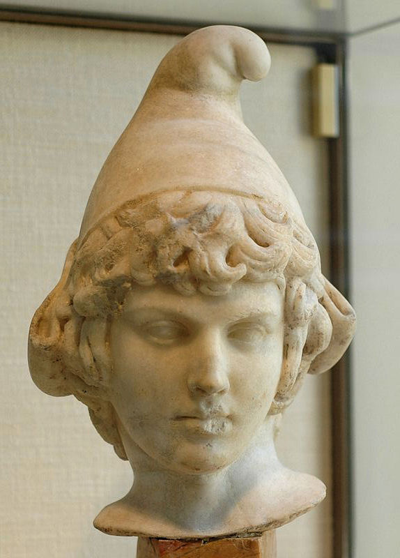
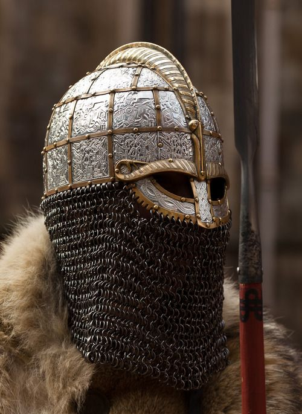

# The House Legions

Houses Cathak, Sesus, and Tepet are _military Houses_, which are permitted by
Imperial edict to raise their own legions. These legions are called _House_
_legions_ to distinguish them from the Empress' own Imperial legions.

House Cathak and House Tepet maintain eight legions apiece. House Sesus
maintains six.

## Purpose of House Legions

House Legions are a huge investment on the part of the military Houses. They are
also a professional military force raised within the Realm beyond the Empress'
direct control. Why does this system continue?

### House Motivations

The Houses benefit from the House legions in myriad ways, but mostly in
prestige, concrete power, and respect. All three Houses have a strong military
history, so a lot of the legions are based on pride and history, but there are a
few major benefits to maintaining them.

The military Houses all have the authority to use violence under the law. That's
an important and valuable thing. Having House legions is expensive, but it is
also a huge and powerful advantage. Nobody is going to cause too much trouble
with a military House, because they rely on the military just like everyone
else.

Military legions are also impressive. They are big, tangible displays of the
House's power and ability to organize and train. It is impossible to see a
legion and not recognize the power behind the House that can raise it. That is
a valuable position to be in for three large Houses that want respect.

### Imperial Motivations

The Empress benefits from the House legions in two major ways.

First, the House legions help her to defray the cost of maintaining her
military. The military Houses take on the burden of paying the salaries and
transport costs of their legions, which otherwise the Empress would pay. She has
enough huge legions and complicated bureaucracies to pay for. Any deferal of
those costs is helpful.

Second, the House legions help keep unauthorized militaries down. It is actually
not very hard to levy a legion of peasants -- _keeping_ them is hard, _training_
them is hard, but getting bodies in line is not particularly difficult. If all
Houses were forbidden from doing so, the Empress would be the only source of
authority that could deal with these uprisings and militaries.

By allowing _some_ Houses to raise legions, she establishes a precedent of
permission. Cathak, Sesus, and Tepet are very invested in maintaining their
exclusive permissions. They are eager to help the Empress deal with any unlawful
militaries, because it makes their legions more valuable.

## Function of House Legions

The House legions pledge their loyalty to their House. They serve many of the
same functions as the Imperial legions: conquering new territory, defending
existing holdings, and dealing with uprisings and wars. The Empress occasionally
requests their assistance where the legions are spread thing.

The major difference for the House legions is that the House legions, held in
private by the military Houses, can be hired by the other Houses for specific
duties, either as a complete legion or being broken up into hired dragons. Many
of the House legions spend their time on loan to other Houses. Cynis and Ragara
sometimes hire the House legions to protect important assets. V'neef and Peleps
occasionally hire the House legions for joint land/sea actions.

## Structure of House Legions

The structure of the House legions is the same as the Imperial legions: 5,120
soldiers arranged into eight dragons, etc.

House legions have slightly more Chosen per legion; young officers unready for
dragon command are appointed to command special forces talons or sometimes the
first talon of the first dragon, to allow them field experience before being
promoted to higher command. The chief physicians of the House legions also tend
to be Dragon-Blooded, to better protect the House's investment.

### Janissaries

The Imperial legions make occasional use of janissary forces, but the House
legions are the ones who get the most mileage out of janissaries. The military
Houses make a special effort to gain authority over satrapies with useful local
military traditions. Although obviously such traditions are rarely valuable for
integration into the legions proper, they are useful in specialized
circumstances.

## Cathak Legions

House Cathak commands eight legions, and has a military heritage tracing back to
the 3rd Century. Based in Myion and influenced by the local military culture,
the Cathak legions have been influenced by the Daoshin climate, Merchant
Federation mercenaries, and House Cathak's own pursuit of glory.

### Cathak Legion Culture

House Cathak is deeply competitive, and that drive for competition permeates the
legions. A Cathak is measured by her victories. A Cathak soldier likewise gains
glory and standing from success in battle. The focus of Cathak's military
culture is glory -- arete and excellence are valued above all else.

For footsoldiers, glory is defined not by one's individual skill with arms, but
instead by one's quality and mettle as a soldier. The brass hand out the most
prestigious awards for performance in battle based on holding formation and
standing firm, not from killing the most. A famous story tells about a young
mortal Cathak footsoldier who crawled through broken glass and raksha winds so
that she would die in her rank and file with her talon. _This_ is the essence of
Cathak glory: excelling in formation.

Cathak discipline is based on the old ways of Myion. The peoples of the Daoshin
Peninsula are famous for their deep and bitter rage. Cathak military training is
focused on harnessing this rage for competition and battlefield fury, putting it
to productive use. Cathak legions fight with a terrifying passion, focused fully
on the glory and thrill of battle.

### Cathak Legion Traditions

Whenever a Cathak legion is camped, you can expect to find huge swathes of land
set aside for sports. Boxing rings and wrestling spaces are set aside for
physical venting, although boxing is often called off when it becomes too rowdy.

Cathak legions have a universal practice known as _calling_. In the time leading
up to an expected battle, the Cathak soldiers will make boasts of feats they
plan to accomplish in battle, such as striking the first blow for their unit,
and so forth. Any individual who accomplishes their boast is lauded with praise
and glory.

When time comes to dispose of the dead, it is traditional for every member of
the deceased's scale to throw a coin onto the body as it passes.

On the first night after the first full day at camp, new legionaries are hazed
by boxing with any and all challengers. The total number of challengers defeated
before the individual is knocked unconscious is called their _stand_, and higher
stands are sources of pride even late into the career. Emerging from one's
hazing without a broken nose is a sign of cowardice.

### Cathak Legion Gear

Cathak legion gear is influenced by the native military traditions of the
swampy, hot Daoshin peninsula. Many of the Cathak infantry forego armor and
instead rely on their shield; these choose to wear simple red or yellow tunics.
Some legionaries wear red, blue, or yellow conical hats, with a distinctive bend
at the top.

In addition to spears, Cathaks occasionally wield native weapons of the Daoshin.
Some supplementary forces wield axes, used for cutting down horses; throwing
hatchets are also a tradition of the Daoshin and occasionally used. Some of the
Cathak heavy legions wield zweihanders, the massive two-handed swords
originating from the city of Baolak on the peninsula.

### Cathak Legion Janissaries

Cathak employs a variety of janissaries from their primarily Southern holdings.
The most famous of these are the Harborhead skirmishers, who are probably the
most famous unit of janissaries, period. The Zebremani battle-alchemists provide
a truly unique advantage with their skill at their strange art. And the
spindly Fragrant Lily Archers, though mutated and exotic, provide unrivaled
ranged coverage for Cathak's primarily formation and melee-focused forces.

#### Harborhead Skirmishers

The **Harborhead skirmishers** are immediately distinguishable by their
beaded hair, plumed helmets, and red, white, yellow, and blue chest-bearing
uniforms. Located to the south and east of the Isle, the satrapy of Harborhead
is one of the most famous satrapies in the Realm. The people of Harborhead have
always been devoted to Ahlat, the Southern God of War and Cattle, which lead to
a vibrant and admirable warrior culture that demands respect; even the Realm
recognizes the skill and valor of Harborhead's skirmishers. Harborhead
skirmishers are armed with spears and leather shields bearing images of bulls
and eagles. They wear heavy jackets, but always, men and women, bear their
breasts, a challenge to those who would do them harm.

The satrapy of Harborhead is proud of their janissaries, and train them not only
in the art of spear-fighting, but also in the art of masonry and mudworking.
Harborhead's great stoneworks are among the finest in the world, and this same
skill is cultivated in the janissaries. They are regarded by the Cathak Eighth
Dragons as among the finest camp engineers one can serve alongside, and are
more than qualified to supplement either the infantry or the Eighth Dragon as
needs demand.

Cathak legions are sometimes accompanied by as much as a whole dragon of
Harborhead skirmishers.

#### Zebremani Battle-Alchemists

Cathak legions _stink_, even more than the sweat and iron of a legion camp are
expected to stink. The smell arises from the Zebremani camp, where roiling pots
of vibrantly-colored liquid boil next to flayed carcasses of hunted beasts and
drying racks hang heavy with herbs. The **Zebremani battle-alchemists** wrap
themselves in layers and layers of gray cloaks, covered in gold and silver
embroidery of magical circles. They abandon gender and sex in pursuit of their
work, removing their genitals and decorating their bodies with mystical tattoos.
They capture their brews in gourds to smash easily on the battlefield, releasing
terrifying tricks like clouds of gas, roaring bonfires, or shining explosions of
flash-freezing air.

In addition to their battlefield tricks, the battle-alchemists are also famed
healers and chirurgeons. They keep the legions in good health. Because of the
service of the battle-alchemists and widespread adoption of their techniques,
Cathak legions have the lowest mortality rates of any of the Realm's military
units. A rare few Zebremani battle-alchemists have what they call the _wuunum_:
by imbibing strange potions, their bodies boil with sudden growth and they
become terrifying monsters turning the tides of battle, before they eventually
succumb to fever and organ failure.

The chief physician of the First Cathak Legion is Burn, a Zebremani alchemist.
In battle, they cast off their cloak, fighting naked. Their mystical tattoos
flash with Essence and crackling magic circles appear when they channel their
power.

Zebremani battle-alchemists serve in specialist talons. Of the 80ish
janissaries, about 10 or so are master alchemists certified by their order; the
rest are apprentices, or more realistically, teenagers and young adults pressed
by the Zebremani government into service as janissaries. Zebreman also has a
unique arrangement with House Cathak, considering units of reagents and
chemicals as "soldiers" for purposes of their tribute.

#### Fragrant Lily Archers

House Cathak prefers land holdings, but refuses to surrender the Fragrant Lily
Isles to Peleps and V'neef advances. The Fragrant Lily Isles are a strange place
in the west, verdant and growing thick with greenery. A handful of floating
islands with purple trees reveal the touches of the Wyld on the Isles -- but
that much is apparent from the natives. They are very tall -- usually nearly ten
feet -- and pale and thin, a little stretched and twiggy. Their thin arms hide
a powerful, corded strength that allows them to wield their huge bows.

**Fragrant Lily Archers** once served as the bodyguards of their monarch, but
now serve House Cathak as eagle-eyed marksmen. Their greatbows release gigantic
arrows, more like artillery than archery, but with pinpoint precision. Although
their strange appearance makes many new legionaries unsettled, they quickly
forget their qualms as soon as a well-placed Fragrant Lily bolt takes out a
whole row of enemy soldiers at just the right moment.

Two talons of Fragrant Lily Archers serve alongside the first and second
Legions. They are small in number and their deaths are mourned in the tradition
of Sextes Jylis, planting their bodies as fertilizer for a purple Fragrant Lily
tree.

## Sesus Legions

House Sesus is currently the smallest military House, commanding six legions.
They have a reputation as thugs and dishonorable cheats, a reputation not
entirely without foundation. House Sesus does not prize glory, like House
Cathak, or tradition, like House Tepet; they prize success. Their legions are
perfectly willing to engage in shady practices -- spycraft, psychological
warfare, lateral thinking -- to gain the upper hand and secure victory. To the
conservative Realm, this willingness to break with established norms makes House
Sesus' legions disreputable, but undeniably effective.

Despite their reputation, Sesus' legions are still effective machines of war.
Although admitting it pains Cathak and Tepet loyalists, House Sesus' focus on
loyalty and victory have made an effective fighting force.

### Sesus Legion Culture

The legions say, "House Sesus takes all comers," a phrase which takes on a
vastly different context. In some cases, especially when spoken by Sesus, it is
a statement of pride. Unlike House Cathak and House Tepet, House Sesus is happy
to make use of any person, no matter their background, who wishes to serve in
their legions. Without the monofocused glory culture of Cathak or the rigid
codes of Tepet, House Sesus' legions are home to everything from peasants to
criminals to their own scions. In other cases, it is said dismissively -- how
can a legion which takes all comers be respectable? And in yet other cases, as a
rowdy legionary is dragged away from her victim after a brawl, it is said with a
bit of both -- House Sesus takes all comers: they always put up a fight.

Like House Sesus itself, the Sesus legions are regarded as thuggish and
dishonorable, a reputation which is not helped by their cosmopolitan attitude to
recruitment. House Sesus cultivates a deep, deep loyalty among its legionaries.
They value loyalty and victory above all else -- in a Sesus legion, it does not
matter where you came from, only that you win. "Once a legionary, always a
legionary," the saying goes. House Sesus' legions are famous for their rowdiness
and terrifying skill in battle; a Sesus legion coming to a city is a terrifying
occasion, ending either in conquest or drunken revelry. The goal is cultivating
a sense of unity. The sometimes suicidal bravery of House Sesus' legions is only
possible because of the deep devotion the soldiers feel to one another.

In matters of camp, House Sesus offers a simple proposition: win and you are
allowed great freedom; lose often and you suffer the consequences. The officers
and leadership are completely happy to look the other way as their soldiers
engage in plenty of questionable behavior -- gambling, blasphemy, brawling -- so
long as the unit continues to win and their loyalty is without question. Firm
discipline is dealt out to those who fail, or those whose antics put the other
soldiers at risk. This lax attitude to punishment is also a major contributor to
the Sesus legions' less-than-stellar reputation.

### Sesus Legion Traditions

The Sesus legions have a long tradition of gambling in their off-time. Dice and
card games are extremely popular. Although the chaplains do not approve of this
indulgence, it is impossible to get Sesus soldiers to keep their coins in their
purse and off the table. Sesus legions also have a strong culture of drinking
songs and late night smoking.

Related to the gambling culture, the Sesus legions have developed a complicated
system of divination based on rolling 3 bone dice and interpreting the
outcomes. Pretty much every scale has a die-caster; die-casters with long
streaks of accurate predictions are acclaimed. Stealing another scale's dice is
a grave insult which demands retribution.

Sesus troops often engage in recreational flyting, the ritualized poetic
exchange of insults. A good flyter is believed to be lucky for her unit.
Sometimes before battle, the best flyters put together a straw mannequin of the
enemy and compete for the best insult to cheers from the crowd.

House Sesus' laxer policy toward policing the camp makes affairs between
legionaries more common -- although finding privacy is as difficult as ever. As
would be expected among House Sesus, a strong gossip culture exists among the
legions of who is hooking up with who and where. Whenever soldiers find a pair
engaged in fraternization, they do their best to steal the pairs clothes and
thus force them to streak or sneak back to camp.

Male Sesus officers are required to sport a large mustache and shave their
beards.

### Sesus Legion Gear

House Sesus favors very light armor for mobility. Most of House Sesus' legions
are active in the north, so their armor reflects this, with fur hats and thick
warm trousers. The legions also prefer dark clothing where possible. Sesus
helmets are distinctive -- they resemble metal caps more than helmets, have
coverings that protect the area around the eyes, and a "beard" of protective
material that falls down over the mouth and neck. Here is a Sesus helmet for a
Dragon-Blooded officer:

The martial tradition of House Sesus includes an emphasis on archery that is
lacking in the other military Houses. Rather than Wàn crossbows, the Sesus
legions train with more traditional bows and arrows. They also prefer curved
swords over the shorter swords favored by Cathak and Tepet.

### Sesus Legion Janissaries

Most of House Sesus' holdings are in the north, so most of their janissaries are
northern. The armored swordsmen of Cotá supplement Sesus' lighter and more
nimble infantry. The poison-swallowers of D'Dena have been transformed and serve
Sesus as assassins and spies. Lastly, the hammer-wielding pelt-covered forces
from Herald are a force of intimidation and overwhelming force when Sesus' more
subtle methods prove ineffective.

#### The Swordsmen of Cotá

The northwestern satrapy of Cotá produces huge amounts of iron and steel thanks
to the riches of its mountains. The Queen of Cotá bedecks her janissaries in her
nation's wealth. Cotanese steel is lighter and stronger than comparable steel
and has a distinctive wavy pattern. The Cotanese janissaries carry heavy iron
javelins called _soliferrum_, but their true skill lies in buckler-and-falcata,
from which they are famously called the _Swordsmen of Cotá_.

The swordsmen of Cotá are to House Sesus what the Harborhead skirmishers are to
House Cathak. Cotá is a large and successful Sesus satrapy with a strong local
warrior tradition, which makes their janissaries especially effective. Sesus
uses the Swordsmen of Cotá for two purposes: ambush and direct conflict.

The swordsmen of Cotá are useful forces on the battlefield, unafraid of enemies
and confident thanks to their powerful armor. They favor opening with a javelin
volley, then closing in with their curved falcata swords. However, the Cotanese
perform best when they are able to establish an ambush. Owing to their native
mountains, the Cotanese are experts at guerilla warfare and getting the drop on
their opponents -- tactics that suit House Sesus just fine.

A dragon of swordsmen is not uncommon. Among these, the first talon are likely
to be armored with their native steel; the rest make do with lesser armor. About
two talons are unarmored and used as scout and ambush forces.

#### D'Dena Poison-Swallowers

The satrapy of D'Dena is lush despite its cold climes, sustained by a powerful
wood demesne and a strange machine buried deep beneath its soil. D'Dena grows
heavy with trees, and from these trees leap poisonous sap, which the people of
D'Dena gather up and refine into syrup. The bravest among them drink the
syrup, and are imbued with visions and strength, if they survive. Before House
Sesus came, these poison-swallowers formed the elite of D'Dena's native forces,
and now they serve House Sesus as assassins and spies.

D'Dena poison-swallowers have a sixth sense about them which alerts them to
danger, and, when they imbibe their poison, receive visions that they believe
are prophetic. Over time, they develop a resistance to their poisons, which
allows them to use the poisons more regularly. They are very skilled at
infiltration and gathering information; their senses are heightened by their
poisons to much higher than normal humans.

Formally, the D'Dena poison-swallowers are scouts, talons of their forces
attached to various legions to act as intelligence. Poison-swallowers rarely
take part in direct combat; when they do, they participate with javelins and
podao, spear-swords with hafts equal in length to the blade. Their armor is
often made from D'Dena diamond-wood, which can be tempered to be nearly as
hard as steel.

#### Herald Hammermen

The satrapy of Herald is one of Sesus' most distant holdings, and home to a
brutal and rugged people used to the cold. They swear themselves not to spear or
sword like most of creation, but instead to the heavy head of a reliable hammer.
The Herald hammermen wield two-handed hammers as effectively as the Cotá
swordsmen wield their blades or the Harborhead skirmishes wield their axes. With
heavy armor and smashing weapons, the hammermen are a fearsome battlefield
presence.

They usually wear lamellar armor with Sesus-style helmets, and heavy with furs
and pelts. The Heralds view bears in particular with extreme reverence; their
mightiest commanders forego metal helmets to wear bear heads prepared as caps.
The Herald hammermen train with two-handed hammers and throwing hammers; their
fighting style relies on overwhelming force.

A dragon of Herald hammermen serves alongside the first Sesus legion, and a
talon or so can be found accompanying each of the other legions. In preparation
for battle, the Heralds smear their faces with black tar and white paste, giving
themselves visages like skulls. Their beating drums fill the heart with fear,
doubly so for any wise enough to know that ringing strikes surely follow.

## Tepet Legions

House Tepet was the very first House, the first military House, and traces its
lineage back to the Shogunate and even earlier. Cathak and Sesus are children
compared to Tepet. The Tepet legions keep the legacy of the House's ancient
heritage with strict codes and honored traditions. The Old General himself laid
down the foundations for the House's Melaist bent and strong sense of duty.

### Tepet Legion Culture

Honor and adherence to tradition are the defining traits of House Tepet's
military culture. The House defines honor in the Tepet Code: the values of
courage, duty, discipline, compassion, honesty, tradition, and humility. Every
recruit, no matter how lowly, swears an oath upon joining, to uphold the virtues
of the Tepet Code without question and serve dutifully at every turn. To House
Tepet, an honorable defeat is preferable to a dishonorable victory -- victory
can always be seized in the future, but honor, once lost, can never be
reclaimed.

When Tepet goes to war, their first thoughts are not stakes and goals, but
whether or not the war is right. Tepet does not accept unjust wars -- there is
no honor in fighting without being in the right. Generals who march to war to
gain territory or seize a valuable asset are greedy and foolish -- a righteous
general marches to defend the Realm, to protect traditions from corrupting
influence, and to end cruel regimes. Tepet always fights for a purpose.

At the infantry level, Tepet soldiers are the most disciplined, the most
educated, and the most scrutinized. Footsoldiers are trained to recite passages
from the _Thousand Correct Actions_ alongside their combat drills. Officers of
the Tepet legions are often able to quote the entire book from memory, and are
provided with a woodblock-printed copy bound in red leather by the House when
they reach their second term. Infantry and officers alike are expected to
maintain all the formal traditions and regulations of the legion, no matter how
minor. Officers reguarly inspect the tents of their soldiers for deviations and
failures to live up to code.

Finally, House Tepet demands perfection. For Cathak and Sesus, the expectation
is that an officer will have a reasonable but flexible plan, and adjust their
approach as the situation demands -- adaptability is valuable. By contrast,
Tepet culture expects your first and only plan to be the perfect one. An officer
is expected to make a plan based off of the wisdom of the _Thousand Correct_
_Actions_ and her confident awareness of the situation based on her scouts and
observations. Then, she executes her plan flawlessly. No Tepet officer would
ever admit to improvising -- such would imply that her plan was less than
perfect. Naturally, all sudden shifts in approach were _certainly_ considered
beforehand...

### Tepet Legion Traditions

The Tepet manuals define protocols for many different situations in camp, and
Tepet's legionaries are expected to follow these protocols, even the obscure
ones. Legionary officers sometimes prank new recruits by citing non-existent
protocols; but they do so carefully, without catching the disapproving glare of
their own superiors.

Tepet legionaries have developed a superstition about bird feathers, supposedly
representing a connection to Mela, the Immaculate Dragon of Air. Many
legionaries wear lucky feathers on their belts. Feathers which have proven
themselves lucky by surviving several combats are valuable commodities for
trade among the legionaries.

Tepet legions are widely devoted to Mela. Their chaplains do the best to root
out Mela cults, but Mela -- especially in her aspect as Mela Perilous -- is a
common object of worship among House Tepet's legions. Many of the legionaries
have carved icons of a fan or a dragon as protective symbols against evil.

Tepet legion cooks do not prepare red meat, only poultry, in accordance with the
dietary restrictions of the Earth and Heaven Harmonious Orthodox lineage which
most Tepet adhere to.

### Tepet Legion Gear

House Sesus favors lamellar over the usual buff jackets of many of the Realm's
other legions. Likewise, Tepet legions use a straight yari without adornment,
unlike many of the other legions, which use sarissas or crescent spears. They
also carry short swords in the Cathak style. Otherwise, Tepet's gear is mostly
as you would expect -- they don't even have silly hats or weird helmets like the
other military Houses.

### Tepet Legion Janissaries

House Tepet are devout Melaists, and believe in the importance of uplifting the
communities which answer to them. For this reason, they employ more janissaries
than any of the other legions -- the goal being to cultivate warrior practice
among both the satrapies and the House.

Tepet's most famous janissaries are the terrifying Medoan heavy cavalry, a force
whose lightning hooves send whole cities quaking. Tepet also makes use of the
unusual weaponry and martial arts of the people of Pha. The slingers from
Shə are said to be able to bring down a war elephant with a single shot.

#### Medoan Heavy Cavalry

The Medoan heavy cavalry are trained from youth in the art of horsemanship. They
are taught to ride as soon as they are able, and grow up wearing armor and
carrying lances. The Medoans have never been an easy satrapy, and their local
warrior tradition of mounted combat even stymied Tepet himself during his first
attempt to conquer them in the First Invasion of the Scavenger Lands. In the
interim, the Medoans have come to hate House Tepet slightly less than the rest
of the Realm, and Medoan heavy cavalry have become an integral feature of House
Tepet's legions.

The Medoans are easily identified by their heavy armor, the intense barding of
their horses, and of course the huge lances that they carry. The Medoans wear
gigantic, almost comical, feathers on their helmets. They are surly and grumpy
people, with a reputation for causing trouble at camp.

#### Pha Levies

The people of Pha are mostly fisherfolk and farmers, so when their first levies
arrived for House Tepet, the House did not know what to make of them. It seemed
Pha had little martial tradition to draw from. The House prepared to deal with
another Luqai unit, more Thornsish -- that kind of sloppy janissary that offers
little for their legion. To House Tepet's surprise, the peasants of Pha were no
slouches. They _had_ a local military tradition, but one that looked unlike any
that Tepet had seen before.

The soldiers of Pha don't train in spears, swords, armor, or shields. Instead,
they make do with peasant's tools repurposed for war. The people of Pha fight
with axes, grain-threshing nunchucks, sickles, and even oars, sharpened on the
side to deliver blows. Although Tepet still doesn't really know what to do with
the Pha, they hold their own well enough in combat, so Tepet is happy to have
them. House Tepet has even studied the Pha's unique combat styles, hoping to
learn more about how warfare devels in society.

#### Shə Slingers

The Shə Islands are located south and west of the Blessed Isle, somewhat in the
direction of An-Teng but not so far. Temperate and fair, the Shə people are
mostly shepherds, tending herds of goats and giant lizards. The Shə use slings
to fend off predators from their flocks -- and truly there are no better
slingers in the world. Every Shə child learns to sling from a very young age --
some Tepet observers even claim that once a child is old enough, the parents
will hide baskets with their food in it in high branches and the children are
not allowed to eat until they sever the rope with a bullet. It is traditional
for a young adult to receive three slings of different lengths on her coming of
age.

Slings are a weapon often looked down upon in the Realm, where "real" weapons
like spears and swords are the norm. House Tepet shares no such delusion --
especially not after the first commander sent to capture the Shə Islands had her
head explode like a melon thanks to a well-placed shot from the barricade. The
slingers are few in number (Shə is not especially populous), but valuable and
assigned as widely as possible among the Tepet legions.
