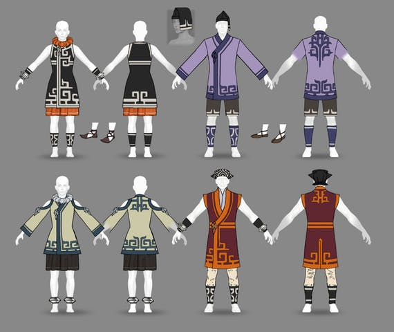
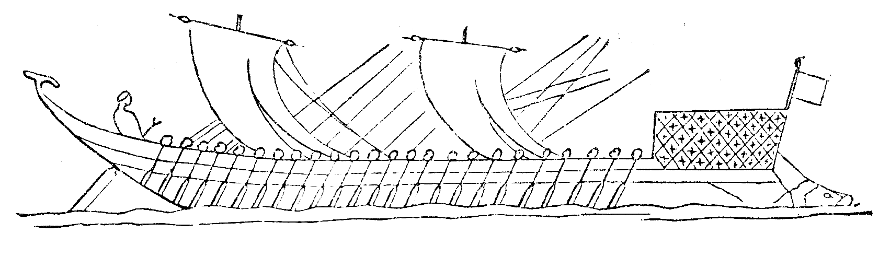
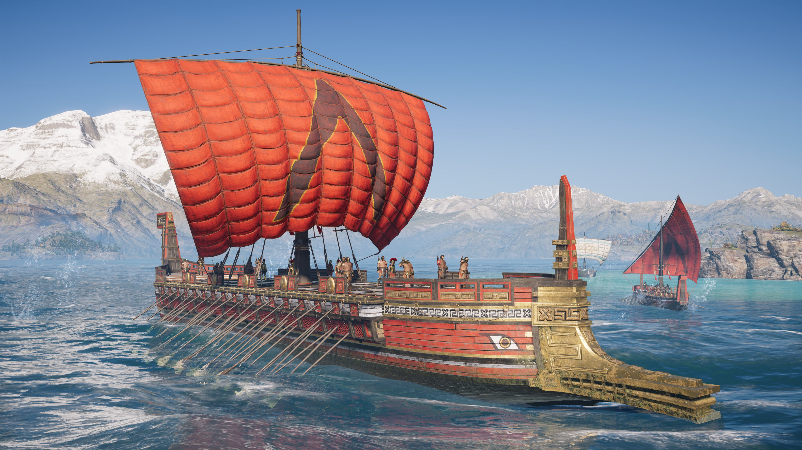
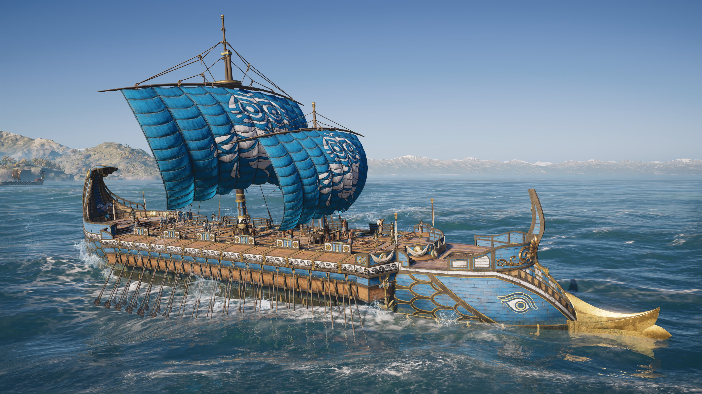
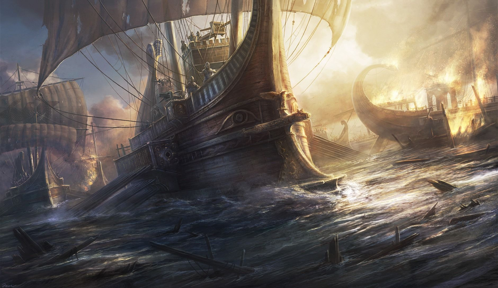
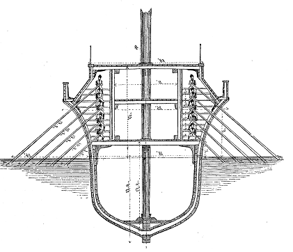
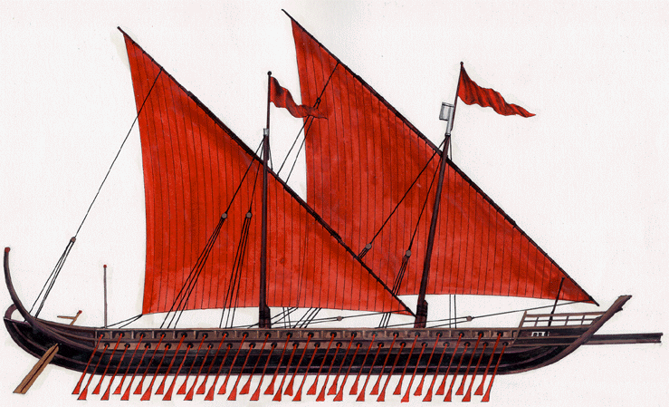
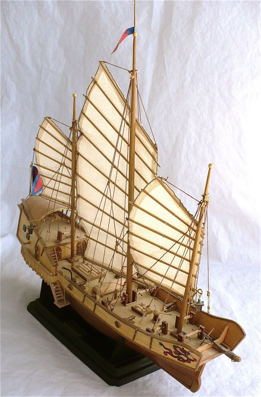
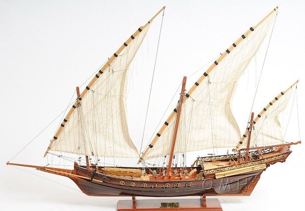
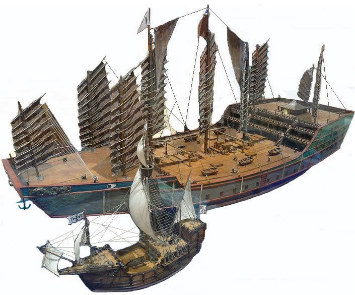

# The Imperial Navy

The Imperial Navy is the Realm's military presence on the water. The Navy and
House Peleps are synonymous; House Peleps is solely responsible for the
administration of the naval forces. The Imperial Navy consists of thousands of
boats spread across the Inland Sea and the Great Western Ocean and employs a
staggering number of sailors, marines, and support staff.

## Her Radiance's Charter of the Imperial Navy

The Empress' formal charter of the Navy outlines its primary duties and general
structure. She tasks the Navy with three main tasks: to secure the Realm's
waters from enemies foreign and domestic; to guarantee the safe and effective
traversal of the waters by official boats; and to expand the Realm's holdings by
conquest of overseas territories.

The service of the Navy is an expansive task, which the Empress assigns
exclusively to House Peleps. In support of House Peleps, the Empress' ministries
contain a few organizations tasked with Imperial oversight of the Navy, such
as auditing ledgers and coordinating naval escorts of high-value Imperial
interests. Overall, House Peleps is allowed incredible leeway when it comes to
running the Navy, as long as they pay their sailors, protect the targets they
have to protect, and keep the pirates under control.

## Rightly Guided Admiralty Board

The commanding body of the Imperial Navy is the Rightly Guided Admiralty Board,
headed by the First Sea Lady. The Admiralty Board is composed of a dozen or so
of the Navy's most experienced and respected admirals, who collectively set the
policy and engagements of the Imperial Navy. The Board meets in total once a
year at the Isle of Wrack, in the deep winter, to plan the next year. For the
rest of the year, the Ladies Nautical of the Board operate independently or in
committee on specialized aspects of the Navy.

Like much of the Navy, the reality of the Board and its theory diverge.
Technically, any admiral of any sex, background, or House is eligible to serve
on the Admiralty Board. In reality, the positions on the Board are reserved
almost exclusively for female Dragon-Blooded natural-born Peleps. Likewise, the
First Sea Lady is technically elected by the Board from any of its members --
but in practice, the First Sea Lady is the heir daughter of the Peleps
matriarch.

### Ladies Nautical

In addition to the _First Sea Lady_ -- the highest officer in the Navy and
direct report to the Empress herself -- the Ladies Nautical of the Board are
assigned specific authorities in the details of running the Navy.

The _Second Sea Lady_ is the second authority after the First Sea Lady, and
usually responsible for running the Admiralty while the First Sea Lady is away
at the Imperial City to answer to the Empress. In many respects, the Second Sea
Lady is more directly relevant to the life of an average sailor, since she
usually administers a greater fraction of the daily operations of the Navy.

The _Third Sea Lady_ is also known as the _Respected Comptroller of the Navy_,
or simply the _Comptroller_. In addition to serving as comptroller -- auditing
the books for profit and loss and ensuring that payroll and expenses are within
operating boundaries -- she also oversees the Navy's production: boatbuilding,
boat repairs, and producing materiel are all under the authority of the
Comptroller.

The _Fourth Sea Lady_ is also titled the _Rightly Honored Chief Quartermaster_
_of Ship and Shore_; in conversation, the Fourth Sea Lady is usually just called
the _Chief 'Master_. Her department, the _Supply Office_, is responsible for the
Navy's logistics and purchasing. The Supply Office makes sure that all of the
Navy's soldiers receive their food and water, that new sails arrive to port in
time, etc.

The _Fifth Sea Lady_ heads the _Staff Office_, which handles recruiting,
promotions, awards, and other aspects of the human resources of the Imperial
Navy.

### Grand Admirals

Also seated on the board are five _Grand Admirals_, who are tasked with the
command and oversight of the [directional fleets](#directional-fleets).

### Other Ladies Admiral

The remaining members of the Board are known as the Ladies Admiral, and oversee
specialized operations of the Navy or are simply respected commanders of the
most important fleets. Beyond the composition of the Ladies Nautical and the
Grand Admirals, the exact size of the Rightly Guided Admiralty Board can vary,
but usually consists of about sixteen to eighteen admirals.

### Deputy Admirals

Each sitting admiral of the Board also has a rear admiral who can sit in for her
when her duties require her to be elsewhere. These _deputy admirals_ are much
more common to find at any given meeting of the Board, since the admirals
themselves are often busy. Deputy admirals also usually sit in on hearings for
which the actual admirals are unable to attend. The deputy admiral is thus a
highly desireable position, with authority but little direct responsibility
beyond acting in the best interest of the admiral; this position is often filled
with the admiral's chosen successor, heir apparent, or other such favored
individuals.

## Structure of the Imperial Navy

### Five Directional Fleets

A _directional fleet_ is the largest unit of division of the Imperial Navy. The
Imperial Navy operates five directional fleets:

- the _Earth Fleet_, which patrols the bays, rivers, and coast of the Blessed
  Isle;
- the _Air Fleet_, which operates in the northern ocean and the White Sea;
- the _Wood Fleet_, which operates between the Isle and the Scavenger Lands and
  in the rivers of the Scavenger Lands;
- the _Fire Fleet_, which operates in the southern Inland Sea; and
- the _Water Fleet_, which operates on the Great Western Ocean.

Except for special detail fleets, all fleets operate as a part of one of the
five directional fleets. Each directional fleet is commanded by a
[Grand Admiral](#great-admirals).

### Fleets

A _fleet_ is the broadest unit of organization a typical soldier deals with in
any meaningful sense. The fleet is the naval equivalent of the army. A fleet is
commanded by an admiral, vice admiral, or rear admiral.

### Flotillas and Squadrons

A _flotilla_ is a formation of warboats which constitutes part of a larger
fleet. The flotilla is the largest unit that an average sailor ever really deals
with consistently. A flotilla is usually commanded by a rear admiral or a
commodore depending on the flotilla's mission and prestige.

A larger flotilla under the command of a vice admiral is often called a
_squadron_.

### Individual Boats

The smallest unit of the Navy's organization is the individual boat. An
individual boat is commanded by a _captain_ and administered by her supporting
officers. A flag commanded by the commanding officer of a formation is called
the _flagship_, because it flies the flag of the commanding officer.

## Naval Equipment

### Uniforms

The Imperial Navy is one of the only navies in Creation to have standardized
uniforms rather than sailors serving in whatever they happen to own. Like a
legionary's equipment, an Imperial uniform is purchased with funds subtracted
from the first several paychecks of service until the cost of the uniform is
recouped by the Navy.

Uniforms come in a variety of styles depending on the fleet and weather, but
always consist of dark undergarments, a breasted jacket, and sandal-shoes for
grip. Soldiers often add hats in a variety of styles to keep the sun off. In
the warmer fleets, uniforms are made of light cloth for the hot weather; in
colder fleets, the uniforms are heavier and long-sleeved for warmth.

While working, many sailors open their uniforms to expose the chest and tie the
garment around the waist. This has lead to working sailors sometimes being known
as _belters_ for the belt-like appearance of the jacket tied about the waist.

Sailors must provide their own garments for off-duty rest time and shore leave.

### Personal Equipment

Sailors are issued utility knives and a few able seamen are equipped with
broadswords in the event of boarding action. The boat's archers are also
equipped, naturally, with bows, arrows, and fire oil.

Sailors serving aboard combat vessels are mostly rowers. They are issued no
personal armament. Their rowing spaces have space beneath the seat to stow a
hammock; many sailors wrap their few personal belongings in this hammock so that
they can have them available when ashore and setting up the hammocks.

Larger non-combat ships have below decks, and thus space for sleeping aboard.
Bunks, rations, and most necessities are supplied by the ship as a benefit of
service. Sailors keep their personal posessions in canvas bags which can be
stored in or beneath their bunk hammocks.

## Directional Fleets

Although huge, the directional fleets are coherent enough to discuss in broad
terms.

### The Earth Fleet

The Earth Fleet's primary mission is the defense and security of the Blessed
Isle's shores and waterways. To that end, it regularly patrols the coast and
rivers, and serves mostly as an anti-pirate force in coordination with the
Merchant Fleet. On the sea, the Earth Fleet operates a few large galley
flagships, but focuses mostly on triremes, well-suited to the placid coastal
waters of the Isle. For river operations, the Earth Fleet stages penteconters,
twenty-five rowers to a side, and biremes; the Imperial, Caracal, Snow, and
Serpentine rivers are so large that they feature some of the same boats as seen
on the seas. In addition to the fighting boats, the Earth Fleet also operates an
array of smaller craft for navigating shallow rivers or steep gorges. The
Fleet's flagship, the _Ivory Pagoda of Pasiap's Wisdom Upon the Waves_, is the
only baochuan in the Earth Fleet.

The Imperial City is home to the administrative offices of the Earth Fleet, but
calling it a home port would be misleading. The most important business of the
Earth Fleet -- trials involving infamous pirates or Dynasts turned to
privateering, and mutinous captains returned to the Isle for a court-martial --
are delegated to the Imperial City. The day-to-day business of the Fleet,
however, takes place in ports throughout the Isle, wherever the Fleet's boats
might be docked.

The pennant of the Wood Fleet is white, with three black chevrons arranged in a
triangle.

The current Grand Admiral of the Earth Fleet is Peleps
Eralin, called the Sea Witch. A cruel-eyed old woman and a powerful sorceress,
the Sea Witch despises House V'neef almost as much as the pirates she must
collaborate with them to hunt. She is always accompanied by her "mussels," a
pair of foreign-born Princes of the Earth that serve as her bodyguards and
enforcers. In her advancing age, Peleps Eralin has grown increasingly pious, and
now practices in the Earth and Heaven Orthodox Lineage of House Tepet, which she
has invested her own time and resources to foster among the Earth Fleet.

Earth Fleet sailors are looked down upon by the other fleets, simultaneously
considered hoity-toity and unworthy of respect. The other fleets regard the
Earth Fleet as a bottom-rung posting for those with little potential, or a cushy
reprieve for spoiled scions whose families do not trust them to leave home. For
their part, the Earth Fleet play up their stereotypes, eager to brawl with all
and sundry, and relentlessly pranking and humiliating the sailors from other
fleets.

### The Air Fleet

The Air Fleet is the most diverse directional fleet in the Navy, and second in
size only to the Wood Fleet. Operating in the northern direction, the Air Fleet
encompasses three active operational zones. In the northern stretches of the
Inland Sea, the Air Fleet resembles the other directional fleets, fielding
triremes and bright-eyed dromon on the relatively calm waters. Further north,
the Air Fleet sends its forces aboard hulking liburna and polyremes to war
against the Sea's rival powers. Lastly, in the northwest -- especially the
Alarian Bight and the Yasari Sea -- the Air Fleet sails naos on the blue water.
In all three fields, the Realm's famous baochuan proclaim the Empress' might.

The Air Fleet's home port is House Sesus' home city of Chanos, where the Grand
Admiral keeps her offices. It also maintains remote operating centers for its
forces further abroad. Grieve, with its tamed lynxes and white stone walls, is
the staging point for the fleet's activities in the White Sea, holding control
over the narrow northern outlet of the Mournful Sound. And the balmy head of
distant Fajad, the burning jewel in the snow, is home to the Air Fleet's most
remote operations center, responsible for their oceanic forces. Fajad is not
only the westernmost port of the Air Fleet, but also the northernmost port of
the Water Fleet; the docks are unofficially divided into Air and Water
territories, and brawls fill the street when both fleets meet ashore.

The pennant of the Air Fleet is a rich blue, with a silver fan.

The Grand Admiral of the Air Fleet is Ragara Feria, who, along with Ledaal
Tsalin and vice-admiral Cathak Ironhawk, is one of the most powerful non-Peleps
in the Imperial Navy. As shrewd as her name suggests, Ragara Feria is the Grand
Admiral most active in her fleet's operations; she is often seen hurling onto
enemy boats on gouts of fire, her axe in hand for the enemy skull. She commands
unwavering loyalty and admiration from her officers.

Sailors of the Air Fleet are frozen from their time in the cold, windy north.
They have a reputation as grumpy and gloomy, and are infamous for their
exaggerations -- even moreso than other sailors. Air Fleet captains sometimes
punish their most troublesome or heinous crew with _Mela's Trial_: to be
sent in one's skivvies to spend the night exposed atop the mast.

### The Wood Fleet

The Wood Fleet is the largest directional fleet in the Navy, numbering 1500
boats, slightly larger than the Air Fleet. Its operational area covers the east
and the Scavenger Lands, from Medo in the north as far as nearly to Kirighast
in the south. This stretch of the Inland Sea is one of the most
heavily-trafficked expanses of open water in Creation, given that it connects
both the densely-populated eastern Isle and the River Province. On the sea, the
Wood Fleet operates a standard accoutrement of triremes, polyremes, and command
baochuan, as well as a few remnant ships from the Realm Before. Beyond the sea,
the Wood Fleet also operates in the rivers of the near east; although the River
Province and the mighty Yanaze are denied to the Navy, the sprawling network of
minor rivers is host to penteconters and light craft flying the Wood Fleet's
penant.

The Wood Fleet's home port is the city of Sdoia, just south of the Imperial
City. The real heart of the fleet, however, is the Evening Isles and the city of
Gloam. Gloam is not only the hub of Isle-River Province trade, but also a vital
staging point for action against aggressive near-east powers. The Wood Fleet
sees plenty of active combat from putting down rebellions, fighting off pirates,
and waging war against coastal and riverine powers seeking to oppose the Realm;
all of these operations rely equally on Gloam as a staging point.

The pennant of the Wood Fleet is verdant green, with a golden flower.

The Grand Admiral of the Wood Fleet is Peleps Po-Lin, a terrifyingly ambitious
woman and very young for her position. Po-Lin has never been satisfied with the
duties of an Admiral; her heart is not in paperwork and administration, and she
desires more than supervising the fleet. Po-Lin is known to lament (sometimes to
her crew, when she is inebriated) that she was born to the wrong mother, and her
rightful position as First Sea Lady is denied to her. Physically, Po-Lin is a
titanic seven feet tall; her flagship, the _Iron Will of Sextes Jylis Arrayed_
_Against Falsehood_, has specially-sized doors just for her. She has a voice
that can knock down walls and limbs like tree trunks; her nickname, the Giant of
Gloam, is well-earned.

All sailors are superstitious, but the sailors of the Wood Fleet especially so.
The Fleet is famous for scraping out of battles with fewer losses than they
ought to have taken, a phenomenon which the fleet's crews have built an arcane
system of lucky practices around. The most widespread practice is to embed a
coin in the main mast whenever a boat sets out from port; once the boat returns
safely, the coin must be thrown overboard in a nighttime ceremony.

### The Fire Fleet

The Fire Fleet's two primary areas of operation are the southwestern shores and
the Gulf of Glass, the southern edge of the Inland Sea. The Gulf of Glass is
likely the safest and calmest body of water in all Creation, with the only major
dangers being the occasional small band of pirates or -- for the Realm --
privateers under letters of marque from the Exilarch of Arjuf-Across-the-Sea. In
these waters, the Fire Fleet operates biremes and triremes. The southwestern
ocean, by contrast, is a dangerous place of pirates, aquatic beast-folk, and
ancient sunken ruins. The Realm's holdings in the Southwest are all coastal or
inland, which means that the Fire Fleet does not operate deep-sea vessels on the
southwestern ocean. This operational area is mostly dromons and a few baochuan.

The Fire Fleet's home port is the city of Arjuf, which the fleet uses as a
staging point for its tight control of the Strait of Arjuf. Although the
Exilarch would never be so stupid as to attack the Fire Fleet or its home port
directly, the fleet must keep a careful eye for privateer forces from
Arjuf-Across-the-Sea harassing freight. The city of Chiaroscuro is the Fire
Fleet's major port on the Gulf of Glass, and the fragrant ports of An-Teng are
the fleet's staging points into the southwestern ocean shores.

The pennant of the Fire Fleet is maroon, with five golden candles.

The Grand Admiral of the Fire Fleet is Peleps Lü Squall, who proves that hard
work, determination, and focus can make up for a lack of raw talent. Squall is
not a great commander, and delegates most of that business to her rear admirals.
She is not a great strategist, and sticks very firmly to the established,
successful tactics of the Peleps archives. She achieved greatness through
persistence and labor. Squall has no fancy tactics, but her diligence in
applying established wisdom gives her one of the lowest loss records in Peleps
history. She has no great charisma, but her careful book-balancing makes sure
that success is rewarded and failure punished, so her people succeed. Her
allies may tell her she is wound like a string and ready to snap at any moment,
but Peleps Lü Squall has served very effectively as Grand Admiral for a very
long time -- and the string has not yet broken.

The Fire Fleet is a very desireable posting in the Navy, because it has very
interesting ports and pretty low risk. Admiral Squall's leadership keeps it
disciplined and focused, so sailors who emerge from the Fire Fleet are desired
by other captains, increasing its prestige. The Fire Fleet observes an elaborate
ceremony for pollywogs who "cross the line" for the first time, rounding
An-Teng and formally departing the Inland Sea. The ceremony is degrading and
treasured.

### Water Fleet

The Water Fleet was, historically, one of the smaller fleets, dealing mostly
with pirates and rebels in the Western Isle's many islands and the small
satrapies in the near reaches of the Great Western Ocean. The discovery and
conquest of Wu-Jian last century changed that fundamentally. Now, the Water
Fleet has grown in size to nearly rival the Wood Fleet, as the Realm scrambles
to conquer the new Western frontier. The Water Fleet operates almost exclusively
on deep water. More than any other fleet, it fields ships like naos, junks, and
mighty baochuan. Among the narrow straits of the Western islands, it fields a
typical complement of dromon and galleys. A powerful Water Fleet squadron might
consist of a commanding baochuan, a trail of junks carrying water and food to
supplement the baochuan, and a maneuverable security fleet.

The home port of the Water Fleet is the Peleps capital of Bittern, on the
western shore of the Isle. Water Fleet ships are commonly seen throughout the
western Isle's many archipelagos. Further west, the city of Wu-Jian has
transformed in the past century into a critical remote operations center for the
fleet; without Wu-Jian, the West would remain a distant mystery. Now the seas
around Wu-Jian are thick with the Realm's djongs and naos, scuffling constantly
with pirates and barbarian powers.

The pennant of the Water Fleet is black, with a silver swirl reminiscent of a
whirlpool.

The admiral of the Water Fleet is Ledaal Tsalin, a small, quiet man with a
beautiful face and exotic blond hair. Tsalin is reclusive, appearing only rarely
on the Isle. Nominally, this is because his duties administering the fleet in
Wu-Jian keep him occupied; in truth, everyone knows that Tsalin, the only male
Admiral on the Board, hates the girl's club atmosphere and resents being a
token. Rumors also contend that Tsalin has faced emotional and physical abuse at
the hands of Fifth Sea Lady Admiral Juvaan, and does his best to avoid her
whenever possible. Regardless of his reasons, Tsalin's gold eyes turn west to
the future, not back toward the Isle, and he famously avoids Isle politics in
favor of local affairs.

## Common Boats of the Navy

The Imperial Navy makes use of a wide variety of boat designs depending on local
conditions, but tends to favor a handful of tried-and-tested shapes and
silhouettes. Most of the Navy's boats are galleys; they reserve larger and less
maneuverable sailing vessels for flagships (like baochuan) or for support roles,
where their mercy to the winds is less of a hindrance.

> The aesthetic of Creation does not, usually, include black powder. As a
> result, Creation's nautical era is more like the Classical Period than the Age
> of Sail. Ships do not mount cannons and sailors do not carry pistols or
> muskets, as you expect from a pirate romp. Instead, warfare relies mostly on
> the size and strength of ships, on ramming, on boarding actions, and on fiery
> arrows.

A _galley_ is a boat powered primarily by oars. Although almost all galleys have
sails which they can use when the wind is favorable, the real power comes from
good ol' human muscle. Galleys usually have silhouettes low to the water,
flatter bottoms than ships, and are usually -- but not always -- a little
smaller. Galleys do best in calm water; large oceanic waves will swamp the low
sides.

A _ship_ is a boat which relies primarily upon sails for power. Ships can be
much larger, because they do not rely on human labor, and thus have much taller
profiles that make them suitable for deep-water operation. The main drawback of
a ship is the reliance on the wind and current. In the Realm, ships are
generally not used for combat; the Navy favors the power and maneuverability of
galleys.

### Penteconters and Triaconters

A _penteconter_ is a very long, narrow galley with 25 rowers to a side, making a
total rowing crew of 25. They are versatile vessels with long operating ranges,
and their narrow design makes them well-suited to river operations. Many
penteconters lack a full deck, which leaves the heads of the rowers exposed; a
narrow platform connects the front and rear. Penteconters can carry cargo under
the platform, but generally are more focused on battle use.

The _triaconter_ is a shorter version of the penteconter, with 15 rowers to a
side for a total of 30. The Realm uses triaconters in some rivers where the very
long penteconter might be less useful.

Although penteconters and triaconters exist in parallel to the trireme, the
trireme design was heavily based on the penteconter, according to Shogunate
texts from around the time that triremes emerged.

### Biremes, Triremes, and Polyremes

The _trireme_ is the archetypal war galley and one of the most common designs
used by the Realm for their ships. A trireme has three lower levels of rowers,
giving it a lot of speed and ramming power. The full deck allows the officers
and marines to operate above the rowers, which allows a trireme to be a very
effective vessel for ship-to-ship actions.

The _bireme_ is a lighter galley with only two rows of oars. Biremes may or may
not have a full deck, but usually have no sail. Biremes are lighter and cheaper
than triremes, so they slightly outnumber their larger cousins. The Realm uses
biremes for both coastal and riverine operations.

A _polyreme_ is a galley with a closed deck and more than 3 rowers per side. A
few polyremes are truly massive, featuring more than 3 rows of oars. Some of the
polyremes fielded by the Realm feature four or five rows of oars; these are
called _quadriremes_ and _quinquiremes_, respectively. These polyreme designs
are very expensive, and the oars are long and unwieldy; most polyremes instead
have three rows of oars and simply increase the number of rowers per oar.
Confusingly, a three-row design with four or five rowers is _also_ called a
quadrireme or quinquireme. In general, the increased manpower means that
polyremes are larger than biremes and triremes, and can often mount ballistae or
catapults.

Biremes, triremes, and pentaremes are often painted in bright, vibrant colors.
They have large rams on the front to allow them to crash into enemy boats. The
galleys intended for boarding actions often have a _corvus_, a kind of
descending front-facing bridge that can be dropped onto the enemy deck. Most
have eyes on the bow -- it seems like a pretty universal decoration. Even
foreign triremes usually have eyes on them.

### Dromons and Liburna

The dromon is a recent style of ship, used mainly by the Air Fleet, Fire Fleet,
and Water Fleet in their western coastal operational areas. A dromon is in many
ways an upscaled bireme, built with more modern techniques to allow for a
larger size. Dromon can move very quickly due to enhancements in stroke-counting
which allow for more continuous operation without tangling the oars. The dromon
is also sometimes called a _fire-spitter_, because they are often outfitted with
archers wielding flaming arrows, catapults to throw firepots, and -- in the Fire
Fleet -- mounted firedust cannons.

A _liburna_ is a smaller dromon, built using many of the same techinques for
operation on the choppier western waters. A liburna is to a penteconter as a
dromon is to a bireme.

### Naos

A _nao_, also known as a _carrack_, is an oceangoing ship with three or four
masts, large enough for internal decks and to mount weaponry. The Realm favors
_dragon rigs_, with parallel ribs, and _lanteen rigs_, with large triangular
sails, for its designs. The nao is the most common ship design in the Realm,
which has only really invested into sails as a primary means of propulsion for
small and medium craft within the past centuries.

### Xebecs

A _xebec_ is lower and slimmer than a nao, with three lanteen sails instead of
a junk rig, a longer and narrower shape, and a more prominent aft deck. Xebecs
have more cargo space than a nao, are generally a little lighter and quicker,
but not as heavily-armed or as effective at ramming. Xebecs are in many ways a
version of the nao tailored to the needs of logistics and the Supply Office.

### Baochuan

The _baochuan_ is the largest sailing ship design in common use in Creation. It
is a testament to the wealth, power, and ingenuity of the Realm that they are
able to field such a vessel.

The _baochuan_ is essentially a floating city, a gigantic vessel which commands
complete authority of the waters around it. Assembling a baochuan depopulates an
entire forest, and requires a crew of hundreds of sailors to run it effectively.
A baochuan mounts a terrifying array of ranged weaponry and a full complement of
elite marines and archers to supplement them. In addition to carrying soldiers,
a baochuan also serves as a mobile command center for an entire fleet, with the
flag officer essentially able to carry a whole ministry aboard to administer the
fleet.

A baochuan's biggest weakness is water. Carrying enough fresh water for the crew
is a mighty task -- and every space in the holds dedicated to water is a space
_not_ dedicated to arms or treasure. As a result, a baochuan never sails alone.
It is always accompanied by an array of small craft carrying water, and a
"security squadron" which serves as a first line of defense for the baochuan.
