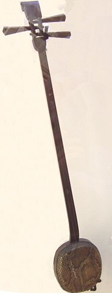
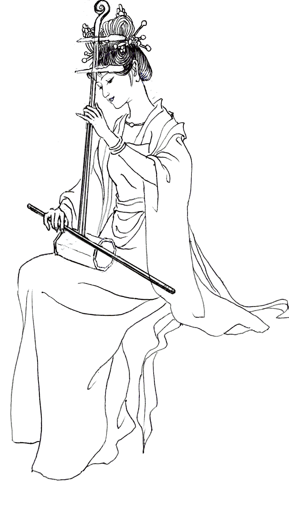
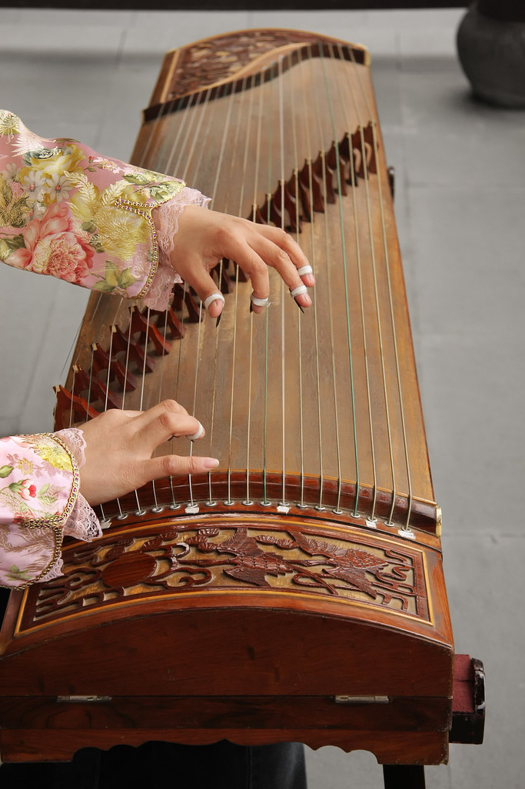
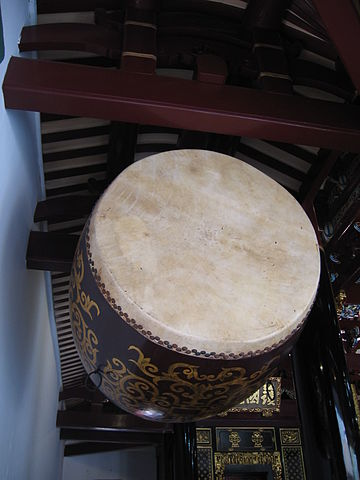
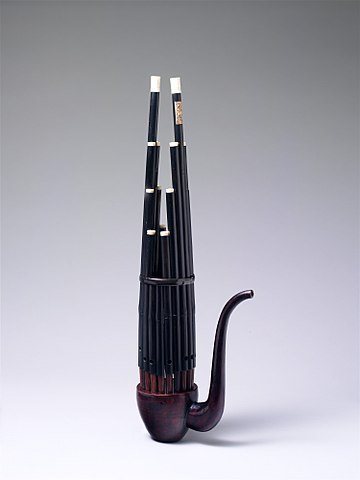

# Music

The Realm's musical tradition is heavily drawn from Wàn music, and focuses on
eight primary categories of instruments, each epitomized by a distinct
instrument:

1. The _plucking_ family, epitomized by the [sanxian](#sanxian);
2. The _bowed_ family, epitomized by the [erhu](#erhu);
3. The _picking_ family, epitomized by the [guzheng](#guzheng);
4. The _striking_ family, epitomized by the [bianqing](#bianqing);
5. The _pounding_ family, epitomized by the [zhu](#zhu);
6. The _hammering_ family, epitomized by the [tanggu](#tanggu);
7. The _blowing_ family, epitomized by the [dizi](#dizi); and
8. The _breathing_ family, epitomized by the [sheng](#sheng).

In addition to these families, the Realm's musical tradition also includes
vocal performance.

Most of the Realm's music is pentatonic.

## The Eight Noble Instruments

These eight instruments embody their family and are generally regarded as the
primary instruments of the Realm's major musical forms.

### Sanxian

The _sanxian_ is a lute with three strings, a long neck, and no fingerboard. It
is played using a large animal-bone plectrum or with the fingers. The body of a
sanxian is traditionally made from reptile skin; in the Realm this is usually
snake skin, but might also be angler lizard, or, most impressively, skin from a
tyrant lizard or other huge foreign beast. In addition to plucking the strings,
a sanxian player can produce sound by striking the body.

### Erhu

{:style="width: 50%;height: 50%"}

The _erhu_ is a two-stringed fiddle which, like the sanxian, lacks a fretboard.
The erhu is often called the _Mother of Strings_ for its clear, powerful notes.
Pieces for the erhu are often somber and contemplative. Some composers use the
plucked erhu, which is more muted and muddy compared to the bow, but evokes a
different emotional tone.

### Guzheng

{:style="width: 50%;height: 50%"}

The _guzheng_ is a large zither instrument with between 14 and 21 strings. The
strings of the guzheng are traditionally made of silk or of brass, especially in
the luxurious guzheng favored by the Dynasty. The guzheng player wears picks on
her fingers made from toirtoiseshell, ivory, or jade. The guzheng has a huge
range and slightly twangy sound. The right hand is used to play notes and the
left to add ornamentation or to play other notes in parallel.

### Bianqing

The _bianqing_ is a rack of hanging chimes, made either from stone or from raw
jade. When struck with a mallet, the chimes produce a refined ringing sound. The
bianqing is a very large instrument which is difficult to relocate, so it is
primarily a court, theater, and performance instrument rather than one which is
used in more casual environments like teahouses or street performances.

### Zhu

The _zhu_ is a percussion instrument consisting of a tapered box with an open
top, played by striking a central baton against the bottom face.

### Tanggu

The _tanggu_ is a variety of standing drum.

### Dizi

The _dizi_ is a bamboo transverse flute, held horizontally. The body of the dizi
is long, which allows it to rest on the left shoulder when played over the
right shoulder. Because the dizi is relatively cheap and easy to make, it is one
of the most common instruments on the Isle. A cousin to the dizi is the _xiao_,
a vertical bamboo flute which does not require a vibrating membrane. The _xiao_
is characteristic of the Western Isle.

> The dizi is the style of flute played by Wei Wuxian in _The Untamed_.

### Sheng

The _sheng_ is a reed instrument consisting of many different vertical pipes,
played by holes at the bottom of each pipe. Along with the dizi and the erhu,
the sheng is one of the oldest instruments still played in the Realm. The sheng
can be played with both inhaled and exhaled breath, which is why the sheng
family are known as "breathing" instruments.

## Vocal Performance

In addition to the instruments listed above, the Realm also uses plenty of vocal
performance in its music. Solo performances and group performances are both
common, and usually set to music; _a capela_ performances are not typical. Vocal
talent is determined primarily by ability to structure more than one's ability
to imbue their performance with personal characteristics.

## Major Contemporary Styles

Some contemporary styles include:

The **Elegant River** style originates from the Imperial River valley and
focuses on smooth, slow forms with many subtle layers. Elegant River music is
appropriate for a night of appreciation in a private salon.

The **Jade Cockerel** style emerges from Wàn musical theater. It features many
vocal performances which show off technical mastery, sliding between difficult
registers with grace. Jade Cockerel music is appropriate for public performance
at a large venue.

The **Summer Rabbit** style focuses on swinging movements, high-energy
performances, and consistent beats that encourage dancing and swinging. Summer
Rabbit music is appropriate for a lively ball or a summer night's swing.

The **Eight Winds** style is extremely contemporary and highly improvisational.
It encourages experimentation and expression, with a focus on classic
instruments like the erhu and the sheng. The style emerged from elite circles in
the northwestern Isle, who were attempting to one up one another with skillful
improvised pieces. The Eight Winds style is popular for devotees of music who
want something avant garde and novel.
