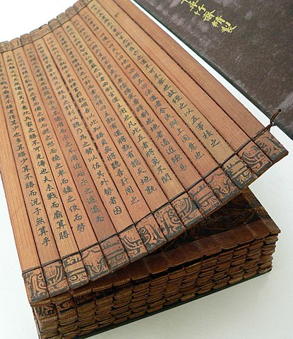

# Literature

The Realm has a long history of the written word, but it is only within the past
100 years that writing has become as widely accessible as it is today.

## A History of the Written Word

For the first centuries of the Realm, during the recovery from the Thousand
Tragedies and reinvention of Shogunate technology, the most common produced
book was a _bamboo slip_ book, produced by lacing several long strips of
bamboo together. Handwritten scrolls and hand-copied books were also produced,
mostly for governmental purposes.

In the fourth century, the Realm's printmakers developed effective methods of
woodblock printing that allowed for reproduction of books. Across the next
few centuries, the woodblock methods were refined through more advanced paper
blends, mechanization of the pressing process, and other marginal improvements.
All of these techniques gradually decreased the price of books. As books became
cheaper, the Immaculate Order increased their literacy education, which in turn
drove more demand for books.

The printing process, however, still remained bottlenecked at a stage well
before ink touches paper. Woodblock printing relies on wooden templates against
which the pages are pressed to mark them with ink. For centuries, the only way
to produce these blocks was to contract an artisan to produce each individual
template by hand. The templates were large, sturdy wooden blocks that took up
a lot of space, and each individual page of each individual book requires its
own template.

In RY 690, the Realm discovered and conquered the port of Wu-Jian, and opened
the Great Western Ocean to reasonable exploration within a mortal lifetime. A
mortal woodblock maker and scion of House Nellens, Nellens Maqi, used new
woodworking techniques imported from the West to finally produce his
_facsimile machine_. The Nellens facsimile machine is able to mechanically
reproduce woodblock templates from a single installed master template. Facsimile
templates are also smaller, thinner, and double-sided, which significantly
reduces the amount of space required to store a whole set of book pages.

The eighth century has been an absolute revolution in literature for the Realm.
The facsimile machine has reduced books from luxury items to finally within the
reach of craftsmen families, which has lead to a staggering increase in the
number of casual readers. The Order has also doubled down on literacy education,
producing hundreds of sanctioned pamphlets to encourage the Order's preferred
interpretations. Thanks to the facsimile machine and other mechanical methods
for printing, the Blessed Isle produces cheaper literature than anywhere else
in Creation. In major cities with a printing center, paper-bound chap books can
be purchased for the price of a nice meal, and proper covered books for a little
more.

## Classical Fiction

The _Great Classics_ are six novels which have been in print more or less
continuously since the earliest days of the Realm. Some of these novels
originate from Shogunate authors; others originate from the early centuries of
the Realm and have simply become established. These six novels were the most
widespread non-religious non-governmental literature available in the form of
books and scrolls until the recent printing revolution.

Some of the Great Classics, like the bandit adventures of _Low Tide Moon_ or the
political situations and grand battles of _The Gate at Peach Mountain Pass_,
purport to be historical accounts, but are identified by contemporary scholars
as containing highly fictionalized details. Some others, like the fictitious
House chronicle _Western Garden_, are understood to be wholly fictional and
completely divorced from reality. The comedies, like _Favorable Doldrums_, are
generally more likely to acknowledge their own fiction than the more serious
Great Classics.

## Popular Fiction

Popular fiction ranges from gory military fiction to romanticized epics to
steamy romances bound with blue covers. In general, the Realm's popular fiction
can be divided into the categories of _peasant fiction_ and _respectable_
_fiction_. The difference is obvious: respectable fiction is what the Dynasty
reads, peasant fiction is what peasants read.

The Dynasty's refined literature comes in many forms like comedies of manners,
novels of manners, and, of course, romances of manners. Beyond that, the Dynasty
also widely enjoys the well-written fictionalized accounts of great periods of
the Shogunate, and the less refined elements of the Dynasty can be found reading
adventure novels which tell of exotic places they may one day rule. A small
number of Dynasts have committed themselves to publishing and discussing the
most worthy works emerging from the satrapies, but such things are trivialities.

_Peasant fiction_, on the other hand, is completely devoid of the refined
experiences of Dynastic fiction. Galavanting heroes prance about through
uncomplicated narratives. Tall tales and accounts like the dishonorable nobles
of _The Tales of Magistrate Shining Eye_ -- based on the real lost egg
Magistrate Shining Eye in the third to fifth centuries -- give rise to unhealthy
opinions. And of course, one must not even _consider_ the salacious romances
which can be found throughout the Isle's major cities. Certainly no Dynast has
ever read such a steamy and disreputable novel in some sealed chamber somewhere.

## Poetry

The Realm has a rich poetic tradition which permeates the Dynasty. Poetry is one
of the most noble pursuits an artist can devote herself to, which gives rise to
an extensive body of poems.

Most poems in the Realm are composed in High Realm, and rely on tricks like tone
sandhi, homonymy, and similar turns of phrase to convey layered meaning. The
southern reaches of Arjuf and Radimel's Seat both have rich native traditions of
poetry in their own languages. Arjufi poetry is flowing and grand, full of
parallelism and heroism. Radimel's Seat's poetry is often on the verge of
theater, set to music and recited by elders.

The peasantry do not understand poetry and prefer novels. It is because they are
unable to appreciate the subtlety of a good poem.
