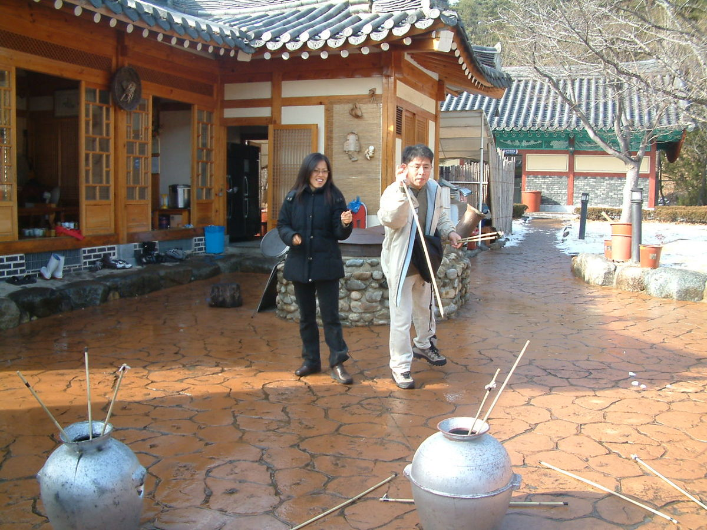
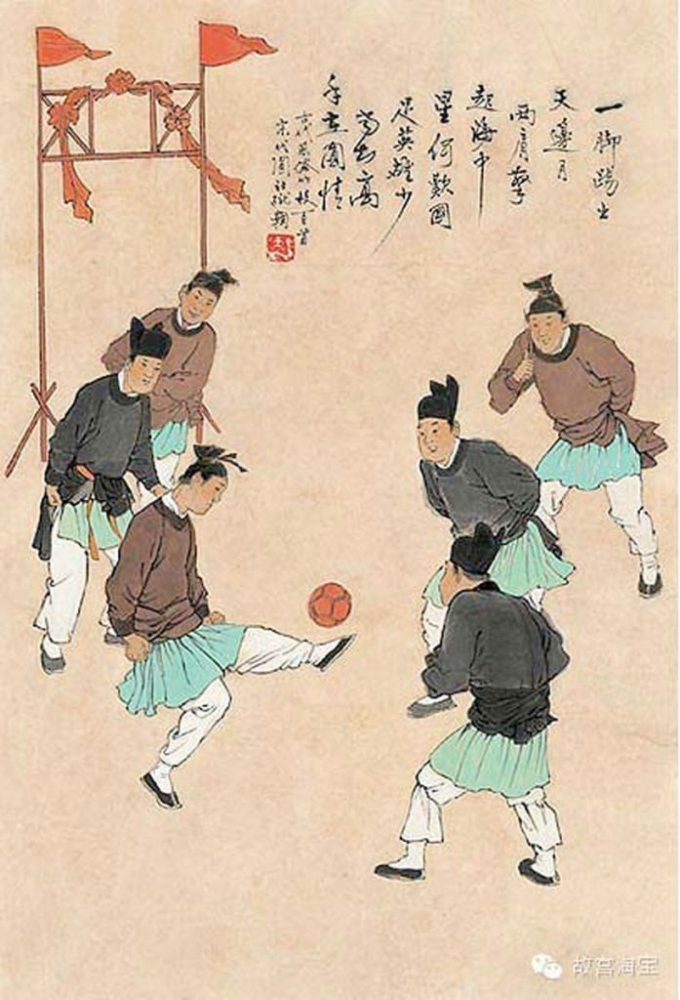
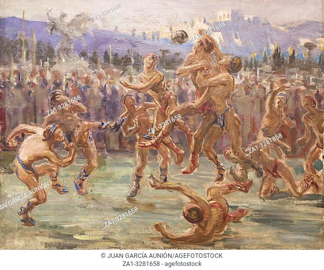

# Sports

The Dynasty enjoys a wide variety of sports and athletics. The Dynasty considers
"sports," as a broad category, to encompass anything which involves physical
activity as well as winning or losing. Thus, swimming alone is not a sport,
while race-swimming is.

These are some examples of sports and athletic pursuits enjoyed on the Isle.

## Athletic Sports

Athletic sports involve little equipment, and focus mainly on the strength or
skill of the competitor. Many of these sports involve one-on-one competition for
achievement, and don't necessarily score for points like ball games.

### Wrestling

_Wrestling_ is one of the oldest sports in Creation, and practiced in some form
by nearly every culture; the Dynasty is no exception. Wrestling is as simple as
they come: grapple with the opponent, and overcome them using your strength.
The first to tap out is the loser. Some competitions add more rules, some even
less -- allowing for strikes and tricks -- but whatever the rules may be,
wrestling is wrestling.

Wrestling is probably the most widely-spread sport in the Realm, competing with
boxing and racing as the most common athletic pursuits.

### Boxing and Brawling

_Boxing_ is the sport of facing off against an opponent and punching one another
until one of you falls down. Boxing is one of the ancient Shogunate's Five
Military Arts, along with archery, javelin-throwing, dueling, and riding. Boxing
is popular among all levels of society since it requires nothing more than two
fists, and allows for excellent betting rings. The Dynasty usually uses
cushioned gloves and forbids strikes to the face and groin, in order to keep
boxing civilized, unlike peasants who simply brawl.

### Archery

_Archery_ is an ancient tradition of the Isle's military cultures. Archery
competitions might involve shooting accurately the farthest, or shooting the
most accurate shots within a short window of time, or any other test of skill
with the bow and arrow. Wàn culture also practices competitive archery with
precision crossbow shooting, and many of the Realm's cultures compete in
mounted archery, trying to shoot accurately while atop a speeding mount.

### Throwing Things and Tuho

{:style="width: 50%;height: 50%"}

There are many, many sports based around throwing things accurately and throwing
them far. A few such arts include discus or chakram throwing (popular in Lord's
Crossing), javelin throwing (an Arjufi favorite), throwing axes (a distinctly
Cathak passtime, descending from Daoshin axe-love), throwing quoits (a favorite
in the ministries because it does not disrupt one's wardrobe), and throwing
darts. Generally, throwing sports involve accuracy or distance, sometimes
both.

As long as there is something to throw, people will make a sport of it, so
throwing sports are very common among the peasantry as well as among the
Dynasty.

_Tuho_ is a throwing game involving large darts which competitors attempt to
throw into the mouth of a large pot from a distance. Tuho is especially popular
for festivals and holidays.

### Skating

_Skating_ is common in the mountainous regions and on the northern shore, where
ice forms in the winter. Skating competitions usually involve challenges with
form and grace, the focus being on body control and precision. Skating is also
popular as [a form of racing](#winter-racing).

## Racing Sports

Racing sports are a great way to show off one's skill in a very direct
competition. Being faster and nimbler than the opponent are almost always
admirable qualities.

### Athletic Racing

_Footraces_ simply involve getting from a starting line to a finish line before
any of one's competitors. Sprinting, long-distance races, and modifications like
hurdles and long jump are found throughout the Isle.

Races might also involve _swimming_ or _relays_, or _swimming relays_.

### Animal Racing

_Animal racing_ or _jockeying_ involves riders atop animals racing to the
finish. Animal races can be short events that take place in a single session, or
long rallies like the Eagle's Landing Invitational which features a many-day
competition from Eagle's Landing to the finish line in Eye-of-Creation.

Common animals for racing include, naturally, horses, which can be found
throughout the Isle. In the northestern Isle, chocobo are a common racing
animal. In the south, riding lizards are ponderous, but can climb cliff-faces,
allowing for startling vertical ascents. Historically, the Tarpan Expanse was
home to centipede-riders, but the decay of Tarpan into the Wastes has lead the
riding centipedes to near extinction. Some Dragon-Blooded Dynasts take advantage
of their prowess to tame mighty sea beasts and race those, especially in and
around the Gulf of Daana'd.

### Chariot Racing

_Chariot racing_ comes primarily in the form of arena racing, where competitors
ride around a huge arena a certain number of times. Chariots almost always use
horses or chocobos, depending on the climate. Chariot races often draw huge,
devoted fans, who cheer on teams identified by a color, an animal, or some other
kind of identifier. The city of Juche was once famously caught up in a massive
riot after the "unjust" loss of the Blues to the Eagles, and the subsequent
public controversy of bribes and cheating.

The Dynasty takes chariot racing to a whole other level with the _Imperial_
_Rally_, Creation's largest and most prestigious race. Beginning and ending in
the Imperial City, the Rally is a huge chariot race along the entire length of
the Great Coast Road. Dynasts compete in specially-made jade chariots, pulled by
bound elementals, which race as fast as brushfire and as nimbly as swirling ice.

### Boat Racing

_Boat racing_ is usually in the form of rowing competitions, where crews face
off against one another to complete a certain distance. Another popular form of
boat racing is sailing, where small sailing vessels compete for time on a fixed
course. Boat races are usually called _regattas_, and feature as a refined
high-class sport enjoyed mostly by the Dynasty.

### Winter Racing

During winter months when ice is on the ground, special races become available
for those who are interested. _Speed skating_ involves competing on ice skates.
_Skiing_ races are common in the mountains, and especially favored by Tepet and
Nellens. Dog-sled races are a regional specialty of Endless Prefecture. Ice
climbing races are a dangerous passion of a dedicated few.

## Ball Sports

Ball sports can be found throughout the Isle, but the most elaborate originate
from Radimel's Seat and the port of Arjuf. Radimel's Seat, as one of the only
places on the Isle that rubber trees grow consistently, is able to produce
rubber balls that are bouncy and flexible. Arjuf, through a rich ancient trade
with Radimel's Sea, has incorporated many of these rubber-ball games into their
own traditions. Elsewhere on the Isle, bouncy balls can be constructed by
inflating an animal bladder with compressed air and wrapping it in leather, and
heavy leather balls can be found anywhere that leather is produced.

Rubber balls remain mostly a toy of the Dynasty, but leather balls are enjoyed
by all classes.

### Ts’u-chü

{:style="width: 50%;height: 50%"}

_Ts’u-chü_ is a competitive team-based ball game pitting two teams of equal size
against one another, ranging from 6 to 12 players per side. A light, bouncy
air-filled ball makes the game very quick. Each side has a large, painted post
at their end of the field. The goal is to kick the ball so that it hits the
opposing team's post. Players may only use their feet.

Ts’u-chü is played by all levels of society. Large cities are filled with
ts’u-chü courts, from dirt courts in peasant alleyways to lovely grassy courts
in the gardens of Dynastic estates.

### Kemari

_Kemari_ is a cooperative game for any number of players, using a ts’u-chü
ball. Instead of teams competing to kick the ball into opposing goals, the
kemari players collaborate to try to keep the ball in the air for as long as
possible. The players may use any part of the body except for their hands or
arms.

### Harpastum

_Harpastum_ is a cooperative game using a dense rubber ball a little smaller
than a head. The ball is colored brightly so that it is easy to see. Harpastum
is played by huge teams, sometimes up to as many as thirty players a side. The
goal is simple: each team has a line at their side of the field, and you want
to get the ball over your opponent's line. Harpastum has few rules besides; the
ball must remain visible at all times, and the ball cannot be thrown out past
the sidelines or into the crowd. Fighting is entirely permitted, using punches,
kicks, or any other means; many matches of harpastum end with bloodied faces and
broken noses.

Although female harpastum leagues certainly exist, harpastum is an archetypally
male sport. Many regard it as _the_ defining male act: brutal, emotional, showy,
and loud. Male harpastum players are highly desired; most leagues play in only
a loincloth, and attract many female admirers. The Empress herself was said to
occasionally take lovers from the most successful, well-muscled harpastum
players.

A variant of harpastum called _episkyros_ is played throughout the northwestern
Isle. The goal in episkyros is not to carry the ball over the opposing team's
line, but instead to throw it over their heads over their line. Episkyros is
generally thought to be an ancestor of harpastum, and generally features more
throwing and less wrestling.

### Handball

_Handball_ is a competitive team sport played with a small, dense ball. Each
team has a goal at their end of the field. They must throw the ball into the
opposing team's goal, but can only move one step while holding the ball, and
must throw the ball within a few seconds of catching it. In handball, the ball
remains in constant motion, the teams maneuvering around one another to try and
open an opportunity to throw to the goal.

### Follis

_Follis_ is a competitive team sport played with an inflated leather ball. The
players on each team face off against one another with a barrier between them,
usually a low wall or a net. The goal is to get the ball to land on the
opponent's side of the field. Players may only hit the ball with their forearms
or shins; because the ball is so dense, players usually wear protective bracers.
Each side may only bounce the ball among themselves twice before they must pass
it over to the other side.

### Laxoa

_Laxoa_ (lah-show-ah) is a bat-and-ball game which is mostly played in Radimel's
Seat, where rubber to make the balls is available. Peleps herself was fond of
the game as a passtime, having learned it during the time in which her House was
based on Radimel's Seat. Because of Peleps' fondness for the game, it has a
small but widespread following.

Laxoa involves two teams, played either solo or in pairs. All players face a
common wall, and hit an extremely bouncy rubber ball using long, narrow
rectangular paddles. After hitting the ball off the wall, it must fly far enough
to cross the foul line, and then bounce once; after it bounces once, it is valid
and the opposing team must try to hit it back. A team scores a point if the
opposing team fails to hit the ball before it bounces a second time, or if the
opposing team hits the ball such that it doesn't clear the foul line. The ball
can reach extremely high speeds, especially when hit by a Prince of the Earth
with fury in her heart; be careful.

## Other Sports

Some of the Dynasty's hobbies don't fit nicely into racing, athleticism, or ball
games, the three broad categories described above. They go here.

### Hunting

Most Dynasts consider hunting a form of sport, based around tracking down a
specific beast. Elk, wild boar, and various kinds of birds are very common
prey for both mortal and Exalted hunters. More exotic creatures, like hellboar,
tyrant lizard, and twisted Wyld things from hidden pockets, are the domain of
Exalted hunters seeking a unique and satisfying hunt.

### Kite Fighting

_Kite fighting_ involves flying kites with abraisive strings, using subtle
motions to direct the kites to try and cut the strings of competitors. Kite
fighting is a relaxing passtime for the Dynasty and often enjoyed on retreats.

### Climbing

_Climbing_ is a challening activity which often requires special equipment. Many
of the Chosen are able to use their powers to enhance their climbing. Often,
climbing is non-competitive, simply a challenge to see which mountains can be
bested and which walls can be climbed. Some well-traversed paths lend themselves
to race-climbing, where two or more climbers try to reach the top lip first. In
some wintery places, ice-climbing on glaciers allows for a unique challenge.
