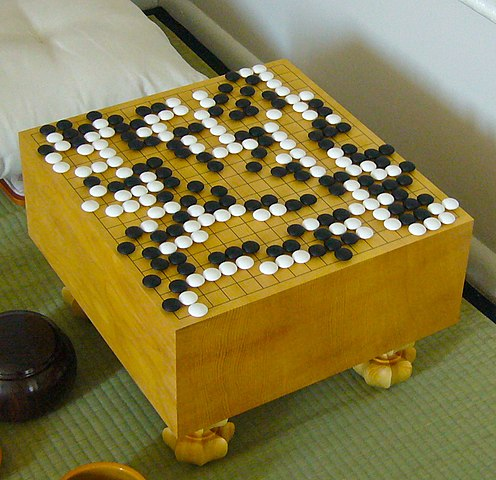
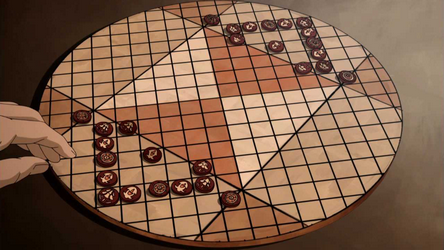
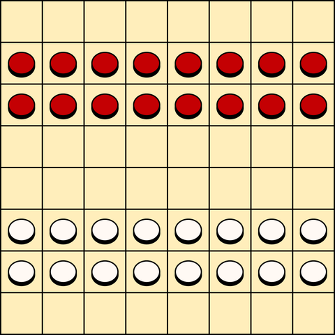
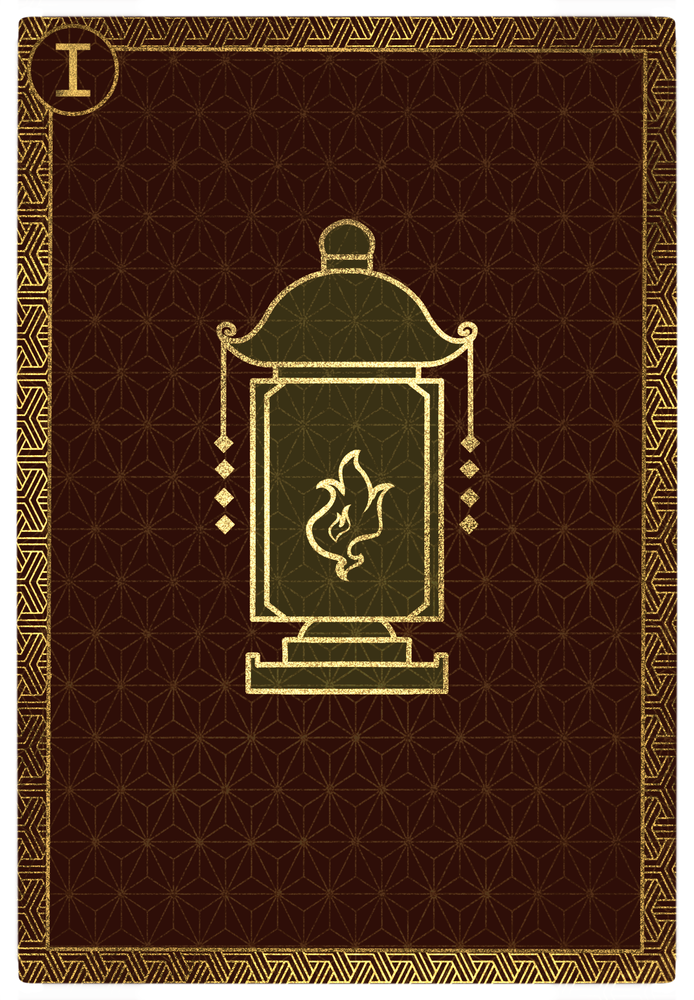
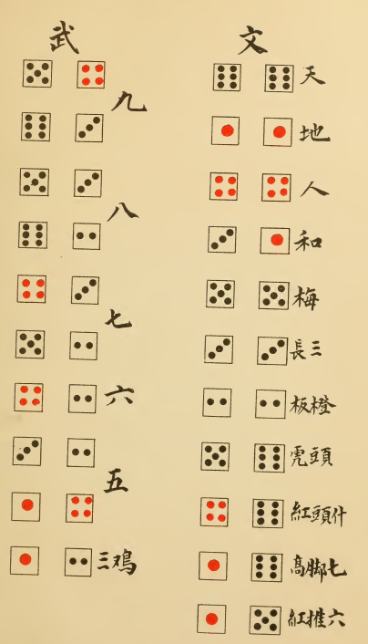

# Games

The Dynasty plays many games to pass the time, from allegorical board games to
gambling games and so forth. Games often transcend social boundaries by using
simple, consistent rules; status in games is usually conveyed not by _different_
games, but by fancier boards, more luxurious cards, and so forth.

## Game Culture

House Cathak is famous for its intense competitive instinct which often comes to
the forefront in sports and games. A stereotype of House Cathak is a hot-headed
red-haired legionary flipping a table in frustration for having lost at a game
of cards.

House Sesus is infamous for their love of gambling, and, along with House Cynis,
are the House which runs most of the Realm's gambling dens. House Sesus gamblers
are as common as House Sesus enforcers; many of the licensed, reputable gambling
dens have former Sesus legionaries as bodyguards and security. A common trope in
fiction is a House Sesus villain being brought low by a throw of the dice.

House Tepet does not share the rest of the Dynasty's fascination with cards and
dice, preferring tiles and dominos in the Shogunate style. House Tepet shares
much more in common when it comes to board games, which they use as a moral and
practical instruction tool.

House Cynis rivals House Sesus for investment into gambling establishments,
focusing on higher-end casinos and resorts rather than Sesus' somewhat gritty
dens. House Cynis claims that their founder, Cynis herself, was responsible for
the phenomenon of coloring the 4 side of dice red like the 1; she once, the
story goes, gambled the life of her house on a game to see who could roll the
most fours when rolling five dice, and when she rolled five 4s, she ordered
thereafter that all fours be marked in bright colors to celebrate her victory.

## Board Games

_Board games_ use a set board and a collection of pieces in order to play a
specific game. Board games are usually luxurious items crafted of fine materials
in order to show off the Dynasty's wealth. Many of these games include intricate
handmade figures that probably might count as iconography, if anyone actually
cared -- only the worst Ledaals will raise a fuss about it. Peasants like to
play a lot of these games, too; their boards are less impressive.

### Gateway

_Gateway_ is the most iconic game of the Dynasty which almost every Dynast
learns to play at a very young age. Gateway is a game of strategic unit
placement on a large grid of lines. Each turn, a player may either place a
new piece or trigger one of the many defined formations, if their pieces are
arranged accordingly. Formations introduce unique effects such as moving a
column, rotating a set of spaces, or capturing pieces. The game is won by
holding a majority of the pre-defined _gate_ pieces with mutually-harmonious
formations.

### Go

_Go_ is an abstract strategy game based around controlling territory. It is
played on a grid of 19×19 lines; as in Gateway, the spaces are not the squares,
but rather the intersections of the various lines. Each turn, players place one
of their stones onto an intersection and once placed, the stones cannot be
moved. The goal is to surround the opponent's stones to remove them from the
board, and at the end of the game, to have surrounded the most territory.

### Pai Sho

_Pai sho_ is a slow and elegant game based around the placement and movement of
circular tiles. Many tiles feature unique flowers, boats, or other symbols to
indicate their particular function. Pai sho is a very, very old game, popular
among classicists and the old-fashioned nobility of the near north.

### Mancala

_Mancala_ is the name for a whole family of games which involve moving beads,
stones, or pebbles from one bowl to many others in some kind of circular
pattern. Mancala games are extremely easy to make and play, so they are very
popular throughout the Isle.

### Dama

_Dama_ is a competitive capture game played on an unmarked 8×8 grid. Each side
plays with a symmetric complement of 16 equal pieces. Pieces move forward or
side-to-side and capture with a jump; they cannot move or jump diagonally. Once
it reaches the back file of the opposing side, a piece can promote to a
_general_, which can move and capture any number of squares forwards, backwards,
or sideways. Dama, like mancala, is easy to produce and easy to learn.

### Fortress

_Fortress_ is a game of architecture originating from House Mnemon. The board is
a large grid of squares, and each of the two players is given an array of pieces
in various shapes, representing buildings. The goal is to force your opponent to
be unable to place any pieces. Fortress sets are usually carved in exquisite
detail from expensive woods or fancy stones; a well-made fortress set is a nice
neutral gift, an object of beauty that is usually appreciated for its cost and
aesthetic appeal.

### Hunt-the-Anathema

_Hunt-the-Anathema_ is a placement and movement game. Each player controls a
couple small, tall pieces called _hunters_ and several rectangular pieces called
_walls_. On your turn, you can move your hunters or build more walls, with the
goal being to render all your opponent's hunters unable to move. While most
versions of hunt-the-anathema use unadorned cylinders and walls, many Dynasts
have an elaborate version featuring miniature terrain and beautiful hand-carved
pieces: silver figurines of beastial creatures, and jade figurines of heroic
Princes. A long-standing hazing ritual of young Dynasts is to force the least
favorite sibling to play the Anathema side.

### Pachisi

_Pachisi_ is a roll-and-move game played on a cross-shaped board with a large
central roundel. Pachisi is a straightforward game with strong regional
variation. In the Western reaches of the Isle, where the game originates, the
roll is done by throwing a handful of carved shells, and counting the number
which land right-ways-up. In the rest of the Isle, players usually use long
rectangular-prism dice with four sides. In Pangu Prefecture, House Cynis
occasionally plays pachisi for spectacle, using courtiers or slaves as
human-sized pieces on a giant board carved into the ground.

## Card Games

{:style="width: 50%;height: 50%"}

Card games have always been popular among the Imperial Legions, and come in and
out of vogue with the Dynasty. Card games offer an appealing balance between
luck and skill which make them popular for gambling.

A Realm deck of card is 50 cards, divided into five suits of 10 cards apiece.
The suits are Ewers, Jewels, Lanterns, Flowers, and Banners. The ten ranks of
the cards are the numeric ranks 1, 2, 3, 4, 5, and the face cards Minister,
Magistrate, General, Matriarch, and Dragon. The face cards have special design
elements: the Dragon is an abstract design; the Matriarch is an older woman in
a chair; the General has a helmet and a weapon; the Magistrate has a badge and
hat; and the Minister is a boy.

Some games use a run of 25 cards in a suit called "trumps," featuring unique art
on each card. Some ignorant peasants use these cards for fortune-telling.

### Trick-Taking Games

All _trick-taking_ games follow the same basic formula. One player "leads" a
card into the "trick" at the center of the table. After every player has played
exactly one card into the trick, the trick goes to the highest card of the suit
lead. Some trick-taking games designate one of the five standard suits as
"trump"; some trick-taking games use the 25-card "trump" suit; and some have no
trump at all.

Trick-taking games are extremely popular among the legions, because they feature
a lot of direct competition and bidding. Competitive Dynasts also enjoy them for
the same reasons, and they are popular among the most refined Dynasts for their
high degree of skill, although not as popular as board games.

### Vying and Banking Games

_Vying_ and _banking_ games are first and foremost gambling games. In a _vying_
game, players compete directly against one another for who has the strongest
hand -- hands can be ranked by a variety of factors, they might be all private
or involve shared cards, and some vying games give the player two or more hands
to manage. A _banking_ game is similar, except instead of competing against the
other players, the players compete individually against the bank.

> Poker is an archetypal vying game. Blackjack/pontoon is an archetypal banking
> game.

Vying and banking games are again very popular among the legions, _especially_
the gambling, brawling Sesus legions. They can also be found all throughout the
Isle's gambling dens. The Dynasty generally frowns upon gambling games in
public, so these games are often played in smokey back-rooms or at private galas
away from the scandalizing public eye.

### Point-Collecting Games

A _point-collecting game_ is like a trick-taking game, but instead of trying to
win the _most_ tricks, you are trying to collect specific cards for points. The
exact points vary, but some common features of the Realm's point-collecting
games are: dragons and 5s being worth the most; magistrates being worth more
points than matriarchs; and ministers being worth 0, like number cards.

Point-collecting games are a more polite alternative to the gambling games, and,
like trick-taking games, can have a high skill ceiling. Point-collecting games
are also usually five-player games. A common mechanism unique to the Realm is a
hidden teams mechanic, where two players compete against the other three, but
nobody is certain of the teams until a certain card is revealed. Because they do
not have the same stigma as gambling games, point-collecting games are seen at
many parties and social events.

### Matriarch-Minister Games (Kiss)

_Matriarch-minister_ games are an obscure family, except for the most iconic
game, called _Kiss_. Kiss is a two-player game where players compete to earn
1000 points by collecting sets of cards. The most valuable two-card combination
is a _kiss_, consisting of the matriarch from one suit and the minister from
the opposing suit. Kisses are scored by laying the cards over one another in an
_X_ shape.

Although Kiss is a complicated games with a lot of mental energy, it is still
popular, especially because of its subtle (or not-so-subtle) undertones of
impropriety. Kiss is also popular in part due to its role in the novel _Western_
_Garden_, by Jurul Kao Kal, a Realm classic. In _Western Garden_, a game of Kiss
featuring the matriarch of Banners and the minister of Lanterns is used to
foreshadow the eventual affair which leads to the collapse of the fictional
House Ivory.

The game of Kiss is also popular among peasantry, who twist it to their own
subversive intent and ignore the balance of the cards. Some such variants
rank the magistrate above all other cards, or worse yet, rank the _one_ above
the _matriarch_ in a direct subversion of the Perfected Hierarchy.

### Fishing Games

_Fishing_ games are based around a simple rule: if the card you play matches a
card on the table, you take the card on the table; otherwise, leave your card on
the table for someone else to "catch." Fishing games are usually based around
collecting certain cards for points, or building certain sets for points.

Fishing games are appropriate for children and for peasants. More mature
players, such as those in the Dynasty, focus on other, more mature games.

### First-Out Wins/Last-In Loses

_First-out wins_ and _last-in loses_ are two closely related families of games.
The basic idea is either to be the first player to empty your hand, or to avoid
being the last player with cards in your hand. Many of these games are
"climbing" games, where the goal is to play a set of cards that exceeds the set
played by whoever went before you. Some are "falling" games, in which you try
to cut _under_ the previous hand.

These games are usually quick, and are generally designed to produce a single
winner or a single loser. They are often used to identify a single person who is
responsible for doing something unpleasant, or to identify a winner who is
exempt from some unpleasant duty. In Sesus households, many children use these
games to determine who must do chores, or who is exempt from doing them.

## Dice Games

_Dice games_ are excellent excuses for gambling. Dice offer a high degree of
randomness, and can require the player to manage probabilities as well as
understand the basics of the game.

Dice used in Realm games often have the one and five painted in bright colors,
in contrast to the plain colors of the other numbers.

### Cho-Han

_Cho-han_ is one of the easiest and most widespread gambling games. The dealer
rolls two dice in a cup and places the cup face-down. The players bet whether
the total is odd or even. The game requires an equal number of bets on each
side. The winning side collects money from the losing side, less 5% for the
dealer.

Cho-han is as simple as dice games come, and it can be found absolutely
everywhere. It is a fixture of Sesus gambling dens, where the dealers play with
their shirts off, to prevent cheating and to show off their tattoos. Small
parlors throughout the Isle follow suit with shirtless dealers.

### Throwing Heaven and Nine

_Throwing heaven and nine_ is a gambling game where the players face off against
one another for the best roll of the dice. All results fall into two categories:
the _military_ category, and the _civil_ category. The first player rolls to
establish the hand, and then the other players roll, until they have another
roll in the same category. Losing rolls pay the banker, and a winning roll
collects from the banker and moves the banker one seat around the table.

Throwing heaven and nine is a very, very old game. Records of its play go all
the way back to the early Shogunate period. It is a respected and venerable
gambling game, one of the few that is acceptable for the upper crust to play
publicly. As such, it is often found in the upper balconies of gambling houses,
above the rabble playing cho-han or cards down below.

### Hazard

_Hazard_ is a pure gambling game. Players bet on a huge array of all possible
outcomes of rolling three dice, and then the banker rolls three dice, paying out
whoever correctly bet on the result. In addition to betting specific numbers,
players can also bet for high/low, odd/even, triples, and so forth.

The game of Hazard is in figuring out which bets to lay. Smart players will bet
on high/low or odd/even, which offer the establishment the lowest advantage. But
brave players and stupid peasants will bet on the most unlikely outcomes, teased
by the prospect of a big payout. Intricately decorated hazard tables can be
found in the swanky Cynis casinos, played with large dice that make spectating
the game exciting. Many Cynis casinos use beautiful foreign slaves to tend their
hazard tables, hoping to draw the attention of players to keep them betting for
as long as possible.

### Chingona

Also called _mariner_, the game of _chingona_ is a casual game for play at a
table of friends. Players are attempting to roll a 6, 5, 4, and the highest
possible results among the remaining. On each player's turn, they pick up five
dice and roll. They may keep any dice they like, with the caveat that they must
keep a 6, 5, and 4 before any other dice. Any dice they don't keep, they reroll,
up to 3 total rolls. The sum of the last 2 dice is their score.

Chingona is a random game which allows for a degree of skill. Knowing when to
keep rolling and when to keep is a tactical decision. Although it is casual and
played for small amounts, chingona is a widespread classic of dice that you can
find in most parts of the Isle. Despite being called _mariner_, the game is not
especially popular in House Peleps.

### Liar's Dice

_Liar's dice_ is a social deception game requiring 5 die per player. Each player
rolls her five dice in secret, keeping them hidden beneath a cup that they can
peak at. Then, each player bids on the number and rank of dice they think are
hidden around the table; for example, a bid of "five sixes" indicates that the
bidder believes there are at least five 6s somewhere, in total, on the table.
After any bid, another player can doubt, and then all players reveal their dice.
If the bidder was correct, they win cash; if the bidder was wrong, the caller
wins instead. Loser sacrifices some number of their dice.

Liar's dice is a very effective tool for learning social deception, so it is a
common childhood game within the Dynasty. Plenty of myths exist which detail the
recruitment of young spies through especially talented players of liar's dice.
Such stories are probably complete bullshit.
