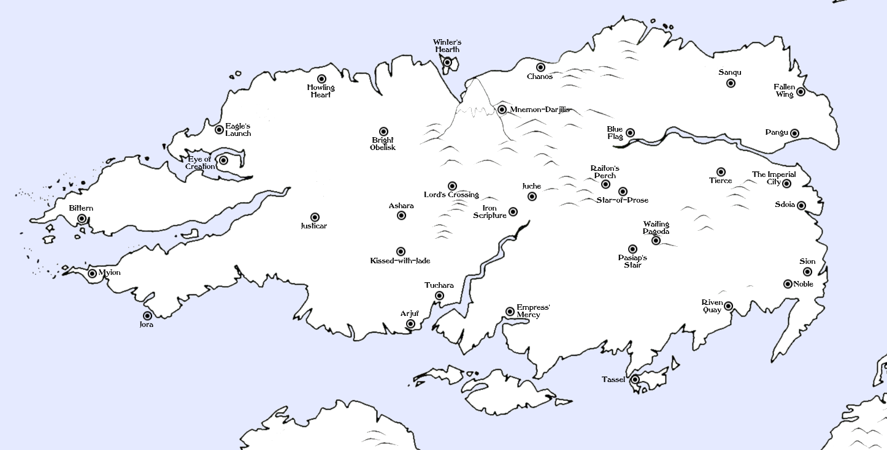

# Geography

The Blessed Isle is home to immense physical diversity and various climes. In
many ways, the Blessed Isle is simply Creation in miniature: cold in the north,
hot in the south, plentiful in the east, and wet in the west. The geography and
climates of the Isle are famously beautiful and hospitable.

Most of the Isle's population is in the lowland areas around the Imperial
Mountains, the river valleys of the Isle's mighty rivers, and along the coasts.
The Imperial City, on the Eastern coast, is the largest and most successful
city in all of Creation. The Isle's other major cities are mostly ports or
House capitals.
