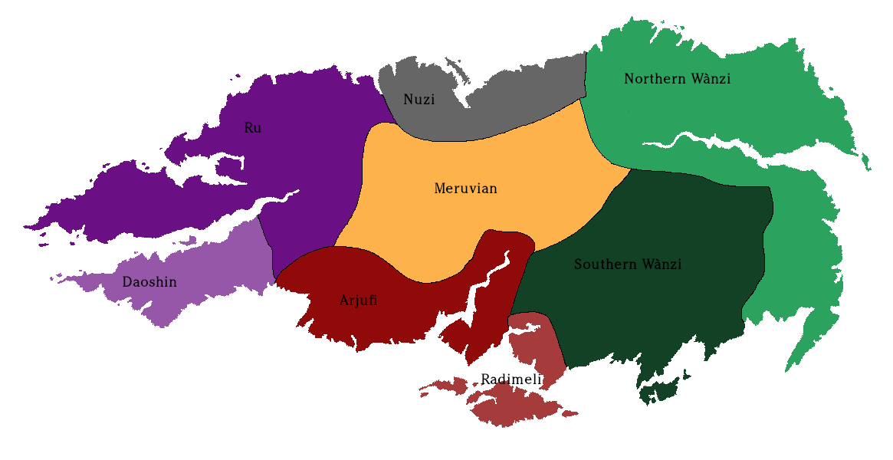

# Languages of the Blessed Isle

Imperial linguists classify the Blessed Isle's languages into eight broad
categories:

- The _Northern Wànzi_ languages, the family of languages most similar to High
  Realm, the official language of government and the nobility;
- The _Southern Wànzi_ languages, very closely related to the Northern Wanzi;
- The _Radimeli_ languages, by far the smallest family, which trace their origin
  back to the historical nation of the See of Radimel;
- The _Arjufi_ languages;
- The _Daoshin_ languages;
- The _Ru_ languages;
- The _Nuzi_ languages; and
- The _Meruvian_ mountain languages which flow down into the Tarpan Wastes.

The languages of the Isle share enough traits that Shogunate scholars were
confident that all were descended from some common ancestor. Today, the families
contain so many different forms that scholars are unsure what is a language,
what is a dialect, and what is simply an affectation.

In addition to the major families, a few pockets of _isolate_ languages exist,
mostly in deep forests or on the slopes of the mountains. These languages,
like the clicking tongue of the Dhorashi dark-dwellers, are of interest to
scholars, but are generally vile and uncouth compared to the respectable High
Realm.
