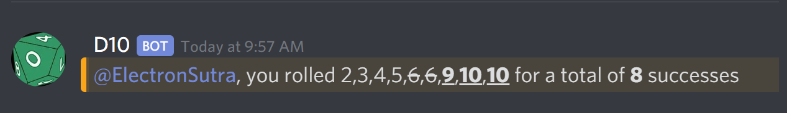

# Systems

All rolls in _Exalted_ use a d10 pool system.

## Rolling Dice

When you are called to make a check, you will gather up (Attribute + Ability)
dice, for some appropriate Attribute/Ability combination. You roll all the dice.
Any die that comes up as a 7, 8, or 9 is 1 success; any die that comes up a 10
counts as 2 successes. Example:

    2, 5, 8 (1 success), 9 (1 success), 10 (2 successes) = 4 successes.

### Specialties

If you have a specialty that applies to a roll, you get +1 die.

### Stunts

If you give a cool description for your action, you get +2 die. This is called
a _basic stunt_.

If someone really impresses you, you can nominate them for an _enhanced stunt_.
If the rest of the table agrees that it is a highlight of the night, that person
gets +2 die, 1 automatic success, and 1 free Willpower.

### Willpower

Willpower is a resource on your character sheet. You can spend 1 Willpower on a
roll to get +1 automatic success, limit 1/roll.

## Using the Dice Bot

For our game we will have access to `d10`, a friendly robot who will do all of
our dice mechanics for us.

The basic syntax for the dice bot is `.roll <#>`, to roll # of d10s. You can add
a series of modifiers separated by a / after the `.roll` part.

The modifiers are:

- `db#s` to add double #s, ie. `.roll/db9s` to roll with double 9s.
- `re#s` to add disappearing #s. You can list several: `re1s2s3s`, for example.
- `as#` to add # automatic successes.
- `no10` will remove double 10s, so that 10s only count as 1 success.

So to roll a pool of 7 dice with double 9s, disappearing 6s, and 2 automatic
successes, you would use

and get the result

