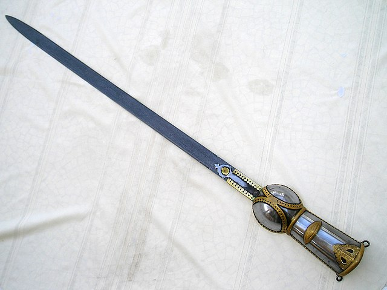

# Melee Weapons

The Realm is heavily influenced by Chinese, Japanese, Indian, Korean, and Roman
cultures, which means that many of the weapons may _look_ different than you
expect. Here are some aesthetics for weapons that you may not have been aware
of.

## Light Melee Weapons

### Club, Cudgel, or Bludgeon

A club can be as simple as a length of wood or an iron bar, or it may be made
with bindings and wraps. Small improvised weapons are often clubs.

#### Chuí

{:style="width: 50%;height: 50%;"}

A _chui_ is a long metal cudgel with a fist-sized bulb at the end. _Chuí_ are
often wielded in pairs. Temple guards frequently carry _chuí_, as do bandits.

### Knife or Dagger

Almost everyone in Creation carries a knife with them. Knives can range from
simple hunting tools to flashy, engraved weapons meant for killing. A passionate
devotee of the knife is called an _edgelord_.

#### Butterfly Swords

{:style="width: 75%;height: 75%;"}

A _butterfly sword_ is halfway between a knife and a sword. It has a distinct
fat blade with a single edge. Butterfly swords are always wielded in pairs.
Techniques with these swords involve a lot of flash and switching grips.

#### Deer Horn Knives

{:style="width: 75%; height: 75%;"}

Deer horn knives are made by laying two metal crescents on top of one another.
They are wielded in pairs. Their unusual shape makes them especially good at
defending against larger swords.

### Sai

The sai is a three-pronged fork-shaped weapon about the size of a dagger. Sai
are wielded as a pair. Their unique shape makes them excellent at disarming
foes. A _manji_ is a sai where one side prong points forward and the other
back. A _jitte_ is a sai with a single side prong; the jitte is often carried
as a weapon in places where more significant weapons are disallowed.

### Short Sword

A short sword has a blade about 2 to 3 feet long. Short swords are the cheapest
swords to manufacture and thus are often carried by soldiers.

#### Jian

{:style="width: 75%; height: 75%;"}

The humble and mighty jian is called the First Prince of Swords, the Noble's
Sword. The jian is one of the most ancient and respected weapons on the Blessed
Isle. It is 24 to 28 inches long and wielded alone.

### Sickle

A sickle is an agricultural tool for cutting grain. Sickles are rarely used as
weapons except by desperate peasants.

#### Kama

The kama is a sickle crafted for war. Unlike a traditional crescent sickle, a
kama has a blade that sticks out at a 90 degree angle to the handle.

#### Kusarigama

The kusarigama is a strange weapon resembling a sickle crossed with a fighting
chain. The chain can be used alongside the blade. The kusarigama is a strange
and exotic weapon.

### Whip

A whip is usually just a simple coil of rope or leather or a length of cord.
Most of the time a whip is meant to hurt rather than kill, but a skilled user
can disarm foes and inflict great pain.

#### Urumi

{:style="height: 50%;width: 50%"}

The urumi is a rare and strange weapon. It is essentially a sword crossed with
a whip. The long, flexible steel blade is edged on both sides and very dangerous
to the wielder. A few commentators have jokingly called it the Fourth Prince of
Swords, the Lunatic's Sword.

## Medium Melee Weapons

### Axe/Hatchet

The axe and the hatchet are broad-bladed weapons for use in one hand. The axe
is cheap to manufacture and easy to use, so it has often been repurposed into
a weapon of war.

### Chopping Sword

A chopping sword is a longsword with a heavy chopping blade. It is made to hack
through armor and bone.

#### Dao

{:style="width: 50%;height: 50%"}

The dao is a simple broad saber. It is known as the Second Prince of Swords, the
Soldier's Sword. It often has a tassle or cloth attached to the handle for
flourishes. A dao is also called a _willow-leaf blade_.

#### Ringed Broadsword

The ringed broadsword is like a dao, but slightly larger, heavier, and with a
series of 7 to 11 rings on the trailing edge. It is particularly associated with
pirates.

### Javelin

The javelin is a small spear meant for throwing as well as personal use. They
are cheap enough that they are often bought as sets.

### Hammer or Mace

The hammer is another work tool sometimes turned into a weapon. Hammers are
often wielded by bandits and thugs. Hammers made for fighting are often
decorated.

### Shield

It is never a bad idea to put some material between you and the person who wants
to kill you. Some traditionalists view the shield as cowardly; these
traditionalists often come to regret their belief.

#### Dhal

A dhal is a small buckler attached to the forearm, adorned with silver and gold.
They are nimble and fast.

#### Bell Shield

{:style="height: 30%;width: 30%;"}

A bell shield is one of the standard pieces of equipment for Legionnaires in the
field. It has a distinct bell shape that gives it its name.

### Slashing Sword

A slashing sword is single-edged and made for smooth cutting motions.

#### Katana

Be the weeb of your dreams. Katana are often carried by Dynasts who want to show
off their wealth and influence. It is known as the Third Prince of Swords, the
General's Sword.

### Spear

The spear is one of the most basic and effective weapons in the world. It, along
with a shield, is one of the Legions' standard pieces of equipment. It is always
a popular and respected choice of arm.

#### Crescent Spear

{:style="width: 50%;height: 50%"}

Most of the Realm's spears are made in the crescent style. A crescent spear may
have one or two crescents. These styles often also have a tassle or cloth
attached near the point.

#### Podao

{:style="width: 50%;height: 50%"}

The podao is a cross between a sword and a spear. It is a long polearm about
four to six feet long. Half the length is a long wrapped handle; the other half
is a single-edged cutting blade.

### Straight Sword

Well-balanced, accurate, and strong, the straight sword is a simple straight
blade about 3 feet long. It is capable of deadly thrusts as well as slashing
cuts.

#### Khanda

{:style="width: 50%;height: 50%"}

The khanda is a double-edged straight sword which fattens toward the tip. They
often have a blunt rectangular edge instead of a point.

#### Pata

{:style="width: 50%;height: 50%"}

The pata is also called a _gauntlet-sword_. It is a straight sword mounted on
the end of a gauntlet. While wielding a pata, the wrist cannot be bent, which
lends it good power but poor stabbing.

### Staff

The humble staff is a sturdy length of wood, sometimes wrapped with grips or
banded in metal. An excellent defensive weapon, the staff can also be used to
deliver a whoppin' on a youngster who does not respect you.

#### Eku

{:style="width: 50%;height: 50%"}

A truly unusual weapon for the Dynast looking to make a statement. The eku is a
peasant weapon based on an oar. It is a long, skinny oar wielded like a staff.

## Heavy Weapons

### Great Axe

A great axe is a two-handed axe with a large, heavy head. It is a favorite
among the Legion's heavy auxiliaries.

### Greatsword

A greatsword is a heavy two-handed sword. Greatswords are often used against
cavalry.

#### Changdao

The changdao is a huge two-handed sword with a five foot blade, similar in
profile to the dao broadsword. Like the dao, it comes in a ringed variant.

#### Nodachi

The nodachi is a huge sword made with the same techniques as the katana. It has
an even larger cousin, the zanbato, with a blade six or seven feet long. Both
of these weapons are dedicated anticavalry swords, for chopping the legs out
underneath horses.

### Lance

Also called a yari, a lance is a large two-handed spear designed to be used
while riding. Lances are usually used to ride down infantry and sow chaos as
part of a cavalry charge.

### Poleaxe/Halberd

The poleaxe is to the spear as the greataxe is to the axe. Much cheaper than a
greatsword, the poleaxe is the most common heavy weapon in Creation.

#### Guandao

{:style="width: 30%;height: 30%"}

The guandao is a single-edged halberd, also called a _reclining moon blade_. The
guandao is wielded with circular motions, and is one of the classic weapons
almost every Dynast has handled.

#### Monk's Spade

{:style="width: 50%;height: 50%"}

Also called the _crescent moon spade_, the monk's spade is particularly
associated with monks (unsurprisingly). The broad spade-like head is designed to
push animals like dogs and leopards away without hurting them too badly.

#### Sodegarami/Tsukubo/Sasumata

{:style="width: 50%;height: 50%"}

A class of man-catching polearms, these three weapons are essentially the same
except for their head. These poles are designed to catch and entangle the
target without killing them.

### Scythe

A two-handed cutting implement used to collect grain, the scythe is also
occasionally used as a weapon.

### Sledge

The sledge is, in essence, a gigantic mass of wood and metal shaped so that it
can be wielded like a hammer. This huge weapon is often wielded by gigantic
bandits and Princes of the Earth with a reputation for physical strength.

#### Tetsubo

The tetsubo is a war club particularly associated with the Earth Dragon style.
A long wooden shaft banded with metal and studs, the tetsubo crushes through
armor and bone.
