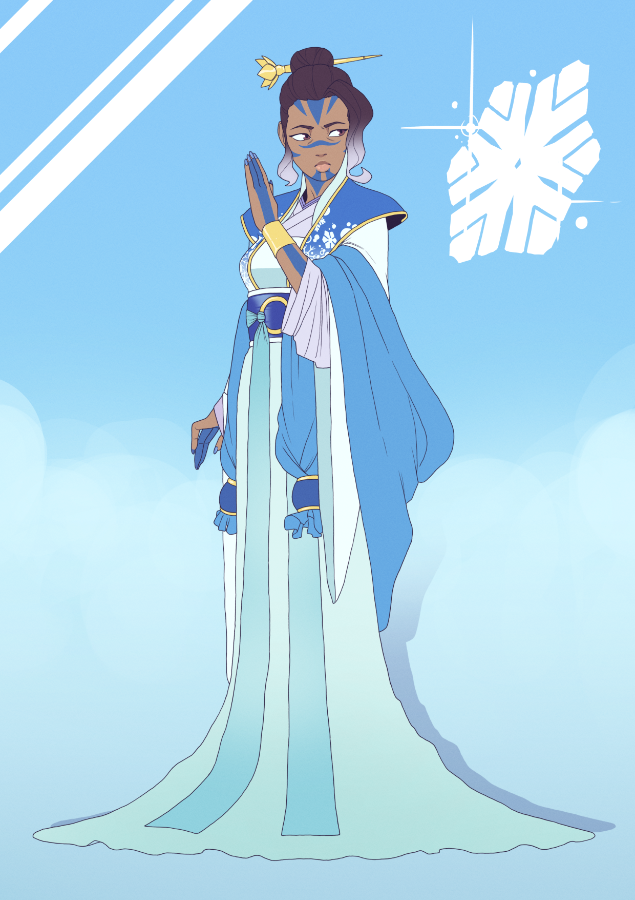
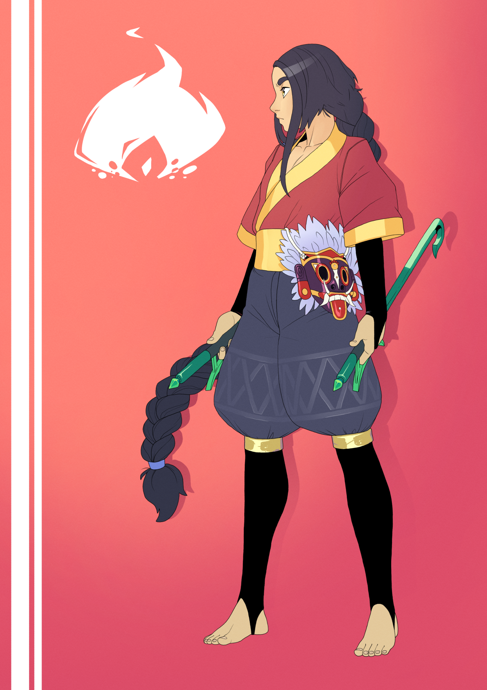
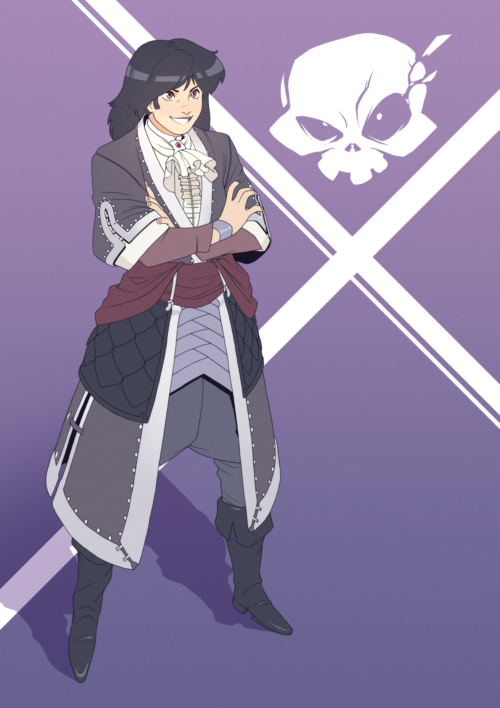

# Dramatis Personae

## Main Cast

### Cynis Jayla

Air Aspect. Ice bitch. Daughter of [Cynis Fa-Len](#cynis-fa-len). Betrothed to
[Tepet Jeongyeon](#tepet-jeongyeon).

### Ledaal Naiyo

Fire Aspect. Monster hunter. Son of [Ledaal Verath](#ledaal-verath), husband of
[Cathak Argent Fawn](#cathak-argent-fawn)

### Peleps Tempest

Water Aspect. Revenant captain; the Phoenix of Whaler's Bay. Sister of
[Peleps Shore](#peleps-shore), daughter of
[Peleps Clear Blue Sky](#peleps-clear-blue-sky).

## Dynasts

### House Cathak

#### Cathak Argent Fawn

Fire Aspect. A former Legionnaire and current lord of the Ashen Granite
Pavillion in Sdoia Province. Wife of [Ledaal Naiyo](#ledaal-naiyo).

### House Cynis

#### Cynis Fa-Len

Wood Aspect. Matriarch of House Cynis in charge of financial affairs. Mother to
[Cynis Jaylah](#cynis-jayla).

#### Cynis Lo-Sa

Wood Aspect. Representative of Cynis Fa-Len, caravaneer and profiteer; has
definitely _never_ sold arms to both sides in a conflict. Sister of
[Cynis Jayla](#cynis-jayla), one of [Cynis Fa-Len's](#cynis-fa-len) Auspicious
Daughters.

### House Ledaal

#### Ledaal Verath

Air Aspect. An esteemed physician, respected alchemist, and famed master of the
White Mountain Phoenix style. Mother of [Ledaal Naiyo](#ledaal-naiyo).

### House Mnemon

#### Mnemon Korvu

Earth Aspect. Blind Magistrate in the service of the Empress. Childhood
acquaintance of the [main cast](#main-cast) and commanding Magistrate of
[Bal Dazo](#bal-dazo/).

#### Mnemon Temperance

Water Aspect. The Artist. A minister in Her Radiance's service, in charge of
coordinating monopolies. In her spare time, a studier of art and art history --
and uncoverer of the Triptych. Sister of [Mnemon Korvu](#mnemon-korvu) by many
years.

### House Nellens

#### Nellens Kamir

Water Aspect. Instructor at the Heptagram specializing in the pharmeceutical
properties of plants. Mentor to [Ledaal Naiyo](#ledaal-naiyo).

### House Peleps

#### Peleps Clear Blue Sky

Water Aspect. A feared judge presiding over the courts in Azure Crane Province,
near the Isle of Wrack. Mother of [Peleps Tempest](#peleps-tempest) and
[Peleps Shore](#peleps-shore).

#### Peleps Shore

Water Aspect. An interpreter of the Curators of the Imperial Registry -- a
super lawyer and bureaucrat. Elder brother by twenty years of
[Peleps Tempest](#peleps-tempest), son of
[Peleps Clear Blue Sky](#peleps-clear-blue-sky).

### House Ragara

#### Ragara Mango

Air Aspect. Assassin, responsible for the murder of Mnemon Temperance. Son of
[Ragara Sayyah](#ragara-sayyah).

#### Ragara Sayyah

Earth Aspect. A former Legionnaire, a current sorcerer, and on the DNFW list.
Mother to [Ragara Mango](#ragara-mango).

#### Ragara Nova

Wood Aspect. Prefect of Chanos Prefecture, long time rival of
[Sesus Majali](#sesus-majali). A crazy old man.

#### Ragara Haama

Aspect Unknown. A pale, pretty young man with dark hair and red eyes.
Unsurprisingly, a blood-witch. Has some kind of connection to [Ragara Nova](#ragara-nova)
and [Ragara Sayyah](#ragara-sayyah).

### House Sesus

#### Sesus Sōng

Fire Aspect. A former general of the Sesus Legions, now a permanent resident of
Chanos. An upright woman who commands respect for her victories. Walks with a
limp. Mother of [Sesus Root](#sesus-root).

#### Sesus Majali

Fire Aspect. The City Governor of the City of Chanos, a rival to [Ragara Nova](#ragara-nova)
for control of the city's politics. Red-haired, and extremely confident of
herself.

#### Sesus Nagezzer

Wood Aspect. Also known as "The Slug."

#### Sesus Root

Wood Aspect. By day, a humble merchant of exotic fineries -- by night, many
things at many times. Untrustworthy. A childhood acquaintance of the
[main cast](#main-cast).

### House Tepet

#### Tepet Jeongyeon

Air Aspect. Newly elevated satrap of the foreign kingdom of Psamal Ide, very
young for his position. Betrothed husband of [Cynis Jaylah](#cynis-jaylah).

## The Patriciate

### House Bal

A powerful patrician house, deeply rooted in the Imperial Treasury.

#### Bal Keraz

Earth Aspect. The Empress' Exchequer, tasked with overseeing tax revenue,
auditing official accounts, and bringing charges against violators. 180 years
old. Relative of [Bal Dazo](#bal-dazo).

#### Bal Dazo

Mortal. Archon in service to [Mnemon Korvu](#mnemon-korvu).

### House Tenna

A patrician house from Sdoia Province.

#### Tenna Sweet Crane

Tempest's new second-in-command, assigned to her staff for transporting the
mysterious cargo from Pangu to Chanos.
