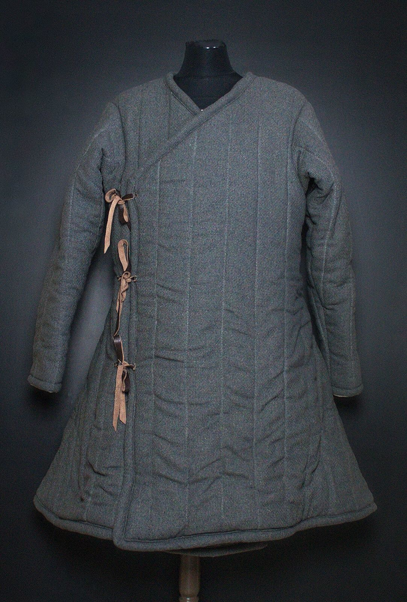

# Armor Types

Armor in the Realm, like weaponry, is influenced by East Asian and Roman
cultures.

Helmets neither help nor hinder.

## Light Armor

{:style="height: 50%;width: 50%"}

{:style="height: 50%;width: 50%"}

{:style="height: 50%;width: 50%"}

{:style="height: 50%;width: 50%"}

{:style="height: 50%;width: 50%"}

{:style="height: 50%;width: 50%"}

{:style="height: 50%;width: 50%"}

{:style="height: 50%;width: 50%"}

Light armor provides protection for vital areas, but is primarily meant to be
light and mobile. Light armor is favored by scouts, leaders, and other people
who need protection but don't want to be encumbered.

## Medium Armor

{:style="height: 50%;width: 50%"}

{:style="height: 50%;width: 50%"}

{:style="height: 50%;width: 50%"}

{:style="height: 50%;width: 50%"}

{:style="height: 50%;width: 50%"}

{:style="height: 50%;width: 50%"}

{:style="height: 50%;width: 50%"}

{:style="height: 50%;width: 50%"}

Medium armor is the standard armor of Creation. Most soldiers wear medium armor.
This category provides ample protection for your vital areas and is generally
reserved for mercenaries, soldiers, and others who make a profession of
violence.

## Heavy Armor

{:style="height: 50%;width: 50%"}

{:style="height: 50%;width: 50%"}

{:style="height: 50%;width: 50%"}

{:style="height: 50%;width: 50%"}

{:style="height: 50%;width: 50%"}

{:style="height: 50%;width: 50%"}

{:style="height: 50%;width: 50%"}

{:style="height: 50%;width: 50%"}

Heavy armor is the best of the best when it comes to armor -- and the most
expensive and difficult to maintain. Heavy armor is reserved for elite units
like heavy auxiliaries or frontline Chosen who expect to be fighting multiple
people at once.
