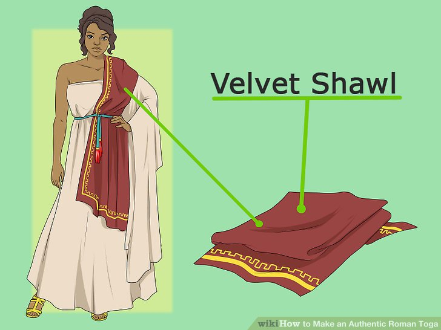

# Clothing

I love clothes so I'm going to talk about them.

Remember that _wearing armor_ outside of when you're expecting battle is a major
social faux pas. You will be wearing plain clothes for the majority of your
time, except when you foresee combat coming.

## Dynastic Clothing

{:style="height: 50%;width: 50%"}

{:style="height: 50%;width: 50%"}

{:style="height: 50%;width: 50%"}

Dynasts favor various forms of robes and tunics rather than the gaudy styles
favored by the patricians.

All types and styles are present in Dynastic wear, as Dynasts prefer to stand
out. For those who don't spend too long thinking about their wardrobe, a kimono
or a daopao are always safe options.

Dynasts are able to afford fine footwear, so they often wear heavy boots, nice
sandals, or other indicators of status. Hats are very common, but not as fancy
as the ones worn by patricians.

Like with patrician clothing, men's cuts tend to be slinky and tight to
emphasize their shape to potential suitors, while women tend to prefer loose
and flowing clothing with elegant appeal.

In general, Dynastic clothing tends to be more about subtle indicators of
status. Unlike patricians, no one in the Dynasty has anything to prove.

## Patrician Clothing

{:style="height: 50%;width: 50%"}

{:style="height: 50%;width: 50%"}

{:style="height: 50%;width: 50%"}

{:style="height: 50%;width: 50%"}

Realm style is at its most austentatious with the patriciate. Stuck between the
peasantry and the Dynasty, the patricians show off their wealth and status with
bold garments.

The archetypal patrician garments are the toga and the sari. Multilayered and
colorful, these garments are what you picture when you think of "the
patriciate." In addition to these, more tradition or less sartorially-minded
patricians wear shenyi, daopaos, and kimonos, much like the Dynasty.

{:style="height: 50%;width: 50%"}

{:style="height: 50%;width: 50%"}

Able to afford nice footwear, the patriciate make ample use of sandals and
stylish footwear to show off their status.

Headgear is a big deal for patrician fashion. Take note:

{:style="height: 50%;width: 50%"}

{:style="height: 50%;width: 50%"}

{:style="height: 50%;width: 50%"}

{:style="height: 50%;width: 50%"}

## Peasant Clothing

Peasant fashion is simple and minimal.

When doing labor, most peasants wear a tunic and pantaloons. Usually the
pantaloons are plain undyed cloth and the tunic is a plain color, something that
they won't mind getting dirty with work.

When relaxing, peasants might wear zhiduo:

{:style="height: 50%;width: 50%"}

or ruqun:

{:style="height: 50%;width: 50%"}

In coastal regions where the weather is nice, sarongs are always popular, and
many men and women strip to the waist to put up with the temperature. Elsewhere,
the heavier jeonbok vest -- with long sleeves and which I can't find a good
picture for -- is common to keep the weather out.

Wealthy peasants try to dress like patricians.

Most peasants go barefoot; those who wear shoes often wear sandals or foot
wrappings.

Many peasants wear wide conical hats like you think of when you think of
Vietnam, a kufi cloth hat, or headbands.
