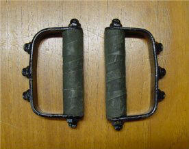
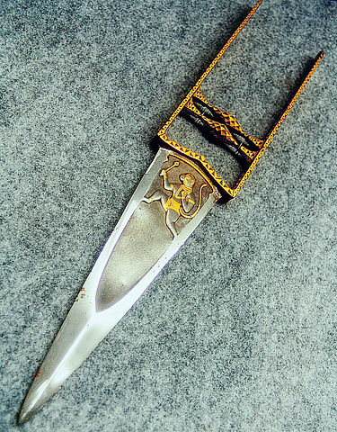
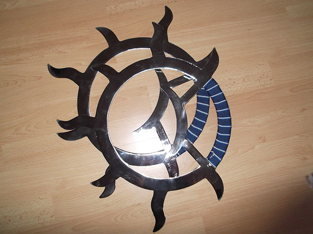
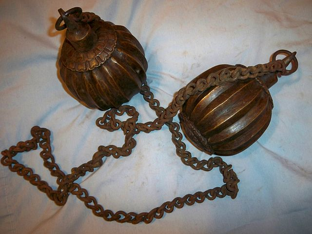
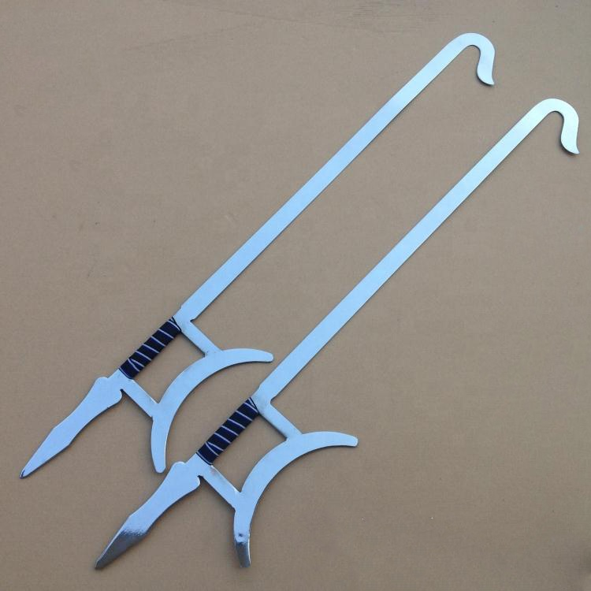
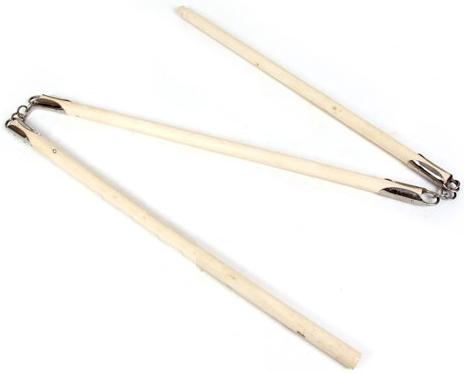

# Martial Arts Weapons

This page includes both weapons with the Martial Arts tag, and weapons with the
Brawl tag.

## Light Martial Arts Weapons

### Cestus

The cestus is a simple fist weapon formed by wrapping the hands in leather
strips, possibly with the addition of iron studs.

#### Tekko

{:style="width: 50%;height: 50%"}

Tekko are stirrup-like fist weapons that somewhat resemble brass knuckles. Held
by the handle with the bar covering the fingers, tekko add extra _oomph_ to your
punches.

#### Yawara

The yawara is a small iron cylinder a little wider than your palm. Not only does
the added mass of the iron give your punch more weight, the bits that stick out
on either side of your fist can be used to strike at pressure points and eyes.

### Khatar

{:style="width: 30%;height: 30%"}

The khatar or _punch-dagger_, is basically a knife that you strap to your
knuckles. Khatar are usually wielded paired.

### Nunchaku

You know what nunchaku look like.

### Tiger Claws

Tiger claws are the family of weapons that you get by making yourself Wolverine
claws. Some are held with a cross-bar in the palm; others are mounted on the
back of a glove. Either way, they're pointy and good for cutting. Usually 3 or 4
per hand.

### War Fan

The war fan is a fan intended to be used in combat. It has a metal-reinforced
frame. The war fan is an excellent disarming weapon. In addition, it can often
be carried into places where weaponry is not allowed.

#### Gunsen

The gunsen is a war fan that is wielded _open_. The gunsen may or may not have
paper to fan onself with; the most obvious gunsen are essentially a series of
small knives fastened together at the base.

#### Tessen

The tessen is a war fan that is wielded _closed_. Often these have genuine paper
interiors, but heavy metal outer plates. Some tessen are simply metal clubs that
have the shape of a folded fan so that they can be stowed away without raising
concern.

#### Gunbai

The gunbai is a war fan which is not a folding fan. The gunbai is a circular,
rectangular, or bell-shaped flat fan reinforced with metal and used to block
arrows and deflect swords. The gunbai is the least common variety of war fan.

### Wind and Fire Wheel

{:style="width: 30%;height: 30%"}

The wind-and-fire wheel is a metal ring about 12 to 15 inches in diameter; one
quarter is grip, the other three-quarters often have spiky protrusions. Wielded
in huge circular motions, the wind-fire wheel is effective at disarming.

## Medium Martial Arts Weapons

### Fighting Chain

The fighting chain is a long, flexible weapon made of slender chain links with
weights on either end. The most common style is the _chain whip_, which has
segments that consist of several thin metal rods connected at flex points by
rings. Flags and cloth at either end add both flair and control.

#### Meteor Hammer

{:style="width: 50%;height: 50%"}

The meteor hammer consists of two large, heavy globes on either end of a sturdy
chain. It is also known as a _flying hammer_ or _dragon fist_.

#### Rope Dart

The rope dart is a chain weapon with a large pointed dart at one end. This
weapon is distinct from the chain in that it is mostly wielded with one end
rather than both, and from the meteor hammer in that it is sharp rather than
blunt and heavy.

### Hook Sword

{:style="width: 50%;height: 50%"}

Also called _Heaven-and-Earth Sun-and-Moon swords_ when wielded in a pair, the
hook sword is a simple straight sword with a notable hook at one end. This hook
makes it excellent for disarming and allows you to extend your reach by hooking
the two swords together.

#### Chicken Sickles

The chicken sickles are hook swords with the addition of a backward spike on the
trailing edge. They are wielded with a different grip than hook swords.

### Seven-Section Staff

{:style="width: 50%;height: 50%"}

The seven-section staff is a staff that has been broken into several sections
and affixed together with flexible ring joints. It is the nunchaku's grown-up
auntie, both larger and scarier. The actual number of segments is usually 3;
7 sections are occasionally seen, as are 2-section staffs.
