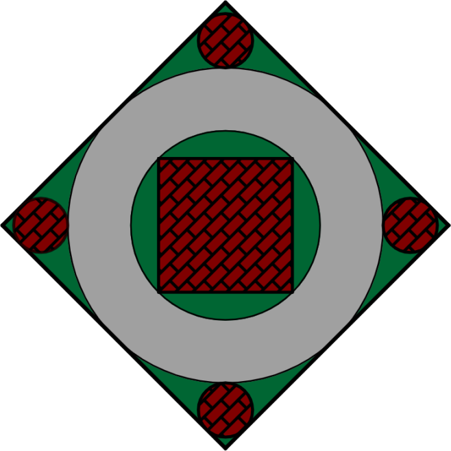
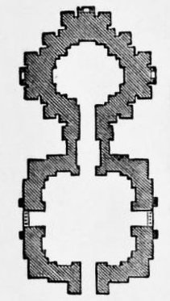

# Temples and Services

The Immaculate house of worship is called the _temple_. Where the family shrine
is the focus of spirituality for the individual, the temple is the focus of
spirituality for the community. Temples serve not only as places to hold
ceremonies and lectures, but also as centers for community activity.

Immaculate faithful are called to attend temples regularly and frequently. The
temple is the beating heart of the local Immaculate community, and the main
place in which the faithful are able to interact formally with the monks. Monks
often leave the temple grounds to invest themselves in the community, so it is
not the _only_ place to encounter them, but all threads of faith lead back to
the temple.

Monks are the formal clergy of the Immaculate Order, those who have given up
their material life in order to pursue a spiritual one. For many Immaculates,
the presence of monks is ubiquitous. If a temple is nearby, then there are monks
there, who offer frequent wisdom, insight, and suggestions for moral life. Even
in the most remote villages, monks sometimes come to visit, bringing wisdom and
advice.

The Order is devoted to ensuring that every devout Immaculate, no matter their
far-flung location, has access, even if only occasionally, to the wisdom of the
Order and guidance on their spiritual affairs. All monks are empowered to make
decisions based on the Texts and offer advice on personal affairs. When a
community loses a monk to death or her retirement to a monastery, there is great
sadness, for the community has not only lost a leader, but also a close friend
and confidant -- sometimes of many generations.

## Immaculate Temples

Immaculate temples are designed in accordance with principles of sacred geometry
and geomancy. They are laid out in a shape that concentrates positive energy
at the focal point, where the innermost sanctum is arranged. Symmetry is a
major focus of the temple, representing harmony and stability.

Very small temples, such as the consecrated household shrines found on many
Dynastic compounds, are not bound by these designs, and usually consist only of
what would be the central building in a larger temple. Monks out in the world
are sometimes called upon for use of a temple when none is available; in these
cases, they can construct an on-the-fly sanctified temple by simply drawing a
square in the dirt and inscribing a circle within it.

### Parts of a Temple

The temple is composed of two subdivisions: the _outer temple_ and the _inner_
_temple_. The design of the inner temple is fairly standardized and fixed, while
the design of the outer temple can vary wildly.

#### The Inner Temple

The inner temple is a standardized layout based on Pasiap's Sacred Geometry: the
circle inscribed within the square. In this mystical plan, the square represents
Creation, and the interior circle represents the sacred temple space. The
square, which is usually the outer wall, is always aligned so that the four
corners each point in a cardinal direction.

A typical inner temple is designed with a large circular ambulatory, surrounding
a central interior circle. This circle houses a square building, arranged with
corners facing the centers of the sides of the outer wall; each face thus points
in a cardinal direction, with a wide window looking out over the shrine in that
corner.

Each corner of the inner temple is home to a shrine representing one of the
Immaculate Dragons: Mela to the north, Sextes Jylis to the east, Hesiesh to the
south, and Daana'd to the west. The shrine to Pasiap is housed within the
central building. Thus, every temple has five major shrines housed within the
inner temple.

The four directional shrines are often very grand, and usually free-standing
buildings surrounded by gardens within their wedge. In small temples, these
shrines may be housed within gazebos, but sprawling temples will construct
entire buildings. One popular shape is _Pasiap's Cudgel_:

The cudgel features a large entry room for meditation and reflection, and an
elevated interior room where the shrine itself is housed.

The shapes of the buildings within the inner temple is variable, as long as it
remains symmetrical. Some larger temples enclose the inner temple entirely, with
arcing glass allowing sunlight into the ambulatory; most temples, however, leave
the inner temple exposed to the air.

#### The Outer Temple

The outer temple is all parts of the temple that surround the walls of the inner
temple. For small temples, there may be very little of the outer temple, simply
a manicured ground and some buildings for the monks to live inside of. In large
temples, the outer temple may have another set of walls or even two, and the
space can be home to dozens of buildings, spectacular gardens, and towering
minarets.

Monks make their homes within the outer temple, as well as carry out most of
their non-faithful business here. The outer temple usually features public
buildings like schoolrooms, meditation halls, and clinics. The outer temple is
meant to be extremely accessible to the community, to provide a place in which
the community can gather and interact with their spiritual leaders.

It is traditional, even in sparsely-populated areas, to feature a special gate,
the "Rainbow Gate", which is only permitted to be used by the Dragon-Blooded.
The Rainbow Gate features a direct path to the inner temple via the "Stormcloud
Gate"; this allows the Princes of the Earth to go about their business
unimpeded. In many temples, the rainbow gate and stormcloud gate are the most
intricately decorated gates in the facility.

### Uses of the Temple

In addition to providing a sacred space for formal services, the temple is also
a meeting place and hub of the community. Monks encourage frequent visits to the
temple, and all holidays and celebrations are held within the temple.

The temple watches over all stages of life and has ceremonies for all occasions.
Throughout the Blessed Isle, children are not named until they are brought to
the temple and have their name recited by a monk in a naming ceremony -- until
that point, they are simply "boy" or "girl." Marriages are usually performed at
the local temple, as well as celebrations of birth and mourning of the dead. The
temple is home to the local House of the Dead, usually in the outer temple or
outside the temple entirely and accessed by a path, which houses the cremated
remains of the dead and serves as a place of remembrance for the deceased.

The monks at the temple are responsible for basic education, so the temple often
has chambers set aside for schooling and childcare. The monks are often the most
qualified people to act as physicians, so many temples include a House of the
Ailing where the monks can tend to the wounded, offer herbal treatments, and
ease suffering.

Monks are outside of politics and expert maintainers of old texts, so local
governments often shelter their records within the local temple. Sometimes local
workers even trust the temple to handle the accounting of loans, leaving
valuable collateral to the temple, where it is secured within the walls and will
not be absconded with during the process of settlement.

In conclusion, the temple provides for all aspects of life. The local temple is
often a vital organ of local public life, a place where all ranks of the
community come and go. The monks serve as a social glue that spans boundaries of
class and status, an impartial outside force that offers wisdom and guidance.

## Services

Immaculate services are focused primarily on chanting, meditation, and group
involvement. The goal of a service is to instill moral lessons that can be
applied to daily life and to guide the faithful toward accumulating merit by
filling their station.

Temples host regularly-scheduled services throughout the week, and larger
temples throughout the day. Monks encourage the community to attend as many
services as they are able, in order to interact with other members of the
community and receive regular guidance on their lives.

Immaculate services are lead by the monks in the central building of the inner
temple, with space reserved at the front for the Dragon-Blooded and mortals in
the rest of the space. In small temples that know they are unlikely to receive
attendance by living saints, the place of honor is usually small and ceremonial.

### A Typical Service

A typical service in the Rainbow Gate of Wisdom lineage follows a predictable
pattern. Once the crowd is assembled, a bell is rung or drum is beat to call
the service to begin. The assembled stand while the presiding monks take their
place at the front of the assembly. They lead the crowd in several chants, and
then five prostrations toward each of the five shrines of the inner temple.

Following prostrations, the monks gather the crowd to be seated, and the
presiding monk takes her place at the front of the assembly on a raised
platform. The monks make their way among the assembled, offering water from a
sacred vessel with which to wash the hands and face. Once the water has been
distributed, the presiding monk begins a recitation of the day's sutras. In most
temples, the monk reads from an oversized copy of the Immaculate Texts, with
pages several feet across, placed on sacred blankets. Normally, only the page
currently being read is exposed; the other page is covered by a blanket until it
is read.

All Immaculate chants and recitations are set to music. Monks assembled at the
rear of the temple play drums, flutes, and other instruments to set the tone of
the ceremony. This allows those in attendance to hum, clap, or vocalize along
with the recitation, even if they do not know the words.

Following the recitation, the monks lead the congregation in making offerings to
each of the Five Elemental Dragons. These offerings are carried among the
congregation, every attendant bowing before the offering as it passes, and then
placed at the window corresponding to each of the shrines. Mela is always first,
offered perfumes, feathers, sweet-scented oils, a fan, a lantern, etc. Then
Sextes Jylis, offered flowers, leafy branches, fresh fruit and vegetables,
etc.; Hesiesh, offered burning incense, bells, pots of tea, etc.; and Daana'd,
offered sacred water, seashells, a mirror, seaweed, etc. Lastly, the monks offer
bread, coins, salt, and milk to Pasiap at the center. The exact offerings for
the day vary, and are determined based on complicated schedules within the
sacred manuals. During all of this, the crowd chants for transformation of the
mundane into the divine and gratitude for the teachings of the Immaculate
Dragons.

After offerings are made, the presiding monk offers a homily on the recitation
for the day. This homily is up to the presiding monk, so it can be rambling and
detailed or short and concise depending on the monk. The homily is intended for
the community at large; individual practitioners can seek private sessions with
the monks to discuss their specific situation, and its solutions based on the
Texts, in more detail.

The final phase of the service is the worship of the gods prescribed for that
day by the local calendar. The monks lead the crowd to the exterior shrine in
the outer temple, which is reserved for this function. There, they assemble an
offering tray appropriate to the god being revered, and lead the congregation in
many rote prayers personalized for the deity being revered. After the prayers
are said, the monks specify which good should be offered at home the next day as
part of the worship. The service is then complete.

### Special Services

Special services take place for atypical circumstances like funerals, namings,
marriages, and so forth. The exact form that these special services take
depends on the local tradition and the circumstances of the event. Most of these
special celebrations take place in the outer temple, at a place of importance.

Namegiving ceremonies bestow a formal name onto the child, and are joyous
celebrations for the whole community. Namegivings are typically held one year
and one day after the child is born; until that point, the child is nameless,
which helps keep malicious spirits from stealing them away. By the time the
namegiving comes around, the monks have already consulted with the parents and
helped to choose an auspicious name. There is a great big celebration with music
and dancing and food, and the baby is named after a monk whispers the baby's
name in each ear five times, covering the other ear with a flower, fan, smooth
stone, mirror, or bell, depending on the child's protective element. Then, the
child is introduced to the Dragons by taking them to the inner temple for the
first time and touring the five shrines and reciting protective chants.

Marriages are highly dependent on local tradition, but are usually orchestrated
by a monk. Most marriages involve tying two cords around the entwined hands of
the participants; the cords are a braid of five twines colored for the elements,
and represents the ties that bond the couple in marriage. Once the cording is
complete, the spouses wear the cords as necklaces for five days.

Funerals are usually private affairs, and involve making a final chant over the
body and a vigil held by the family at the temple. During the vigil, mourners
can come by to chant over the deceased or seek counsel from the monks. Once the
vigil is complete, the body is disposed of. Most funerals end in cremation on a
pyre; devotees of a specific Dragon may choose an alternative. Some devotees of
Pasiap are mummified; the costs of mummifying and maintaining a mummified tomb
fall to the family, so this is rather rare. Devotees of Daana'd are buried at
sea or sunk into lakes. Devotees of Sextes Jylis are buried and have trees or
flowers planted over their corpse. Lastly, rarest of all, some devotees of Mela
opt for a sky burial, allowing their bodies to be picked clean by birds in
special towers far from settlements.

### Physical Attendance of Gods

The Immaculate Philosophy is practiced not only by humans, but also by spirits
of many kinds who have been converted. Such gods and spirits are not denied
access to the temple, and are permitted to chant, meditate, and pray like any
other practitioner during service -- but are handled with extra care.

Gods who choose to attend service are kept segregated from mortal practitioners
for the sake of the souls of both. Spirits are pushed to the far left and far
right of the mortal practitioners, and separated physically; they are expected
to move as the crowd moves, unlike mortal practitioners who can rotate in place
when the direction of worship changes. This ensures that worship is never
directed _at_ the spirits. Larger temples, or temples with regular attendance by
spirits, have balcony platforms reserved for spirits in attendance, which allow
them a greater degree of freedom of movement than being on the floor with
mortals.

Gods and spirits are also allowed personal religious guidance just like mortals,
and can request assistance on matters of faith from the monks. Pastoral care of
gods and spirits is a complicated and messy affair with lots of detailed and
nuanced questions, so it is usually performed by ranking monks. In the same way
as mortals come to cherish their monks, gods and spirits also often come to view
the elder monks at their local temple as friends -- in turn, these pious gods
tend to be easier to deal with, which creates a reinforcing cycle of amicable
understanding in the best circumstances.

#### Gods At Their Own Worship

Sometimes, gods like to attend their own days of worship in person to observe or
take part in the service. The monks have a special procedure for these days.

The presiding monk will always be an elder, and wears special robes to reflect
the circumstance. The service has a greater emphasis on text readings and the
homily usually involves a lecture on the proper relationship between mortals and
gods. If at all possible, a Prince of the Earth is made to attend, or --
ideally -- to preside, if the temple is lucky enough to merit a Prince among its
monks.

The presiding monk leads the congregation to the worship shrine as usual, but
carries with her a coiled whip (ideally for a Prince, a sacred direlash held
by the temple) and a sword. The monk whips at the air and beckons the god to
come forth. The presiding monk recites a catechism with the god outlining the
position of gods and their relationship to mortals. Then, the god offers the
sword to the monk, who accepts it and allows the god to enter their shrine.

Having prepared and contextualized the act of worship, the assembly is now
permitted to directly worship the god in attendance, under the strict
supervision of the monks. This direct, physical worship is highly desireable by
gods and spirits, who bear the humiliation of the ritual for the high of worship
in person.
